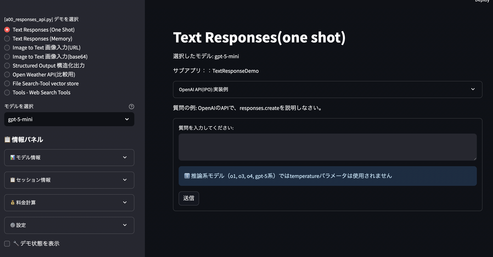
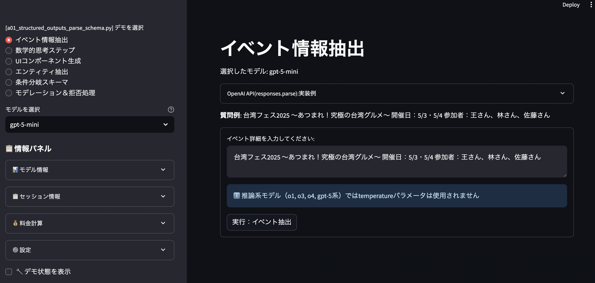
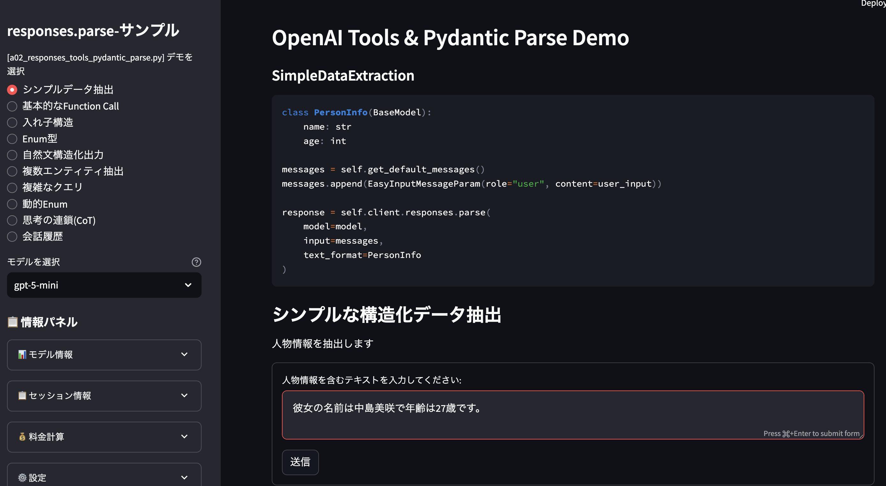
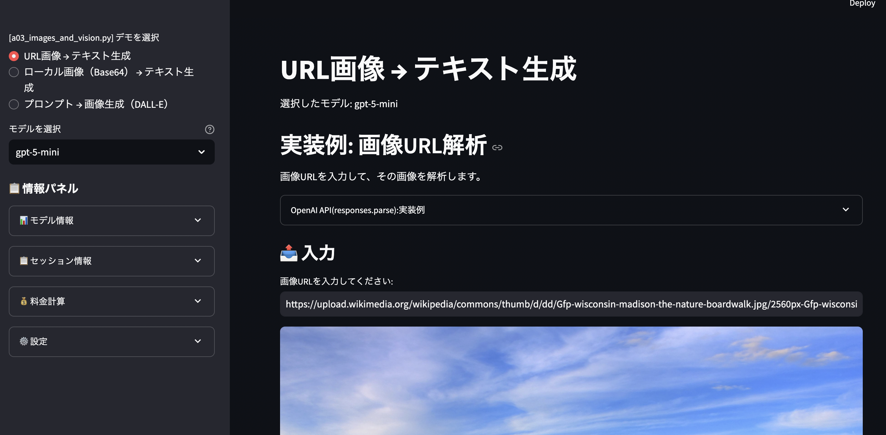
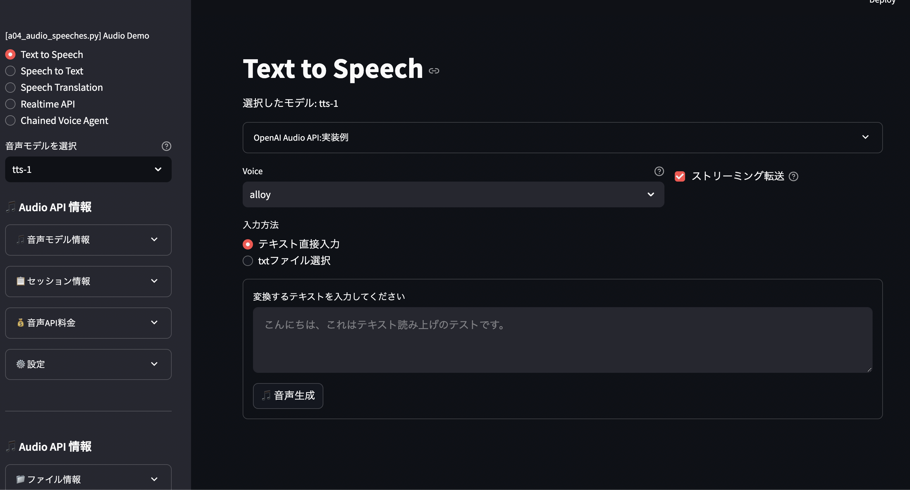
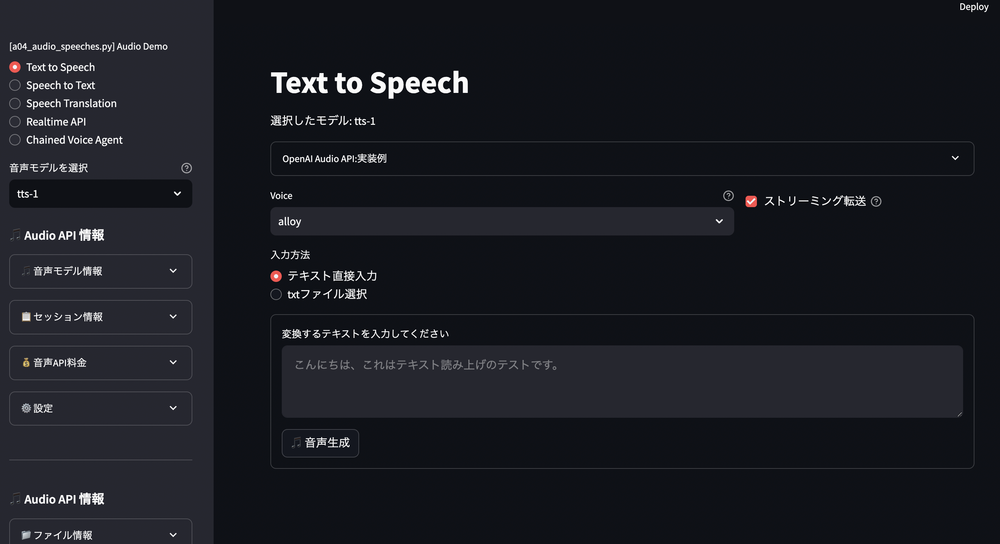
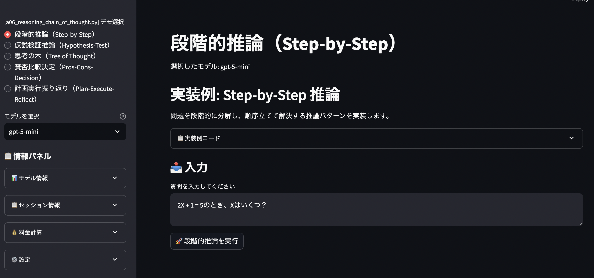

# 🚀 OpenAI API From Scratch with Streamlit

<div align="center">

**OpenAI APIを基礎から応用まで体系的に学習するための包括的チュートリアル**

[](https://www.python.org/)
[](https://openai.com/)
[](https://streamlit.io/)
[](LICENSE)

[English](#) | **日本語** | [中文](#)

</div>

## 🔗 関連プロジェクト## 🔗 関連プロジェクト


| プロジェクト                                                             | 説明                                         | ステータス |
| ------------------------------------------------------------------------ | -------------------------------------------- | ---------- |
| [openai_api_jp](https://github.com/nakashima2toshio/openai_api_jp)       | OpenAI API完全ガイド（本プロジェクト）       | ✅ 公開中  |
| [anthropic_api_jp](https://github.com/nakashima2toshio/anthropic_api_jp) | Anthropic Claude API活用                     | ✅ 公開中  |
| [openai_rag_jp](https://github.com/nakashima2toshio/openai_rag_jp)       | RAG実装パターン集（cloud版、Local-Qdrant版） | ✅ 公開中  |
| [openai_mcp_jp](https://github.com/nakashima2toshio/openai_mcp_jp)       | MCP(Model Context Protocol)実装              | 🚧 整備中  |
| [openai_django_jp](https://github.com/nakashima2toshio/openai_django_jp) | OpenAI API + Django実装                      | 🚧 整備中  |
| [openai_agent_jp](https://github.com/nakashima2toshio/openai_agent_jp)   | AIエージェント構築                           | 📝 作成中  |

---

## 📚 プロジェクト概要

**OpenAI API JP**は、OpenAI APIの全機能を体系的に学習できるプロジェクトです。基本的なテキスト生成から最新のマルチモーダル処理まで、実践的なデモアプリケーションを通じて段階的に習得できます。

### 🎯 学習目標

- **基礎理解**: OpenAI APIの基本概念とプログラミングパターン
- **実践スキル**: Streamlitを使った対話型アプリケーション開発
- **応用技術**: 構造化出力、関数呼び出し、マルチモーダル処理
- **最新機能**: Chain-of-Thought推論、Realtime API、Vector Store統合

---

## 🏗️ プログラム構成

### 🎓 学習パス別プログラム構成

#### 【入門】OpenAI APIクイックスタート


| ファイル                | 概要                              | 学習内容                          |
| ----------------------- | --------------------------------- | --------------------------------- |
| **a0_simple_api.ipynb** | Jupyter NotebookでAPIの基本を試す | API呼び出しの基礎、レスポンス処理 |

#### 【基礎】コアAPI機能


| ファイル                                   | 概要                                           | 主要API/機能                                  |
| ------------------------------------------ | ---------------------------------------------- | --------------------------------------------- |
| **a00_responses_api.py**                   | OpenAI APIの全機能を統合的に紹介するメインデモ | `responses.create`, Vector Stores, Web Search |
| **a01_structured_outputs_parse_schema.py** | スキーマ検証を用いた構造化出力                 | `responses.parse`, Pydanticモデル検証         |
| **a02_responses_tools_pydantic_parse.py**  | Pydanticベースの解析と関数呼び出し             | `pydantic_function_tool`, 複数ツール連携      |

#### 【応用】マルチモーダル処理


| ファイル                     | 概要                        | 主要API/機能               |
| ---------------------------- | --------------------------- | -------------------------- |
| **a03_images_and_vision.py** | 画像生成とビジョンAPIのデモ | DALL-E 3/2, GPT-4 Vision   |
| **a04_audio_speeches.py**    | 音声処理（TTS/STT/翻訳）    | Whisper, TTS, Realtime API |

#### 【上級】高度な機能


| ファイル                              | 概要                           | 主要API/機能                         |
| ------------------------------------- | ------------------------------ | ------------------------------------ |
| **a05_conversation_state.py**         | 会話状態管理とコンテキスト保持 | `previous_response_id`, ステート管理 |
| **a06_reasoning_chain_of_thought.py** | Chain-of-Thought推論パターン   | o1/o3モデル, 推論戦略                |

#### 【ユーティリティ】補助ツール


| ファイル               | 概要                              | 用途                |
| ---------------------- | --------------------------------- | ------------------- |
| **a10_get_vsid.py**    | Vector Store ID管理ユーティリティ | ベクトルストア操作  |
| **get_cities_list.py** | 都市リストデータ処理              | 天気API用データ準備 |

#### 【共通モジュール】ヘルパー関数


| ファイル          | 概要                           | 主要機能                                   |
| ----------------- | ------------------------------ | ------------------------------------------ |
| **helper_api.py** | OpenAI API操作の中核機能       | クライアント管理、エラー処理、トークン計算 |
| **helper_st.py**  | Streamlit UI共通コンポーネント | UIヘルパー、セッション管理、レスポンス表示 |

---

## 🚀 クイックスタート

### 1. 環境セットアップ

```bash
# リポジトリのクローン
git clone https://github.com/nakashima2toshio/openai_api_jp.git
cd openai_api_jp

# Python仮想環境の作成
python3 -m venv venv
source venv/bin/activate  # Windows: venv\Scripts\activate

# 依存関係のインストール
pip install -r requirements.txt
```

### 2. API キーの設定

```bash
# 環境変数の設定
export OPENAI_API_KEY='sk-proj-your-openai-api-key'

# オプション: 外部API（天気・為替）
export OPENWEATHER_API_KEY='your-key'
export EXCHANGERATE_API_KEY='your-key'
```

### 3. デモアプリの実行

```bash
# メイン統合デモ（推奨）
streamlit run a00_responses_api.py --server.port=8501

# その他のデモ（個別実行）
streamlit run a01_structured_outputs_parse_schema.py --server.port=8502
streamlit run a03_images_and_vision.py --server.port=8503
```

📖 **詳細なセットアップ手順**: [README_setup.md](README_setup.md)

## 📊 各デモアプリケーションの詳細機能

<details>
<summary><b>🔍 a00_responses_api.py - メイン統合デモ</b></summary>

### デモクラス一覧と機能


| クラス名                      | 機能説明         | 実装内容                                 |
| ----------------------------- | ---------------- | ---------------------------------------- |
| **TextResponseDemo**          | 基本テキスト応答 | シンプルなプロンプト送信とレスポンス処理 |
| **MemoryResponseDemo**        | 会話履歴付き応答 | コンテキストを保持した連続会話           |
| **ImageResponseDemo**         | 画像入力処理     | URL/Base64形式の画像解析・説明生成       |
| **StructuredOutputDemo**      | 構造化出力       | JSONスキーマ定義による型安全な出力       |
| **WeatherDemo**               | 外部API連携      | OpenWeatherMapとの統合例                 |
| **FileSearchVectorStoreDemo** | ベクトル検索     | ファイルアップロード・セマンティック検索 |
| **WebSearchToolsDemo**        | Web検索統合      | リアルタイム情報取得・解析               |

</details>

<details>
<summary><b>📝 a01_structured_outputs_parse_schema.py - 構造化出力</b></summary>

### 6つの構造化出力パターン


| デモ名                    | 用途                     | スキーマ例                     |
| ------------------------- | ------------------------ | ------------------------------ |
| **EventExtractionDemo**   | イベント情報抽出         | 日時、場所、参加者の構造化     |
| **MathReasoningDemo**     | 数学的推論               | ステップバイステップの解法記録 |
| **UIGenerationDemo**      | UI生成                   | コンポーネント定義のJSON出力   |
| **EntityExtractionDemo**  | エンティティ抽出         | 人名、組織名、場所の識別       |
| **ConditionalSchemaDemo** | 条件分岐スキーマ         | 動的なスキーマ選択             |
| **ModerationDemo**        | コンテンツモデレーション | 安全性チェック・フィルタリング |

</details>

<details>
<summary><b>🛠️ a02_responses_tools_pydantic_parse.py - 関数呼び出し</b></summary>

### Pydantic統合デモ一覧


| デモ名                    | 実装パターン     | 使用例                   |
| ------------------------- | ---------------- | ------------------------ |
| **BasicFunctionCallDemo** | 単一関数呼び出し | 計算機能、データ取得     |
| **MultipleToolsDemo**     | 複数ツール連携   | 天気+為替レート同時取得  |
| **NestedStructureDemo**   | 入れ子構造処理   | 複雑なJSONデータのパース |
| **EnumTypeDemo**          | 列挙型の活用     | 選択肢の制約と検証       |
| **ChainOfThoughtDemo**    | 思考連鎖の実装   | 段階的問題解決プロセス   |

</details>

<details>
<summary><b>🎨 a03_images_and_vision.py - 画像処理</b></summary>

### Vision API活用デモ


| デモ名                    | 入力形式             | 出力内容               |
| ------------------------- | -------------------- | ---------------------- |
| **URLImageToTextDemo**    | 画像URL              | 画像の詳細説明・分析   |
| **Base64ImageToTextDemo** | Base64エンコード画像 | ローカル画像の解析     |
| **PromptToImageDemo**     | テキストプロンプト   | DALL-E 3による画像生成 |

</details>

<details>
<summary><b>🎤 a04_audio_speeches.py - 音声処理</b></summary>

### 音声API統合機能


| デモ名                    | API機能  | 処理内容                   |
| ------------------------- | -------- | -------------------------- |
| **TextToSpeechDemo**      | TTS      | 多言語・多声質の音声生成   |
| **SpeechToTextDemo**      | Whisper  | 高精度音声認識・文字起こし |
| **SpeechTranslationDemo** | 翻訳     | リアルタイム音声翻訳       |
| **RealtimeApiDemo**       | Realtime | ストリーミング音声処理     |

</details>

---

## 🎯 学習ロードマップ

### 🌱 **Phase 1: 基礎習得** (1-2週間)

1. **環境構築**: README_setup.mdに従ってセットアップ
2. **基本理解**: a0_simple_api.ipynb でAPI基礎を学習
3. **統合デモ体験**: a00_responses_api.py で全機能を俯瞰

### 🚀 **Phase 2: 機能別習得** (2-3週間)

1. **構造化出力**: a01でスキーマ定義とバリデーション
2. **関数呼び出し**: a02でPydantic統合とツール連携
3. **マルチモーダル**: a03-a04で画像・音声処理

### 🎓 **Phase 3: 実践応用** (3-4週間)

1. **状態管理**: a05で会話コンテキストの永続化
2. **推論パターン**: a06でChain-of-Thought実装
3. **独自実装**: 学んだパターンを組み合わせてオリジナル機能開発

---

## 🔧 開発環境とツール

### 推奨環境

- **OS**: macOS 13+ / Ubuntu 22.04+ / Windows 11 with WSL2
- **Python**: 3.11 以上
- **メモリ**: 16GB以上推奨
- **IDE**: PyCharm Professional / VS Code with Python拡張

### テスト実行

```bash
# 全テスト実行
pytest

# カバレッジ付きテスト
pytest --cov=. --cov-report=html

# 特定マーカーのテスト
pytest -m unit        # 単体テストのみ
pytest -m integration # 統合テストのみ
```

### コード品質管理

```bash
# フォーマット
black *.py

# リント
flake8 *.py --max-line-length=120

# 型チェック
mypy *.py --ignore-missing-imports
```

---

## 📸 スクリーンショット

### メイン統合デモ画面



### 構造化出力デモ



### 関数呼び出しデモ



### 画像処理デモ



### 音声処理デモ



### 会話状態管理



### 推論パターンデモ



## 💼 プロジェクト構造

```
openai_api_jp/
├── 📚 学習用デモアプリケーション
│   ├── a0_simple_api.ipynb             # 入門: Jupyter Notebook
│   ├── a00_responses_api.py            # 統合デモ
│   ├── a01_structured_outputs_parse_schema.py  # 構造化出力
│   ├── a02_responses_tools_pydantic_parse.py   # 関数呼び出し
│   ├── a03_images_and_vision.py        # 画像処理
│   ├── a04_audio_speeches.py           # 音声処理
│   ├── a05_conversation_state.py       # 状態管理
│   └── a06_reasoning_chain_of_thought.py # 推論パターン
│
├── 🔧 ユーティリティ
│   ├── a10_get_vsid.py                 # Vector Store管理
│   ├── get_cities_list.py              # データ処理
│   ├── helper_api.py                   # API共通機能
│   └── helper_st.py                    # UI共通機能
│
├── 📁 リソース
│   ├── config.yml                      # 設定ファイル
│   ├── requirements.txt                # 依存関係
│   ├── pytest.ini                      # テスト設定
│   ├── data/                           # サンプルデータ
│   ├── images/                         # サンプル画像
│   ├── assets/                         # スクリーンショット
│   └── doc/                            # ドキュメント
│
└── 📖 ドキュメント
    ├── README.md                        # 本ドキュメント
    ├── README_setup.md                  # セットアップ詳細
    └── CLAUDE.md                        # Claude Code用設定
```

---

## 🌟 主な特徴

### ✅ 包括的なAPI網羅

- **テキスト生成**: GPT-4o, GPT-5, o1/o3推論モデル
- **構造化出力**: JSONスキーマ, Pydantic統合
- **マルチモーダル**: 画像生成(DALL-E), 画像解析(Vision), 音声(Whisper/TTS)
- **高度な機能**: Vector Store, Web検索, Realtime API

### ✅ 実践的な学習設計

- **段階的学習**: 基礎から応用まで体系的カリキュラム
- **実行可能なデモ**: すべてのコードが即座に実行可能
- **詳細なコメント**: 日本語による丁寧な解説
- **エラーハンドリング**: 本番環境を想定した堅牢な実装

### ✅ 開発者フレンドリー

- **モジュール設計**: 再利用可能なコンポーネント
- **型安全**: Pydanticによる型検証
- **テスト**: pytest完備
- **UI/UX**: Streamlitによる直感的インターフェース

---

## 📞 サポート・貢献

### 🐛 問題報告

[GitHub Issues](https://github.com/nakashima2toshio/openai_api_jp/issues)

### 🤝 コントリビューション

プルリクエスト歓迎！[Contributing Guide](CONTRIBUTING.md)を参照

### 📧 連絡先

- GitHub: [@nakashima2toshio](https://github.com/nakashima2toshio)
- Email: プロフィールを参照

---

## 📄 ライセンス

MIT License - 詳細は[LICENSE](LICENSE)ファイルを参照

---

<div align="center">

**🎯 OpenAI APIマスターへの道を、今すぐ始めよう！**

⭐ このプロジェクトが役立ったら、スターをお願いします！

</div>
