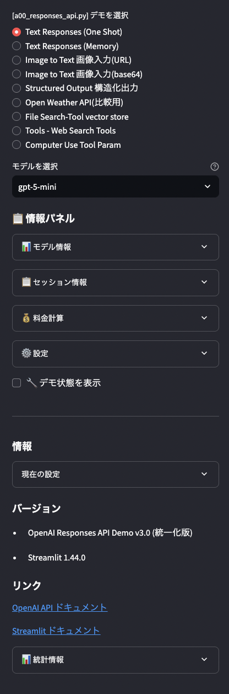

### 本概要署m、OpenAI API サンプルプログラム一覧

### 概要

- OpenAI APIの学習用サンプルプログラム集の機能一覧です。
- 各プログラムは異なるAPIの側面と機能を実際に体験できるよう設計されており、
- 基本的な使用法から高度な応用まで段階的に学習できます。

#### 環境のセットアップ

[環境セットアップ](https://./README_setup.md)

#### ドキュメント、設計書：

[ドキュメント] ./doc/ 以下のディレクトリ、プログラムと同名のファイル.md
-----------------------------------------------------------------------

## a00_responses_api.py 画面


### a01_structured_outputs_parse_schema.py　画面


### a02_responses_tools_pydantic_parse.py　画面


### a03_images_and_vision.py　画面


### a04_audio_speeches.py　画面


### a05_conversation_state.py　画面


### a06_reasoning_chain_of_thought.py　画面


### **OpenAI Responses API 統合デモ**


| 機能名                    | 概要                                                                                |
| ------------------------- | ----------------------------------------------------------------------------------- |
| Text Responses (One Shot) | 基本的なテキスト応答デモ。デフォルトメッセージ+ユーザー入力でワンショット応答を実行 |
| Text Responses (Memory)   | 連続会話対応デモ。`previous_response_id`を使った会話状態の継続と履歴管理            |
| Image to Text (URL)       | 画像URL入力からテキスト生成。マルチモーダル対応のビジョン機能デモ                   |
| Image to Text (Base64)    | ローカル画像ファイル（Base64）からテキスト生成。画像アップロード対応                |
| Structured Output         | 構造化出力デモ。イベント情報の抽出とPydanticモデルによる型安全な出力                |
| Open Weather API          | 外部API連携デモ。OpenWeatherMap APIを使用したリアルタイム天気情報取得               |
| File Search-Tool          | Vector Store検索デモ。ファイル検索ツールによるRAG（検索拡張生成）実装               |
| Web Search Tools          | Web検索ツール専用デモ。地域設定対応のリアルタイムWeb検索機能                        |

**主要API**: `responses.create`, Vector Stores API, OpenWeatherMap API, Web Search Tool, Computer Use Tool

---

## a01_structured_outputs_parse_schema.py

**Structured Outputs 6パターン**


| 機能名                   | 概要                                                             |
| ------------------------ | ---------------------------------------------------------------- |
| イベント情報抽出         | テキストからイベント名、日付、参加者を構造化して抽出するデモ     |
| 数学的思考ステップ       | 数学問題を段階的に解く思考プロセスを構造化出力で表現             |
| UIコンポーネント生成     | UI設計要求から再帰的なコンポーネント構造をJSON形式で自動生成     |
| エンティティ抽出         | テキストから属性、色、動物などの複数種類のエンティティを同時抽出 |
| 条件分岐スキーマ         | ユーザー情報または住所情報を判別して適切なスキーマで構造化       |
| モデレーション＆拒否処理 | 不適切コンテンツの検出と拒否理由の構造化された出力               |

**主要API**: `responses.parse`, Pydantic モデル

---

## a02_responses_tools_pydantic_parse.py

**Pydantic Parse 高度デモ**


| 機能名                | 概要                                                 |
| --------------------- | ---------------------------------------------------- |
| シンプルデータ抽出    | 基本的な人物情報をPydanticモデルで抽出する入門デモ   |
| 基本的なFunction Call | 天気APIとニュース検索の基本的な関数呼び出し実装      |
| 入れ子構造            | プロジェクトとタスクの階層構造を持つ複雑なデータ処理 |
| Enum型                | 温度単位などの列挙型を使った型安全なパラメータ処理   |
| 自然文構造化出力      | 段階的な問題解決プロセスを自然文で構造化して出力     |
| 複数エンティティ抽出  | 人物と書籍情報を同時に抽出する複合エンティティ処理   |
| 複雑なクエリ          | SQL風の条件指定とソート機能を持つ高度なクエリ処理    |
| 動的Enum              | 優先度付きタスク管理での動的な列挙型活用             |
| 思考の連鎖(CoT)       | Chain of Thought思考プロセスの実装と可視化           |
| 会話履歴              | 連続対話での文脈保持と構造化された質疑応答管理       |

**主要API**: `responses.parse`, `pydantic_function_tool`, OpenWeatherMap API

---

## a03_images_and_vision.py

**画像＆ビジョンAPI**


| 機能名                             | 概要                                                   |
| ---------------------------------- | ------------------------------------------------------ |
| 入力画像(URL) → テキスト生成      | 画像URLを入力として画像内容をテキストで詳細説明生成    |
| 入力画像データ(Base64) → テキスト | ローカル画像ファイルをBase64エンコードしてテキスト生成 |
| プロンプト → 画像生成 (DALL-E)    | テキストプロンプトからDALL-E 3/2を使用した画像生成     |

**主要API**: `responses.create`, `images.generate`, DALL-E 3/2

---

## a04_audio_speeches.py

**音声処理API統合**


| 機能名              | 概要                                                             |
| ------------------- | ---------------------------------------------------------------- |
| Text to Speech      | テキストを音声に変換するTTSデモ。ストリーミング対応MP3出力       |
| Speech to Text      | 音声ファイルをテキストに変換するSTTデモ。Whisperモデル使用       |
| Speech Translation  | 音声ファイルを英語テキストに翻訳。英訳フォールバック機能付き     |
| Realtime API        | リアルタイム音声対話デモ。マイク入力とスピーカー出力の双方向通信 |
| Chained Voice Agent | 音声→テキスト→Chat→音声の連鎖処理による音声エージェント       |

**主要API**: `audio.speech.create`, `audio.transcriptions.create`, `audio.translations.create`, Realtime API

---

## a05_conversation_state.py

**会話状態管理**


| 機能名                 | 概要                                                     |
| ---------------------- | -------------------------------------------------------- |
| ステートフルな会話継続 | `previous_response_id`を使用した前の会話コンテキスト保持 |
| Web検索と構造化パース  | Web検索実行後の結果をJSON形式に構造化パース              |
| Function Calling       | OpenWeatherMap APIを使用した天気情報取得の関数呼び出し   |

**主要API**: `responses.create`, `responses.parse`, Web Search Tool, Open-Meteo API

---

## a06_reasoning_chain_of_thought.py

**Chain of Thought 5パターン**


| 機能名                             | 概要                                                           |
| ---------------------------------- | -------------------------------------------------------------- |
| Step-by-Step（逐次展開型）         | 問題を順序立てて段階的に解決。数学問題、アルゴリズムに最適     |
| Hypothesis-Test（仮説検証型）      | 仮説を立てて証拠で検証。バグ解析、実験計画に使用               |
| Tree-of-Thought（分岐探索型）      | 複数の思考経路を探索して最適解を発見。パズル、最適化に適用     |
| Pros-Cons-Decision（賛否比較型）   | メリット・デメリットを比較して合理的決定。技術選定に有効       |
| Plan-Execute-Reflect（反復改良型） | 計画・実行・振り返りのループで継続改善。プロジェクト管理に使用 |

**主要API**: `responses.create`, 推論系モデル対応

---

### ヘルパー関数


| ファイル名    | 概要                                                                                         | 利用API / 機能        |
| ------------- | -------------------------------------------------------------------------------------------- | --------------------- |
| helper_api.py | OpenAI Python SDK 呼び出しや共通ユーティリティの集約（クライアント初期化・共通呼び出し等）。 | **OpenAI Python SDK** |
| helper_st.py  | Streamlit UI 用の共通部品（レイアウト/入力/表示まわりのヘルパー）。                          | **Streamlit**         |

---

## 学習の進め方

### 📚 初心者向け

- **a00_responses_api.py** - 全機能を一通り体験
- **a01_structured_outputs_parse_schema.py** - 構造化出力の基本

### 🔧 中級者向け

- **a02_responses_tools_pydantic_parse.py** - Pydantic活用
- **a03_images_and_vision.py** - マルチモーダル処理

### 🚀 上級者向け

- **a04_audio_speeches.py** - 音声処理
- **a05_conversation_state.py** - 状態管理
- **a06_reasoning_chain_of_thought.py** - 推論パターン

---

## 実行方法　 : （注）ポート番号は適切に調整してください。

```bash
# メイン統合デモ
streamlit run a00_responses_api.py --server.port=8501

# 構造化出力デモ
streamlit run a01_structured_outputs_parse_schema.py --server.port=8501

# Tools・Pydantic Parse デモ
streamlit run a02_responses_tools_pydantic_parse.py --server.port=8502

# 画像・ビジョンデモ
streamlit run a03_images_and_vision.py --server.port=8503

# 音声処理デモ
streamlit run a04_audio_speeches.py --server.port=8504

# 会話状態管理デモ
streamlit run a05_conversation_state.py --server.port=8505

# Chain of Thought デモ
streamlit run a06_reasoning_chain_of_thought.py --server.port=8506
```

## 必要な環境変数

```bash
# 必須
export OPENAI_API_KEY='your-openai-api-key'

# オプション（一部機能で使用）
export OPENWEATHER_API_KEY='your-openweather-api-key'
export EXCHANGERATE_API_KEY='your-exchangerate-api-key'
```

---

### その他のリポジトリ一覧：

・内容　　　　　　　　　　　　　　「リポジトリーURL」

- OpenAI API - 基本・応用：　URL:[openai_api_jp](https://github.com/nakashima2toshio/openai_api_jp)　このプロジェクトサンプル：6本、API-41パターン
- RAGの作成と検索：          URL:[openai_rag_jp](https://github.com/nakashima2toshio/openai_rag_jp)　  別リポジトリ（整備中）
- MCPの作成と利用例:         URL:[openai_mcp_jp](https://github.com/nakashima2toshio/openai_mcp_jp)　　別リポジトリ（整備中）
- Agentの作成と利用例:       URL:[openai_agent_jp](https://github.com/nakashima2toshio/openai_agent_jp)　別リポジトリ（作成中）

### 画面構成


### OpenAI API：利用例

#### 左ペイン



### セットアップ

```bash
# 1. リポジトリクローン
git clone https://github.com/nakashima2toshio/openai_api_app.git
cd openai_api_app

# 2. 依存関係インストール
pip install -r requirements.txt

# 3. 環境変数設定
export OPENAI_API_KEY='your-api-key'

# 4. 実行
streamlit run a10_00_responses_api.py
```
