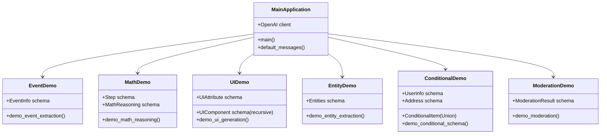

# 📋 a01_structured_outputs_parse_schema.py 設計書

## 📝 目次

1. [📖 概要書](#📖-概要書)
2. [🔧 システム構成](#🔧-システム構成)
3. [📋 関数一覧](#📋-関数一覧)
4. [📑 関数詳細設計](#📑-関数詳細設計)
5. [⚙️ 技術仕様](#⚙️-技術仕様)
6. [🚨 エラーハンドリング](#🚨-エラーハンドリング)

---

## 📖 概要書

### 🎯 処理の概要

**OpenAI Structured Outputs 6パターン実演アプリケーション**

本アプリケーションは、OpenAI Responses APIの`client.responses.parse()`メソッドを使用したStructured Outputs（構造化出力）の包括的なデモンストレーションです。Pydanticスキーマを活用し、6つの異なる実用的ユースケースで型安全な構造化データ抽出・生成を体験できます。

#### 🌟 主要機能

| 機能 | 説明 |
|------|------|
| 📅 **イベント情報抽出** | イベント詳細から構造化情報を抽出 |
| 🧮 **数学的思考ステップ** | 数学問題の段階的解法を構造化 |
| 🖼️ **UIコンポーネント生成** | 再帰的UIコンポーネント構造を自動生成 |
| 🏷️ **エンティティ抽出** | テキストから複数種類のエンティティを同時抽出 |
| 🔄 **条件分岐スキーマ** | Union型による柔軟なスキーマ適用 |
| 🛡️ **モデレーション拒否** | コンテンツ審査と拒否理由の構造化 |

### 📋 サブプログラムの一覧表

| プログラム名 | クラス・関数名 | 処理概要 |
|-------------|-------------|----------|
| a01_structured_outputs_parse_schema.py | BaseDemo | デモ機能の基底クラス（統一化版） |
| | EventExtractionDemo | イベント情報抽出デモ |
| | MathReasoningDemo | 数学的思考ステップデモ |
| | UIGenerationDemo | UIコンポーネント生成デモ |
| | EntityExtractionDemo | エンティティ抽出デモ |
| | ConditionalSchemaDemo | 条件分岐スキーマデモ |
| | ModerationDemo | モデレーション＆拒否処理デモ |
| | DemoManager | デモの管理クラス（統一化版） |

#### 🎨 処理対象データ


### 🔄 mainの処理の流れ


---

## 🔧 システム構成

### 📦 主要コンポーネント



### 📋 データフロー


---

## 📋 関数一覧

### 🏗️ アプリケーション制御関数

| 関数名 | 分類 | 処理概要 | 重要度 |
|--------|------|----------|---------|
| `main()` | 🎯 制御 | アプリケーションメイン制御・デモ選択 | ⭐⭐⭐ |
| `default_messages()` | 📝 構築 | デフォルト会話履歴作成 | ⭐⭐ |

### 🤖 デモ実装関数

| 関数名 | 分類 | 処理概要 | 重要度 |
|--------|------|----------|---------|
| `demo_event_extraction()` | 📅 抽出 | イベント情報構造化抽出 | ⭐⭐⭐ |
| `demo_math_reasoning()` | 🧮 推論 | 数学的思考ステップ構造化 | ⭐⭐⭐ |
| `demo_ui_generation()` | 🖼️ 生成 | UIコンポーネント構造生成 | ⭐⭐⭐ |
| `demo_entity_extraction()` | 🏷️ 抽出 | 複数エンティティ同時抽出 | ⭐⭐⭐ |
| `demo_conditional_schema()` | 🔄 条件 | 条件分岐スキーマ適用 | ⭐⭐⭐ |
| `demo_moderation()` | 🛡️ 審査 | コンテンツモデレーション | ⭐⭐⭐ |

---

## 📑 関数詳細設計

### 📅 demo_event_extraction()

#### 🎯 処理概要
イベント記述テキストから構造化された情報（名前・日付・参加者）を抽出

#### 📊 処理の流れ


#### 📋 IPO設計

| 項目 | 内容 |
|------|------|
| **INPUT** | イベント描述テキスト、モデル選択 |
| **PROCESS** | EventInfoスキーマ適用 → API呼び出し → 構造化抽出 |
| **OUTPUT** | 構造化JSON（name, date, participants） |

#### 🔍 EventInfoスキーマ詳細
```python
class EventInfo(BaseModel):
    name: str = Field(..., description="イベント名")
    date: str = Field(..., description="開催日") 
    participants: List[str] = Field(..., description="参加者一覧")
    
    model_config = {"extra": "forbid"}
```

---

### 🧮 demo_math_reasoning()

#### 🎯 処理概要
数学問題の段階的解法プロセスを構造化して出力

#### 📊 処理の流れ


#### 📋 IPO設計

| 項目 | 内容 |
|------|------|
| **INPUT** | 数学式、モデル選択 |
| **PROCESS** | MathReasoningスキーマ適用 → 段階的解法生成 |
| **OUTPUT** | 構造化解法ステップ配列、最終答え |

#### 🔍 MathReasoningスキーマ詳細
```python
class Step(BaseModel):
    explanation: str = Field(..., description="このステップでの説明")
    output: str = Field(..., description="このステップの計算結果")

class MathReasoning(BaseModel):
    steps: List[Step] = Field(..., description="逐次的な解法ステップ")
    final_answer: str = Field(..., description="最終解")
    
    model_config = {"extra": "forbid"}
```

---

### 🖼️ demo_ui_generation()

#### 🎯 処理概要
UI要求から再帰的なコンポーネント構造を自動生成

#### 📊 処理の流れ


#### 📋 IPO設計

| 項目 | 内容 |
|------|------|
| **INPUT** | UI記述テキスト、モデル選択 |
| **PROCESS** | UIComponentスキーマ適用 → 再帰構造生成 |
| **OUTPUT** | 階層化UIコンポーネントツリー |

#### 🔍 UIComponentスキーマ詳細
```python
class UIAttribute(BaseModel):
    name: str = Field(..., description="属性名")
    value: str = Field(..., description="属性値")

class UIComponent(BaseModel):
    type: str = Field(..., description="コンポーネント種類")
    label: str = Field(..., description="表示ラベル")
    children: List["UIComponent"] = Field(default_factory=list)
    attributes: List[UIAttribute] = Field(default_factory=list)
    
    model_config = {"extra": "forbid"}
```

---

### 🏷️ demo_entity_extraction()

#### 🎯 処理概要
テキストから複数種類のエンティティを同時に構造化抽出

#### 📊 処理の流れ


#### 📋 IPO設計

| 項目 | 内容 |
|------|------|
| **INPUT** | 抽出対象テキスト、モデル選択 |
| **PROCESS** | Entitiesスキーマ適用 → カテゴリ別抽出 |
| **OUTPUT** | カテゴリ別エンティティリスト |

---

### 🔄 demo_conditional_schema()

#### 🎯 処理概要
Union型を使用した条件分岐スキーマの動的適用

#### 📊 処理の流れ


#### 📋 IPO設計

| 項目 | 内容 |
|------|------|
| **INPUT** | ユーザー情報または住所テキスト |
| **PROCESS** | Union型スキーマ適用 → 適切なスキーマ自動選択 |
| **OUTPUT** | 適用されたスキーマに応じた構造化データ |

---

### 🛡️ demo_moderation()

#### 🎯 処理概要
コンテンツモデレーションと拒否理由の構造化出力

#### 📊 処理の流れ


#### 📋 IPO設計

| 項目 | 内容 |
|------|------|
| **INPUT** | モデレーション対象テキスト |
| **PROCESS** | ModerationResultスキーマ適用 → 審査実行 |
| **OUTPUT** | 承認状態または拒否理由 |

---

## ⚙️ 技術仕様

### 📦 依存ライブラリ

| ライブラリ | バージョン | 用途 | 重要度 |
|-----------|-----------|------|---------|
| `streamlit` | 最新 | 🎨 Web UIフレームワーク | ⭐⭐⭐ |
| `openai` | 最新 | 🤖 OpenAI API SDK | ⭐⭐⭐ |
| `pydantic` | 最新 | 📊 スキーマ定義・検証 | ⭐⭐⭐ |
| `typing` | 標準 | 🔤 型ヒント・Union型 | ⭐⭐⭐ |

### 🗃️ モデル対応

#### 📋 対応モデル

```yaml
Available_Models:
  - "o4-mini"          # 推奨・効率的
  - "gpt-4o-2024-08-06" # 高品質
  - "gpt-4o-mini"      # バランス型
```

### 🔄 API統合パターン

#### 📋 Structured Outputs統一パターン

```python
# 基本パターン
response = client.responses.parse(
    model=selected_model,
    input=[
        EasyInputMessageParam(role="user", content=user_input)
    ],
    text_format=PydanticSchema
)

# 結果取得
result = response.output_parsed.model_dump()
```

#### 🔍 Pydanticスキーマ設計原則

```python
class ExampleSchema(BaseModel):
    field: str = Field(..., description="詳細な説明")
    
    model_config = {
        "extra": "forbid"  # 厳密な検証
    }
```

### 💾 デモ管理

#### 🗂️ デモ分類体系

```python
demo_categories = {
    "データ抽出": ["event_extraction", "entity_extraction"],
    "思考プロセス": ["math_reasoning"],
    "構造生成": ["ui_generation"],
    "条件処理": ["conditional_schema"],
    "審査機能": ["moderation"]
}
```

---

## 🚨 エラーハンドリング

### 📄 エラー分類

| エラー種別 | 原因 | 対処法 | 影響度 |
|-----------|------|--------|---------|
| **Pydantic検証エラー** | 🚫 スキーマ不適合 | スキーマ見直し・入力調整 | 🔴 高 |
| **API呼び出しエラー** | 🌐 通信・制限問題 | リトライ提案・モデル変更 | 🔴 高 |
| **スキーマ定義エラー** | 📋 モデル設計問題 | スキーマ修正・フィールド調整 | 🟡 中 |
| **JSON解析エラー** | 🔤 出力形式問題 | 再実行提案・モデル変更 | 🟡 中 |
| **UI状態エラー** | 🎨 Streamlit問題 | ページリロード提案 | 🟠 低 |

### 🛠️ エラー処理戦略

#### 🔧 段階的エラー処理


#### ✅ エラーメッセージ例

```python
# Pydantic検証エラー
st.error("❌ スキーマ検証に失敗しました")
st.warning("⚠️ 出力がスキーマ要件を満たしていません")
st.info("💡 対処法: モデルを変更して再実行してください")

# API呼び出しエラー
st.error("❌ OpenAI API呼び出しに失敗しました")
st.info("💡 対処法: API制限を確認するか、しばらく待ってから再実行してください")

# スキーマ定義問題
st.error("❌ スキーマ定義に問題があります")
st.code("# 正しいスキーマ例\nclass Example(BaseModel):\n    field: str = Field(...)")
```

---

## 🎉 まとめ

この設計書は、**a01_structured_outputs_parse_schema.py** の包括的な技術仕様と実装詳細を網羅した完全ドキュメントです。

### 🌟 設計のハイライト

- **📊 構造化出力特化**: OpenAI Structured Outputsの実用的デモンストレーション
- **🔍 6パターン網羅**: 実際のユースケースを想定した多様なスキーマ例
- **🛡️ 型安全性**: Pydanticによる厳密な型検証とスキーマ定義
- **🎨 直感的UI**: Streamlitによるインタラクティブな学習環境
- **🔄 柔軟性**: Union型・再帰構造など高度なスキーマ対応

### 🔧 Structured Outputs特徴

- **📋 スキーマ強制**: `extra="forbid"`による厳密な構造制御
- **🔄 動的分岐**: Union型による条件分岐スキーマ
- **🌳 再帰構造**: UIコンポーネントの階層化対応
- **🛡️ 審査統合**: モデレーション機能との自然な統合
- **⚡ 高効率性**: 構造化出力による解析工数削減