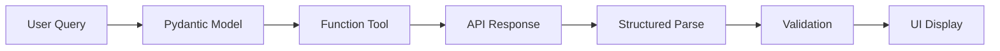
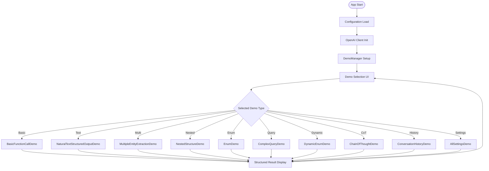
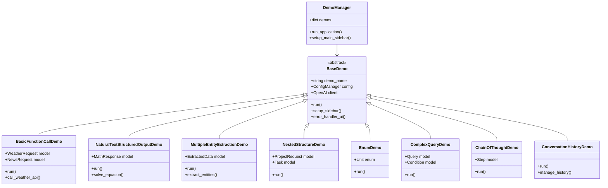
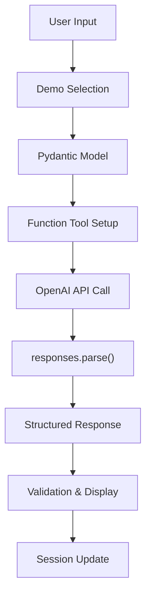
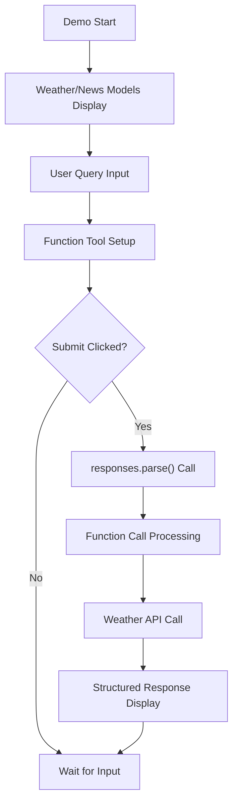
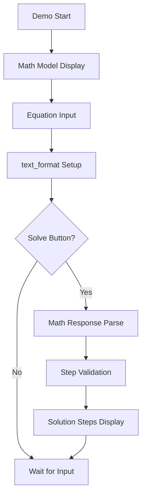
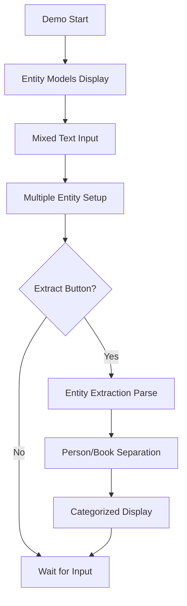
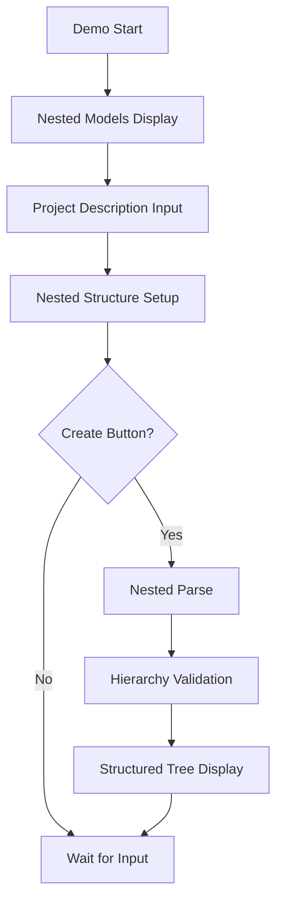
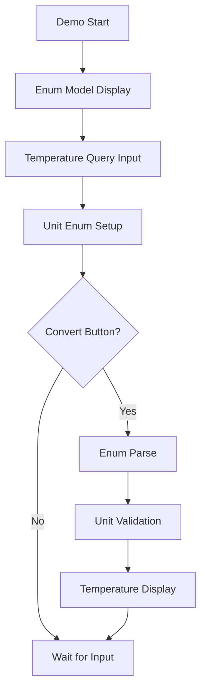
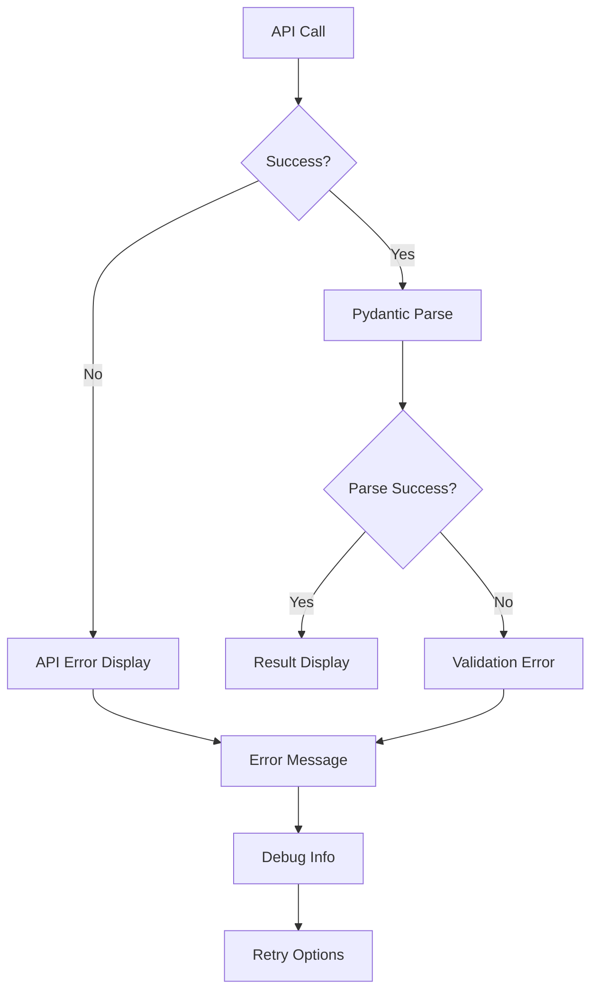

# 📋 a02_responses_tools_pydantic_parse.py 設計書

## 📝 目次

1. [📖 概要書](#📖-概要書)
2. [🔧 システム構成](#🔧-システム構成)
3. [📋 関数一覧](#📋-関数一覧)
4. [📑 関数詳細設計](#📑-関数詳細設計)
5. [⚙️ 技術仕様](#⚙️-技術仕様)
6. [🚨 エラーハンドリング](#🚨-エラーハンドリング)

---

## 📖 概要書

### 🎯 処理の概要

**OpenAI Tools & Pydantic Parse 高度デモアプリケーション**

本アプリケーションは、OpenAI Responses APIの`responses.parse()`メソッドとPydantic関数ツールを活用した高度な構造化出力デモンストレーションです。10の段階的なデモを通じて、簡単なデータ抽出から複雑な入れ子構造処理、外部API連携、会話履歴管理まで、実用的なAIアプリケーション開発パターンを体験できます。

#### 🌟 主要機能

| 機能 | 説明 |
|------|------|
| 🧠 **基本的Function Call** | 天気APIと連携したシンプルな関数呼び出し |
| 📝 **自然文構造化出力** | 数学問題の段階的解法を構造化 |
| 🏷️ **複数エンティティ抽出** | 人物・書籍情報の同時抽出処理 |
| 🏗️ **入れ子構造** | プロジェクト・タスクの階層データ処理 |
| 📊 **Enum型活用** | 温度単位等の列挙型による型安全処理 |
| 🔍 **複雑クエリ** | 条件・ソート機能を含む高度なクエリ処理 |
| 🎯 **動的Enum** | 優先度管理での日本語列挙型活用 |
| 🧠 **思考の連鎖(CoT)** | Chain of Thought推論プロセス実装 |
| 💬 **会話履歴** | 連続対話でのコンテキスト保持管理 |
| ⚙️ **設定統合** | 複数設定パターンの統一管理 |

### 📋 サブプログラムの一覧表

| プログラム名 | クラス・関数名 | 処理概要 |
|-------------|-------------|----------|
| a02_responses_tools_pydantic_parse.py | BaseDemo | デモ機能の基底クラス |
| | BasicFunctionCallDemo | 基本的なfunction callのデモ |
| | MultipleToolsDemo | 複数ツールの登録・複数関数呼び出しデモ |
| | AdvancedMultipleToolsDemo | 高度な複数ツール呼び出しデモ |
| | NestedStructureDemo | 入れ子構造のデモ |
| | EnumTypeDemo | Enum型のデモ |
| | NaturalTextStructuredOutputDemo | 自然文での構造化出力デモ |
| | SimpleDataExtractionDemo | シンプルなデータ抽出デモ |
| | MultipleEntityExtractionDemo | 複数エンティティ抽出デモ |
| | ComplexQueryDemo | 複雑なクエリパターンデモ |
| | DynamicEnumDemo | 動的な列挙型デモ |
| | ChainOfThoughtDemo | 思考の連鎖デモ |
| | ConversationHistoryDemo | 会話履歴デモ |
| | DemoManager | デモの管理クラス |

#### 🎨 処理対象データ



### 🔄 mainの処理の流れ



---

## 🔧 システム構成

### 📦 主要コンポーネント



### 📋 データフロー



---

## 📋 関数一覧

### 🏗️ アプリケーション制御関数

| 関数名 | 分類 | 処理概要 | 重要度 |
|--------|------|----------|---------|
| `main()` | 🎯 制御 | アプリケーション起動・デモ管理 | ⭐⭐⭐ |
| `DemoManager.run_application()` | 🎯 制御 | デモ統合管理・実行制御 | ⭐⭐⭐ |
| `BaseDemo.__init__()` | 🔧 初期化 | 基底クラス初期化・設定管理 | ⭐⭐⭐ |
| `BaseDemo.run()` | 🎯 制御 | 抽象実行メソッド | ⭐⭐⭐ |

### 🤖 デモ実装関数

#### BasicFunctionCallDemo
| 関数名 | 分類 | 処理概要 | 重要度 |
|--------|------|----------|---------|
| `BasicFunctionCallDemo.run()` | 🎯 実行 | 基本的関数呼び出しデモ | ⭐⭐⭐ |
| `call_weather_api()` | 🌤️ API | OpenWeatherMap API呼び出し | ⭐⭐⭐ |

#### NaturalTextStructuredOutputDemo
| 関数名 | 分類 | 処理概要 | 重要度 |
|--------|------|----------|---------|
| `NaturalTextStructuredOutputDemo.run()` | 🎯 実行 | 自然文構造化出力デモ | ⭐⭐⭐ |

#### MultipleEntityExtractionDemo
| 関数名 | 分類 | 処理概要 | 重要度 |
|--------|------|----------|---------|
| `MultipleEntityExtractionDemo.run()` | 🎯 実行 | 複数エンティティ抽出デモ | ⭐⭐⭐ |

#### NestedStructureDemo
| 関数名 | 分類 | 処理概要 | 重要度 |
|--------|------|----------|---------|
| `NestedStructureDemo.run()` | 🎯 実行 | 入れ子構造処理デモ | ⭐⭐⭐ |

#### EnumDemo
| 関数名 | 分類 | 処理概要 | 重要度 |
|--------|------|----------|---------|
| `EnumDemo.run()` | 🎯 実行 | 列挙型活用デモ | ⭐⭐⭐ |

#### ComplexQueryDemo
| 関数名 | 分類 | 処理概要 | 重要度 |
|--------|------|----------|---------|
| `ComplexQueryDemo.run()` | 🎯 実行 | 複雑クエリ処理デモ | ⭐⭐⭐ |

#### ChainOfThoughtDemo
| 関数名 | 分類 | 処理概要 | 重要度 |
|--------|------|----------|---------|
| `ChainOfThoughtDemo.run()` | 🎯 実行 | 思考連鎖推論デモ | ⭐⭐⭐ |

#### ConversationHistoryDemo
| 関数名 | 分類 | 処理概要 | 重要度 |
|--------|------|----------|---------|
| `ConversationHistoryDemo.run()` | 🎯 実行 | 会話履歴管理デモ | ⭐⭐⭐ |

---

## 📑 関数詳細設計

### 🧠 BasicFunctionCallDemo.run()

#### 🎯 処理概要
基本的なFunction Calling・外部API連携・構造化レスポンス処理

#### 📊 処理の流れ


#### 📋 IPO設計

| 項目 | 内容 |
|------|------|
| **INPUT** | ユーザークエリ、モデル選択、API設定 |
| **PROCESS** | Function Tool登録 → API呼び出し → 外部API連携 → 結果構造化 |
| **OUTPUT** | 構造化天気情報、ニュース検索結果 |

#### 🔍 使用モデル詳細
```python
class WeatherRequest(BaseModel):
    city: str = Field(..., description="天気を調べる都市名")
    date: str = Field(..., description="天気を調べる日付")

class NewsRequest(BaseModel):
    topic: str = Field(..., description="ニュース検索のトピック")
    date: str = Field(default="today", description="検索日付")
```

---

### 📝 NaturalTextStructuredOutputDemo.run()

#### 🎯 処理概要
自然文での数学問題解法を段階的に構造化出力

#### 📊 処理の流れ


#### 📋 IPO設計

| 項目 | 内容 |
|------|------|
| **INPUT** | 数学方程式、求解方法指定 |
| **PROCESS** | text_format適用 → 段階的解法生成 → 構造化 |
| **OUTPUT** | ステップ配列、最終解答 |

#### 🔍 使用モデル詳細
```python
class Step(BaseModel):
    explanation: str = Field(..., description="このステップの説明")
    output: str = Field(..., description="計算結果")

class MathResponse(BaseModel):
    steps: List[Step] = Field(..., description="解法ステップ")
    final_answer: str = Field(..., description="最終答え")
```

---

### 🏷️ MultipleEntityExtractionDemo.run()

#### 🎯 処理概要
複数種類のエンティティを同時に抽出・構造化処理

#### 📊 処理の流れ


#### 📋 IPO設計

| 項目 | 内容 |
|------|------|
| **INPUT** | 人物・書籍情報混在テキスト |
| **PROCESS** | 複数モデル適用 → 同時抽出 → カテゴリ分離 |
| **OUTPUT** | 人物情報配列、書籍情報配列 |

#### 🔍 使用モデル詳細
```python
class PersonInfo(BaseModel):
    name: str = Field(..., description="人物名")
    age: int = Field(..., description="年齢")

class BookInfo(BaseModel):
    title: str = Field(..., description="書籍タイトル")
    author: str = Field(..., description="著者名")
    year: int = Field(..., description="出版年")

class ExtractedData(BaseModel):
    people: List[PersonInfo] = Field(..., description="抽出された人物情報")
    books: List[BookInfo] = Field(..., description="抽出された書籍情報")
```

---

### 🏗️ NestedStructureDemo.run()

#### 🎯 処理概要
プロジェクト・タスクの入れ子構造データ処理

#### 📊 処理の流れ


#### 📋 IPO設計

| 項目 | 内容 |
|------|------|
| **INPUT** | プロジェクト詳細描述 |
| **PROCESS** | 入れ子構造適用 → 階層データ生成 → 検証 |
| **OUTPUT** | プロジェクト情報、タスクリスト |

---

### 📊 EnumDemo.run()

#### 🎯 処理概要
列挙型を活用した型安全な温度単位処理

#### 📊 処理の流れ


#### 📋 IPO設計

| 項目 | 内容 |
|------|------|
| **INPUT** | 温度変換クエリ |
| **PROCESS** | Enum型適用 → 単位検証 → 温度処理 |
| **OUTPUT** | 温度値、単位情報 |

#### 🔍 使用Enum詳細
```python
class Unit(str, Enum):
    celsius = "celsius"
    fahrenheit = "fahrenheit"
```

---

## ⚙️ 技術仕様

### 📦 依存ライブラリ

| ライブラリ | バージョン | 用途 | 重要度 |
|-----------|-----------|------|---------|
| `streamlit` | 最新 | 🎨 Web UIフレームワーク | ⭐⭐⭐ |
| `openai` | 最新 | 🤖 OpenAI API SDK | ⭐⭐⭐ |
| `pydantic` | 最新 | 📊 データ検証・モデル定義 | ⭐⭐⭐ |
| `requests` | 最新 | 🌐 外部API通信 | ⭐⭐⭐ |
| `helper_st` | カスタム | 🎨 UI統合ヘルパー | ⭐⭐⭐ |
| `helper_api` | カスタム | 🔧 API管理ヘルパー | ⭐⭐⭐ |

### 🗃️ 外部API統合

#### 📋 OpenWeatherMap API仕様

```yaml
WeatherAPI:
  endpoint: "https://api.openweathermap.org/data/2.5/weather"
  method: "GET"
  params:
    lat: "緯度"
    lon: "経度" 
    appid: "API_KEY"
  cities:
    Tokyo: [35.6895, 139.69171]
    Osaka: [34.6937, 135.5023]
```

#### 🔄 API呼び出しパターン

```python
# Function Tool登録
tools = [
    pydantic_function_tool(WeatherRequest),
    pydantic_function_tool(NewsRequest, name="news_search")
]

# API呼び出し
response = self.client.responses.parse(
    model=model,
    input=messages,
    tools=tools
)

# 結果処理
for function_call in response.output.function_calls:
    args = function_call.parsed_arguments
```

### 💾 Pydanticモデル体系

#### 🏗️ モデル分類

```yaml
Model_Categories:
  basic: ["WeatherRequest", "NewsRequest", "PersonInfo"]
  nested: ["ProjectRequest", "ExtractedData", "MathResponse"]
  enum: ["Unit", "Priority", "Operator"]
  complex: ["Query", "Condition", "Step"]
```

#### ⚙️ モデル設計パターン

```python
# 基本パターン
class BasicModel(BaseModel):
    field: str = Field(..., description="説明")
    
# 入れ子パターン
class NestedModel(BaseModel):
    items: List[SubModel] = Field(..., description="子要素")
    
# Enumパターン  
class Status(str, Enum):
    active = "active"
    inactive = "inactive"
```

---

## 🚨 エラーハンドリング

### 📄 エラー分類

| エラー種別 | 原因 | 対処法 | 影響度 |
|-----------|------|--------|---------|
| **Pydantic検証エラー** | 🚫 モデル検証失敗 | スキーマ確認・データ修正 | 🔴 高 |
| **API通信エラー** | 🌐 外部API問題 | API状態確認・リトライ | 🔴 高 |
| **Function Call失敗** | 🔧 関数呼び出し問題 | ツール設定確認・再実行 | 🟡 中 |
| **モデル選択エラー** | 🤖 無効モデル | サポートモデル確認 | 🟡 中 |
| **セッション状態エラー** | 💾 状態管理問題 | セッションリセット | 🟠 低 |

### 🛠️ エラー処理戦略

#### 🔧 統一エラーハンドリング



#### ✅ エラーメッセージ例

```python
# Pydantic検証エラー
st.error("❌ データ検証に失敗しました")
st.warning("⚠️ 入力データがモデル要件を満たしていません")
st.info("💡 対処法: モデルスキーマを確認してください")

# 外部API エラー
st.error("❌ 外部API呼び出しに失敗しました")
st.info("💡 対処法: APIキーを確認するか、しばらく待ってから再実行してください")
```

### 🎯 デバッグ機能

```python
# デバッグ情報表示
with st.expander("🐛 デバッグ情報"):
    st.json({
        "model": selected_model,
        "messages": messages,
        "tools": tool_names,
        "response": response_dict
    })
```

---

## 🎉 まとめ

この設計書は、**a10_02_responses_tools_pydantic_parse.py** の包括的な技術仕様と実装詳細を網羅した完全ドキュメントです。

### 🌟 設計のハイライト

- **📊 段階的学習**: 10デモによる構造化出力の体系的習得
- **🔧 実用的統合**: 外部API連携とFunction Calling実装
- **🛡️ 型安全性**: Pydanticによる厳密な型検証システム
- **🎨 豊富なUI**: インタラクティブな学習・体験環境
- **💡 実践的例**: 実際の業務で使用可能なパターン集

### 🔧 アーキテクチャ特徴

- **📦 モジュール設計**: BaseDemo継承による統一インターフェース
- **🔄 API統合**: OpenAI + 外部APIのシームレス連携
- **💾 セッション管理**: 会話履歴とコンテキスト保持機能
- **⚙️ 設定統合**: 中央集約型設定管理システム
- **🎯 段階的複雑度**: 基礎から高度な機能まで段階的に学習可能