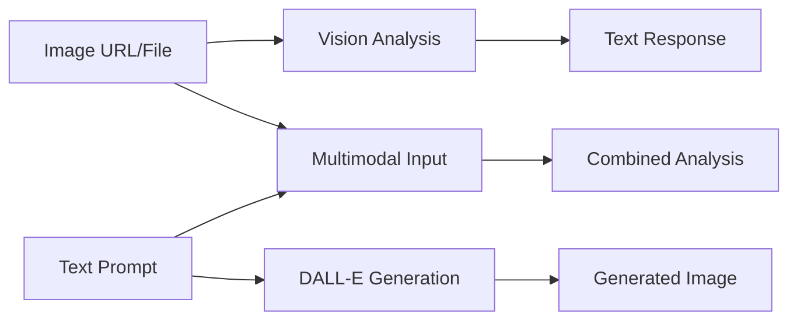
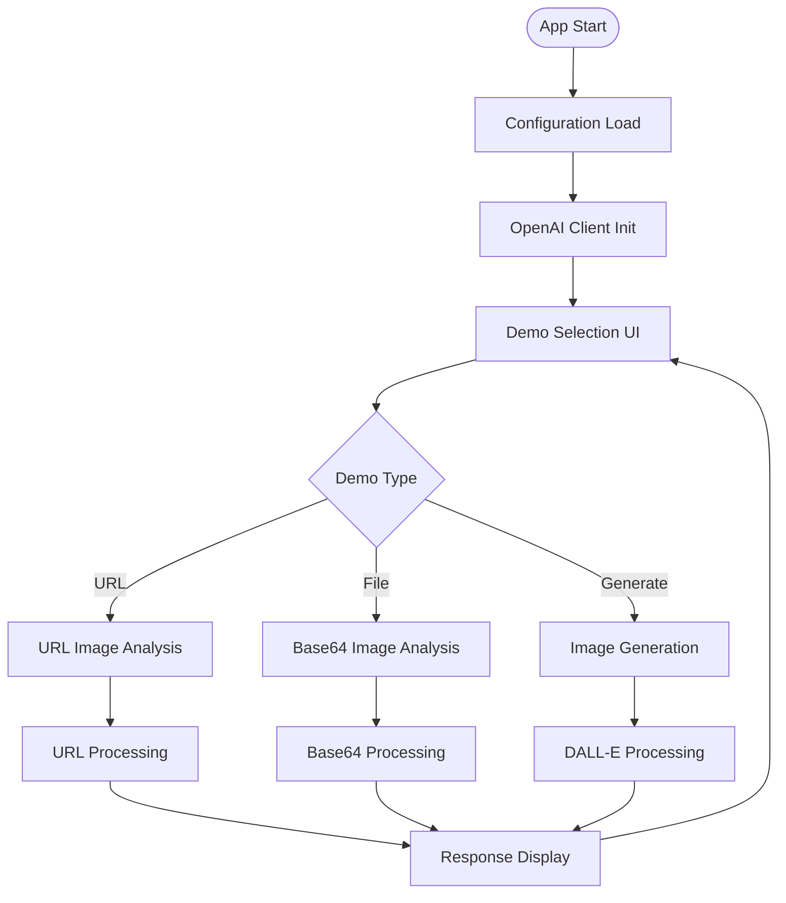
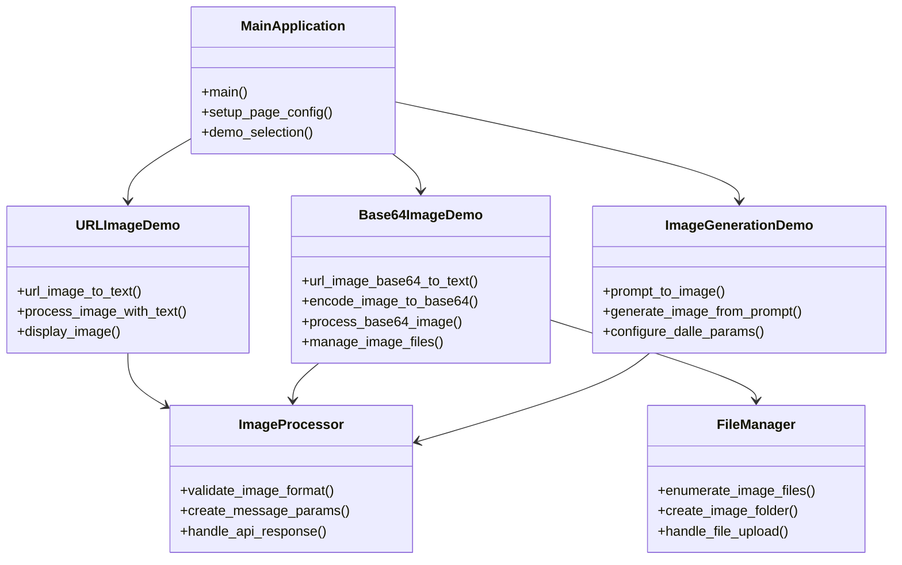
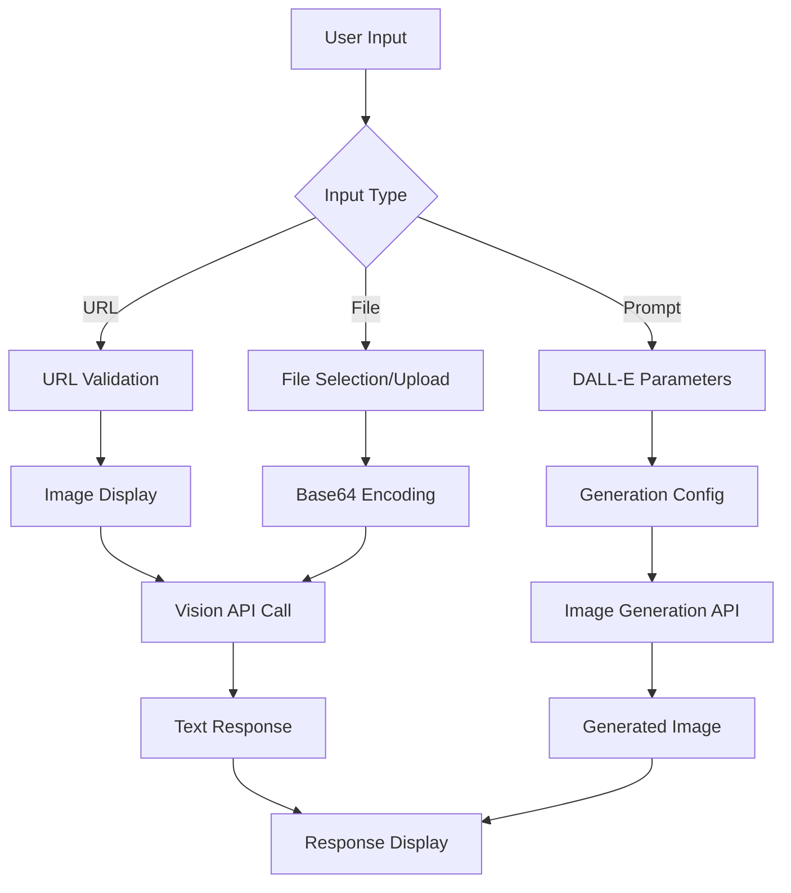
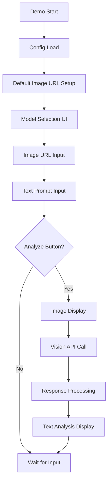
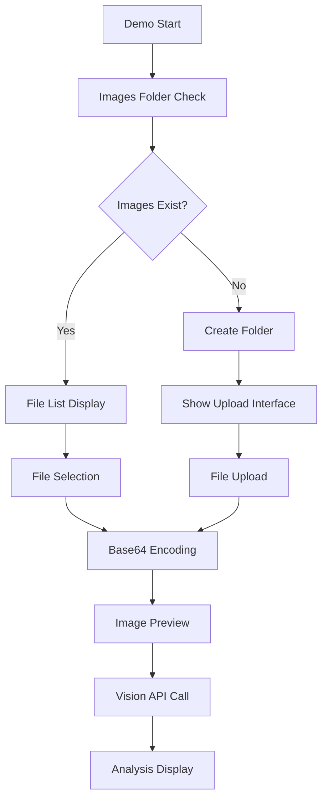
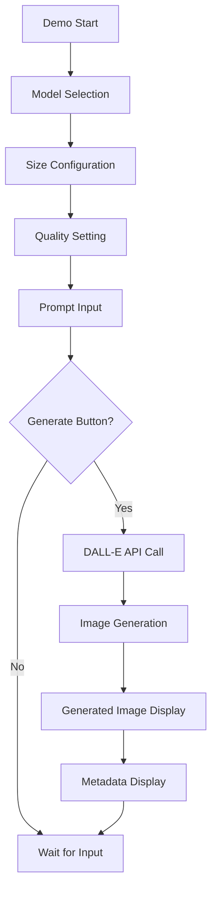
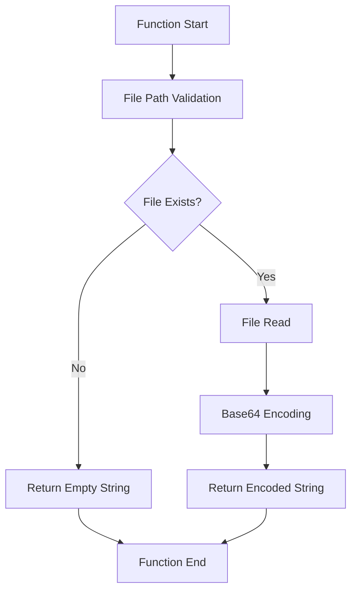
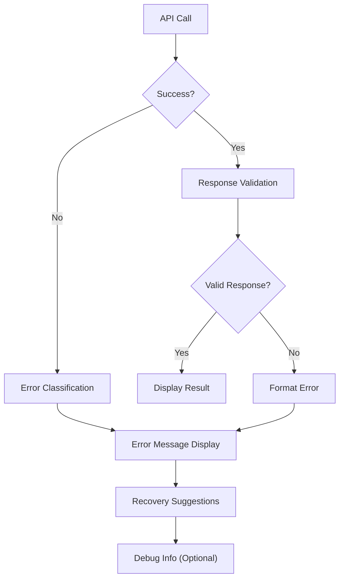

# 📋 a10_03_images_and_vision.py 設計書

## 📝 目次

1. [📖 概要書](#📖-概要書)
2. [🔧 システム構成](#🔧-システム構成)
3. [📋 関数一覧](#📋-関数一覧)
4. [📑 関数詳細設計](#📑-関数詳細設計)
5. [⚙️ 技術仕様](#⚙️-技術仕様)
6. [🚨 エラーハンドリング](#🚨-エラーハンドリング)

---

## 📖 概要書

### 🎯 処理の概要

**OpenAI 画像・ビジョンAPI統合デモアプリケーション**

本アプリケーションは、OpenAIのマルチモーダルAPIの包括的なデモンストレーションです。画像からテキストへの変換（Vision API）とテキストから画像への生成（DALL-E API）の両方向処理を体験できます。URL入力とローカルファイル（Base64）の両方に対応し、実用的な画像処理ワークフローを提供します。

#### 🌟 主要機能

| 機能 | 説明 |
|------|------|
| 🖼️ **画像URL → テキスト** | Web画像URLから内容をテキストで詳細分析 |
| 📁 **画像ファイル → テキスト** | ローカル画像ファイルをBase64で処理・分析 |
| 🎨 **テキスト → 画像生成** | DALL-E 2/3による高品質画像生成 |
| 🔍 **マルチモーダル分析** | 画像＋質問テキストの同時処理 |
| ⚙️ **柔軟な設定管理** | モデル・サイズ・品質の詳細設定 |
| 📂 **ファイル管理** | 自動フォルダ作成・ファイル列挙・アップロード |

#### 🎨 処理対象データ



### 🔄 mainの処理の流れ



---

## 🔧 システム構成

### 📦 主要コンポーネント



### 📋 データフロー



---

## 📋 関数一覧

### 🏗️ アプリケーション制御関数

| 関数名 | 分類 | 処理概要 | 重要度 |
|--------|------|----------|---------|
| `main()` | 🎯 制御 | アプリケーション起動・デモ選択管理 | ⭐⭐⭐ |

### 🖼️ 画像分析関数

| 関数名 | 分類 | 処理概要 | 重要度 |
|--------|------|----------|---------|
| `url_image_to_text()` | 🌐 URL分析 | Web画像URLからテキスト生成 | ⭐⭐⭐ |
| `url_image_base64_to_text()` | 📁 ファイル分析 | ローカル画像ファイル分析 | ⭐⭐⭐ |
| `process_image_with_text()` | 🔄 処理 | 画像＋テキストの統合処理 | ⭐⭐⭐ |
| `process_base64_image()` | 🔄 処理 | Base64画像の処理実行 | ⭐⭐⭐ |

### 🎨 画像生成関数

| 関数名 | 分類 | 処理概要 | 重要度 |
|--------|------|----------|---------|
| `prompt_to_image()` | 🎨 生成 | テキストプロンプトから画像生成 | ⭐⭐⭐ |
| `generate_image_from_prompt()` | 🔄 処理 | DALL-E API実行・画像生成 | ⭐⭐⭐ |

### 🔧 ユーティリティ関数

| 関数名 | 分類 | 処理概要 | 重要度 |
|--------|------|----------|---------|
| `encode_image_to_base64()` | 🔤 変換 | 画像ファイルのBase64エンコード | ⭐⭐⭐ |

---

## 📑 関数詳細設計

### 🌐 url_image_to_text()

#### 🎯 処理概要
Web画像URLから画像内容をテキストで詳細分析・説明生成

#### 📊 処理の流れ


#### 📋 IPO設計

| 項目 | 内容 |
|------|------|
| **INPUT** | 画像URL、分析用テキストプロンプト、ビジョンモデル選択 |
| **PROCESS** | URL検証 → 画像表示 → マルチモーダルメッセージ構築 → Vision API呼び出し |
| **OUTPUT** | 画像の詳細テキスト分析、エラーメッセージ |

#### 🔍 メッセージ構築パターン
```python
messages.append(
    EasyInputMessageParam(
        role="user",
        content=[
            ResponseInputTextParam(type="input_text", text=prompt),
            ResponseInputImageParam(
                type="input_image",
                image_url=image_url,
                detail="auto"
            )
        ]
    )
)
```

---

### 📁 url_image_base64_to_text()

#### 🎯 処理概要
ローカル画像ファイルをBase64エンコードして画像分析実行

#### 📊 処理の流れ


#### 📋 IPO設計

| 項目 | 内容 |
|------|------|
| **INPUT** | ローカル画像ファイル、分析プロンプト |
| **PROCESS** | ファイル管理 → Base64変換 → 画像プレビュー → API処理 |
| **OUTPUT** | 画像分析テキスト、ファイル管理状況 |

#### 🔍 ファイル管理機能
```python
# サポート形式
SUPPORTED_FORMATS = ['.png', '.jpg', '.jpeg', '.webp', '.gif']

# フォルダ自動作成
if not images_folder.exists():
    images_folder.mkdir()
    st.info("📁 imagesフォルダを作成しました")
```

---

### 🎨 prompt_to_image()

#### 🎯 処理概要
テキストプロンプトからDALL-E 2/3による高品質画像生成

#### 📊 処理の流れ


#### 📋 IPO設計

| 項目 | 内容 |
|------|------|
| **INPUT** | テキストプロンプト、DALL-Eモデル、サイズ、品質設定 |
| **PROCESS** | パラメータ設定 → DALL-E API実行 → 画像生成 → メタデータ処理 |
| **OUTPUT** | 生成画像、ダウンロードURL、生成パラメータ、リビジョンプロンプト |

#### 🔍 DALL-E設定詳細
```python
# モデル別設定
dalle_configs = {
    "dall-e-2": {
        "sizes": ["256x256", "512x512", "1024x1024"],
        "quality": ["standard"]
    },
    "dall-e-3": {
        "sizes": ["1024x1024", "1792x1024", "1024x1792"],  
        "quality": ["standard", "hd"]
    }
}
```

---

### 🔤 encode_image_to_base64()

#### 🎯 処理概要
ローカル画像ファイルのBase64エンコード処理

#### 📊 処理の流れ


#### 📋 IPO設計

| 項目 | 内容 |
|------|------|
| **INPUT** | `image_path: str` - 画像ファイルパス |
| **PROCESS** | ファイル存在確認 → バイナリ読み込み → Base64エンコード |
| **OUTPUT** | `str` - Base64エンコード済み文字列 or 空文字（エラー時） |

---

## ⚙️ 技術仕様

### 📦 依存ライブラリ

| ライブラリ | バージョン | 用途 | 重要度 |
|-----------|-----------|------|---------|
| `streamlit` | 最新 | 🎨 Web UIフレームワーク | ⭐⭐⭐ |
| `openai` | 最新 | 🤖 OpenAI API SDK | ⭐⭐⭐ |
| `base64` | 標準 | 🔤 Base64エンコード処理 | ⭐⭐⭐ |
| `pathlib` | 標準 | 📁 ファイル・パス操作 | ⭐⭐⭐ |

### 🗃️ 対応モデル・形式

#### 📋 Vision APIモデル

```yaml
Vision_Models:
  supported: ["gpt-4o", "gpt-4o-mini", "gpt-4-vision-preview"]
  recommended: "gpt-4o"  # 高精度・コストバランス
  detail_levels: ["auto", "low", "high"]
```

#### 🎨 DALL-E APIモデル

```yaml
DALLE_Models:
  dall-e-2:
    sizes: ["256x256", "512x512", "1024x1024"]
    quality: ["standard"]
    max_prompt: 1000文字
    
  dall-e-3:
    sizes: ["1024x1024", "1792x1024", "1024x1792"]
    quality: ["standard", "hd"]  
    max_prompt: 4000文字
    features: ["prompt_revision"]
```

#### 📁 サポート画像形式

```yaml
Image_Formats:
  input: [".png", ".jpg", ".jpeg", ".webp", ".gif"]
  max_size: "20MB"
  encoding: "Base64"
  url_support: true
```

### 🔄 API統合パターン

#### 🔍 Vision API呼び出しパターン

```python
# マルチモーダルメッセージ
response = client.responses.create(
    model=vision_model,
    input=[
        EasyInputMessageParam(
            role="user",
            content=[
                ResponseInputTextParam(type="input_text", text=prompt),
                ResponseInputImageParam(
                    type="input_image",
                    image_url=image_url,  # URL or data:image/...
                    detail="auto"
                )
            ]
        )
    ]
)
```

#### 🎨 Image Generation API呼び出しパターン

```python
# DALL-E画像生成
response = client.images.generate(
    model=dalle_model,
    prompt=prompt,
    size=size,
    quality=quality,  # DALL-E 3のみ
    n=1
)

generated_image_url = response.data[0].url
```

### 💾 ファイル管理

#### 🗂️ ディレクトリ構造

```yaml
File_Structure:
  project_root/
    images/          # ローカル画像ファイル
      - sample1.png
      - sample2.jpg
      - ...
  config.yml         # デフォルト画像URL設定
  assets/           # アプリケーション用画像
```

#### ⚙️ ファイル操作機能

```python
# 自動フォルダ作成
if not images_folder.exists():
    images_folder.mkdir()

# ファイル列挙
image_files = [
    f for f in images_folder.iterdir() 
    if f.suffix.lower() in SUPPORTED_FORMATS
]

# アップロード処理
uploaded_file = st.file_uploader(
    "画像ファイルをアップロード", 
    type=['png', 'jpg', 'jpeg', 'webp', 'gif']
)
```

---

## 🚨 エラーハンドリング

### 📄 エラー分類

| エラー種別 | 原因 | 対処法 | 影響度 |
|-----------|------|--------|---------|
| **画像URL無効** | 🚫 アクセス不能URL | URL確認・代替画像提案 | 🔴 高 |
| **ファイル読み込み失敗** | 📁 ファイル形式・権限問題 | サポート形式説明・権限確認 | 🔴 高 |
| **Base64エンコード失敗** | 🔤 ファイル破損・サイズ | ファイル再選択・サイズ制限説明 | 🟡 中 |
| **API呼び出しエラー** | 🌐 通信・制限・認証問題 | 認証確認・制限説明・リトライ | 🔴 高 |
| **DALL-E生成失敗** | 🎨 プロンプト問題・制限 | プロンプト見直し・ポリシー説明 | 🟡 中 |
| **UI状態エラー** | 🖥️ Streamlit問題 | ページリロード・キャッシュクリア | 🟠 低 |

### 🛠️ エラー処理戦略

#### 🔧 段階的エラー処理



#### ✅ エラーメッセージ例

```python
# 画像URL エラー
st.error("❌ 画像URLにアクセスできません")
st.info("💡 対処法: 有効な画像URLを入力してください")
st.code("例: https://example.com/image.jpg")

# ファイル形式エラー
st.error("❌ サポートされていないファイル形式です")
st.info("💡 対応形式: PNG, JPG, JPEG, WEBP, GIF")

# DALL-E エラー
st.error("❌ 画像生成に失敗しました") 
st.warning("⚠️ プロンプトがポリシーに違反している可能性があります")
st.info("💡 対処法: より具体的で適切な表現に変更してください")
```

#### 🎯 デバッグ機能

```python
# デバッグモード切り替え
debug_mode = st.sidebar.checkbox("🐛 デバッグモード")

if debug_mode:
    with st.expander("🔍 デバッグ情報"):
        st.json({
            "model": selected_model,
            "image_url": image_url,
            "prompt": prompt,
            "response": response_dict
        })
```

### 🔄 自動復旧機能

```python
# ファイル管理の自動復旧
if not images_folder.exists():
    images_folder.mkdir()
    st.info("📁 画像フォルダを自動作成しました")
    st.rerun()

# API呼び出し失敗時の代替提案
except Exception as e:
    st.error(f"エラー: {str(e)}")
    st.info("💡 別のモデルを試すか、しばらく待ってから再実行してください")
```

---

## 🎉 まとめ

この設計書は、**a10_03_images_and_vision.py** の包括的な技術仕様と実装詳細を網羅した完全ドキュメントです。

### 🌟 設計のハイライト

- **🖼️ マルチモーダル対応**: 画像↔テキストの双方向処理
- **🔄 柔軟な入力**: URL・ローカルファイル・アップロードの複数対応
- **🎨 高品質生成**: DALL-E 2/3による詳細設定可能な画像生成
- **📁 自動管理**: ファイルフォルダの自動作成・管理機能
- **🛡️ 堅牢性**: 包括的エラーハンドリングと自動復旧

### 🔧 アーキテクチャ特徴

- **🎯 機能分離**: URL・Base64・生成の独立したデモ実装
- **🔄 統一インターフェース**: 共通のレスポンス処理パターン
- **📦 モジュール設計**: helper_st/helper_apiとの効率的連携
- **⚙️ 設定駆動**: config.ymlによる柔軟な設定管理
- **🎨 直感的UI**: Streamlitによる使いやすいインターフェース