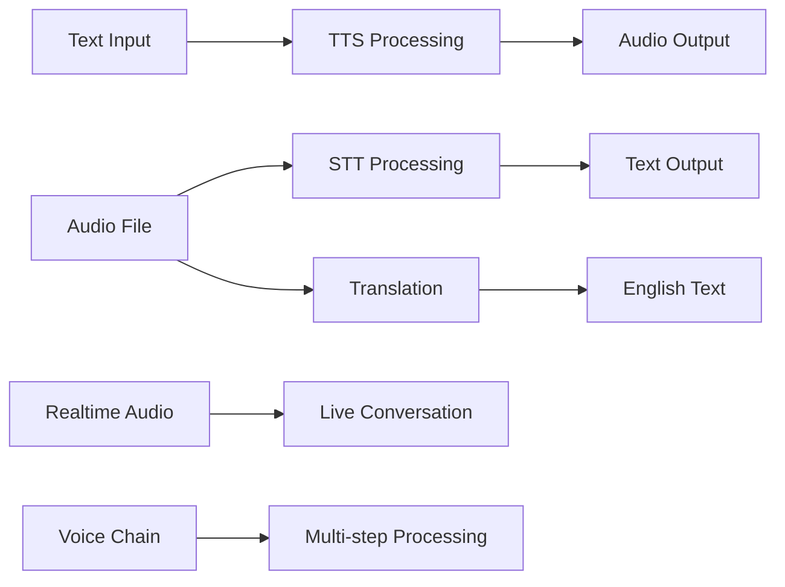
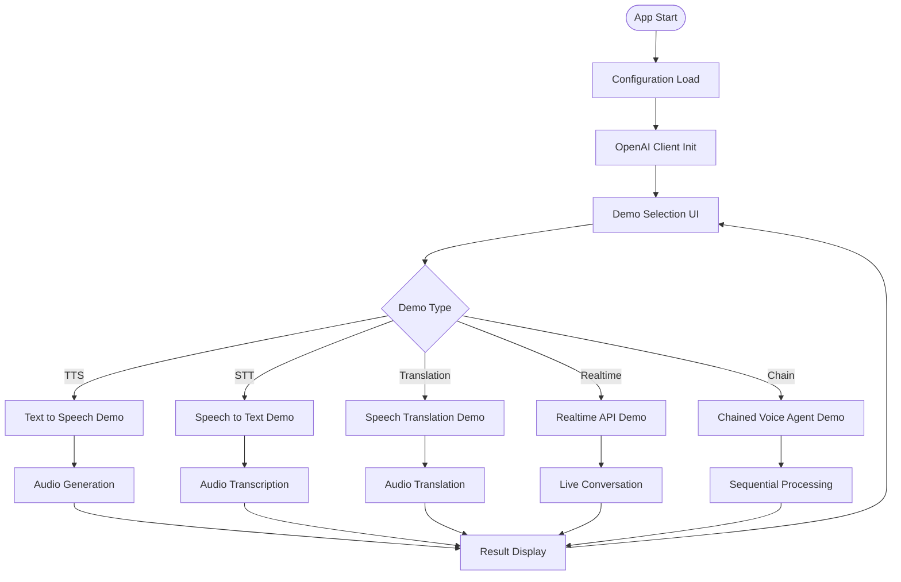
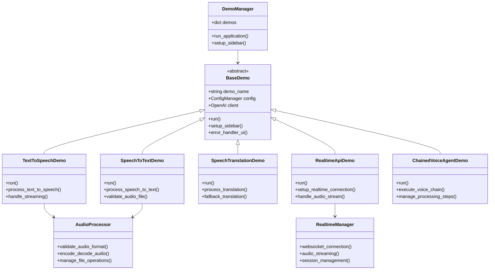
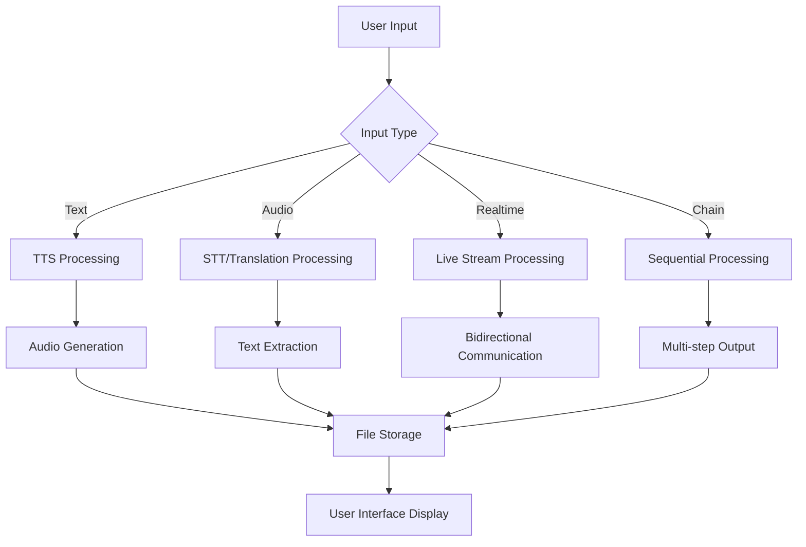
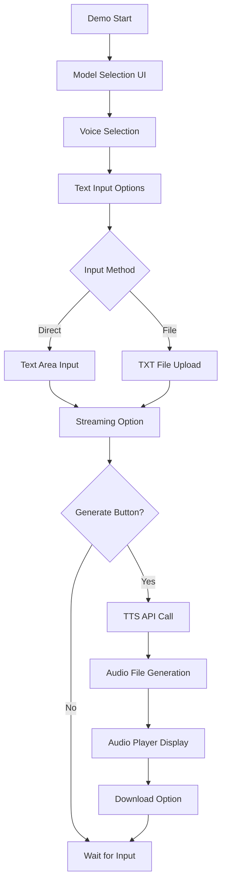
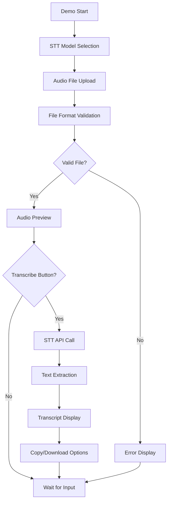
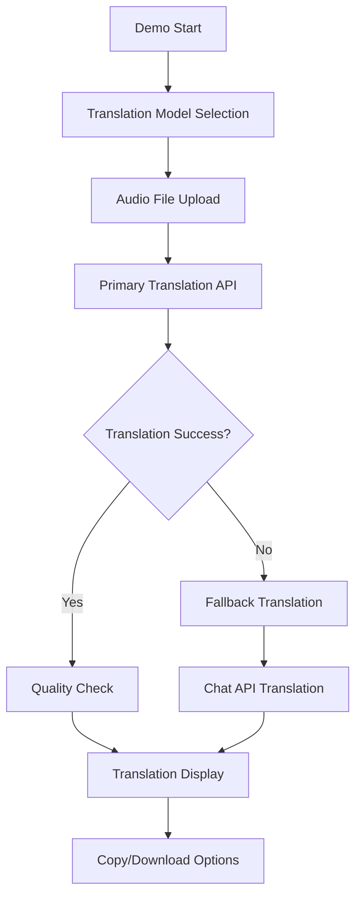
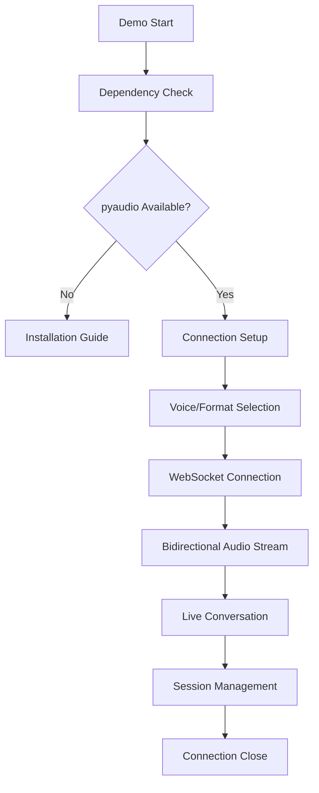
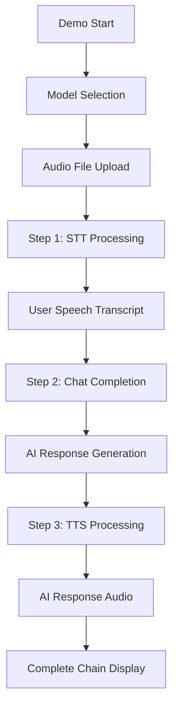
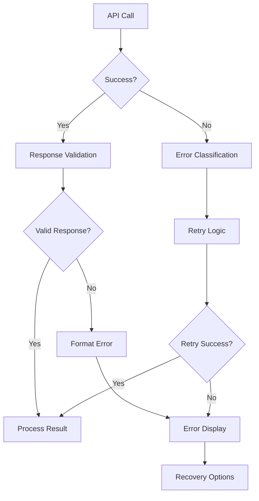

# 📋 a10_04_audio_speeches.py 設計書

## 📝 目次

1. [📖 概要書](#📖-概要書)
2. [🔧 システム構成](#🔧-システム構成)
3. [📋 関数一覧](#📋-関数一覧)
4. [📑 関数詳細設計](#📑-関数詳細設計)
5. [⚙️ 技術仕様](#⚙️-技術仕様)
6. [🚨 エラーハンドリング](#🚨-エラーハンドリング)

---

## 📖 概要書

### 🎯 処理の概要

**OpenAI Audio & Speech API 統合処理アプリケーション**

本アプリケーションは、OpenAI Audio APIの包括的な機能を統合したStreamlit Webアプリケーションです。テキスト読み上げ（TTS）、音声テキスト変換（STT）、音声翻訳、リアルタイムAPI、連鎖音声エージェントなど、音声処理の全般的なワークフローを体験・学習できます。

#### 🌟 主要機能

| 機能 | 説明 |
|------|------|
| 🎤 **Text to Speech** | テキストをリアルタイムストリーミング音声変換 |
| 📝 **Speech to Text** | 音声ファイルの高精度テキスト変換 |
| 🌐 **Speech Translation** | 音声の英語翻訳・フォールバック機能付き |
| 🔄 **Realtime API** | WebSocket双方向リアルタイム音声対話 |
| 🤖 **Chained Voice Agent** | 音声→テキスト→Chat→音声の連鎖処理 |
| 📁 **ファイル管理** | 音声・テキストファイルの統合管理 |
| 💰 **コスト計算** | リアルタイムコスト推定・使用量追跡 |

#### 🎨 処理対象データ



### 🔄 mainの処理の流れ



---

## 🔧 システム構成

### 📦 主要コンポーネント



### 📋 データフロー



---

## 📋 関数一覧

### 🏗️ アプリケーション制御関数

| 関数名 | 分類 | 処理概要 | 重要度 |
|--------|------|----------|---------|
| `main()` | 🎯 制御 | アプリケーション起動・デモ管理 | ⭐⭐⭐ |
| `DemoManager.run_application()` | 🎯 制御 | デモ統合管理・実行制御 | ⭐⭐⭐ |
| `BaseDemo.__init__()` | 🔧 初期化 | 基底クラス初期化・設定管理 | ⭐⭐⭐ |

### 🎤 音声処理デモ関数

#### TextToSpeechDemo
| 関数名 | 分類 | 処理概要 | 重要度 |
|--------|------|----------|---------|
| `TextToSpeechDemo.run()` | 🎯 実行 | テキスト音声変換デモ実行 | ⭐⭐⭐ |
| `process_text_to_speech()` | 🔄 処理 | TTS API呼び出し・音声生成 | ⭐⭐⭐ |

#### SpeechToTextDemo
| 関数名 | 分類 | 処理概要 | 重要度 |
|--------|------|----------|---------|
| `SpeechToTextDemo.run()` | 🎯 実行 | 音声テキスト変換デモ実行 | ⭐⭐⭐ |
| `process_speech_to_text()` | 🔄 処理 | STT API呼び出し・転写処理 | ⭐⭐⭐ |

#### SpeechTranslationDemo
| 関数名 | 分類 | 処理概要 | 重要度 |
|--------|------|----------|---------|
| `SpeechTranslationDemo.run()` | 🎯 実行 | 音声翻訳デモ実行 | ⭐⭐⭐ |
| `process_translation()` | 🔄 処理 | 音声翻訳・フォールバック処理 | ⭐⭐⭐ |

#### RealtimeApiDemo
| 関数名 | 分類 | 処理概要 | 重要度 |
|--------|------|----------|---------|
| `RealtimeApiDemo.run()` | 🎯 実行 | リアルタイムAPIデモ実行 | ⭐⭐⭐ |
| `setup_realtime_connection()` | 🔄 接続 | WebSocket接続・セッション管理 | ⭐⭐⭐ |

#### ChainedVoiceAgentDemo
| 関数名 | 分類 | 処理概要 | 重要度 |
|--------|------|----------|---------|
| `ChainedVoiceAgentDemo.run()` | 🎯 実行 | 連鎖音声エージェントデモ | ⭐⭐⭐ |
| `execute_voice_chain()` | 🔄 処理 | 3段階音声処理の連鎖実行 | ⭐⭐⭐ |

---

## 📑 関数詳細設計

### 🎤 TextToSpeechDemo.run()

#### 🎯 処理概要
テキスト入力からストリーミング対応の高品質音声生成

#### 📊 処理の流れ


#### 📋 IPO設計

| 項目 | 内容 |
|------|------|
| **INPUT** | テキスト入力（直接入力/TXTファイル）、音声モデル、音声種類、ストリーミング設定 |
| **PROCESS** | テキスト検証 → TTS API呼び出し → ストリーミング音声生成 → MP3ファイル作成 |
| **OUTPUT** | MP3音声ファイル、音声プレイヤー、ダウンロードリンク、処理統計 |

#### 🔍 TTS API呼び出しパターン
```python
# ストリーミングTTS
with client.audio.speech.with_streaming_response.create(
    model=model,
    voice=voice,
    input=text
) as response:
    response.stream_to_file(output_path)

# 標準TTS
response = client.audio.speech.create(
    model=model,
    voice=voice,
    input=text
)
```

---

### 📝 SpeechToTextDemo.run()

#### 🎯 処理概要
音声ファイルの高精度テキスト転写・メタデータ付き出力

#### 📊 処理の流れ


#### 📋 IPO設計

| 項目 | 内容 |
|------|------|
| **INPUT** | 音声ファイル（MP3/WAV/M4A、≤25MB）、STTモデル選択 |
| **PROCESS** | ファイル検証 → 音声プレビュー → STT API呼び出し → 転写処理 |
| **OUTPUT** | 転写テキスト、メタデータ、コピー・ダウンロード機能 |

#### 🔍 STT API呼び出しパターン
```python
with open(audio_file, "rb") as f:
    transcript = client.audio.transcriptions.create(
        model=model,
        file=f,
        response_format="text"
    )
```

---

### 🌐 SpeechTranslationDemo.run()

#### 🎯 処理概要
音声ファイルの英語翻訳・フォールバック機能付き品質保証

#### 📊 処理の流れ


#### 📋 IPO設計

| 項目 | 内容 |
|------|------|
| **INPUT** | 音声ファイル、翻訳モデル選択 |
| **PROCESS** | 主要翻訳API → 品質確認 → フォールバック処理 → 結果統合 |
| **OUTPUT** | 英語翻訳テキスト、翻訳メタデータ、品質情報 |

---

### 🔄 RealtimeApiDemo.run()

#### 🎯 処理概要
WebSocket双方向リアルタイム音声対話システム

#### 📊 処理の流れ


#### 📋 IPO設計

| 項目 | 内容 |
|------|------|
| **INPUT** | リアルタイムマイク音声、音声設定、VAD設定 |
| **PROCESS** | WebSocket接続 → 双方向音声ストリーミング → リアルタイム処理 |
| **OUTPUT** | リアルタイム音声応答、ライブ会話セッション |

#### 🔍 リアルタイムAPI接続パターン
```python
async with async_client.beta.realtime.connect(
    model="gpt-4o-realtime-preview"
) as conn:
    await conn.session.update(session={
        "voice": voice,
        "input_audio_format": "pcm16",
        "turn_detection": {"type": "server_vad"}
    })
```

---

### 🤖 ChainedVoiceAgentDemo.run()

#### 🎯 処理概要
音声→テキスト→Chat→音声の3段階連鎖処理エージェント

#### 📊 処理の流れ


#### 📋 IPO設計

| 項目 | 内容 |
|------|------|
| **INPUT** | 音声ファイル、STT/TTSモデル選択、音声種類選択 |
| **PROCESS** | ステップ1（STT）→ ステップ2（Chat）→ ステップ3（TTS）の連鎖実行 |
| **OUTPUT** | ユーザー転写、AIテキスト応答、AI音声応答、全ステップファイル |

---

## ⚙️ 技術仕様

### 📦 依存ライブラリ

| ライブラリ | バージョン | 用途 | 重要度 |
|-----------|-----------|------|---------|
| `streamlit` | 最新 | 🎨 Web UIフレームワーク | ⭐⭐⭐ |
| `openai` | 最新 | 🤖 OpenAI API SDK (sync/async) | ⭐⭐⭐ |
| `pyaudio` | 最新 | 🎤 リアルタイム音声キャプチャ | ⭐⭐⭐ |
| `simpleaudio` | 最新 | 🔊 音声再生機能 | ⭐⭐⭐ |
| `tiktoken` | 最新 | 🔢 トークン計算・管理 | ⭐⭐ |
| `asyncio` | 標準 | 🔄 非同期処理 | ⭐⭐⭐ |
| `base64` | 標準 | 🔤 音声データエンコード | ⭐⭐ |

### 🗃️ 音声API仕様

#### 📋 対応モデル

```yaml
TTS_Models:
  standard: ["tts-1", "gpt-4o-mini-tts"]
  hd: ["tts-1-hd"]
  voices: ["alloy", "nova", "echo", "onyx", "shimmer"]
  max_chars: 4096
  
STT_Models:
  whisper: ["whisper-1"]
  transcribe: ["gpt-4o-transcribe"]
  formats: ["mp3", "wav", "m4a"]
  max_size_mb: 25

Translation_Models:
  primary: ["whisper-1", "gpt-4o-transcribe"]
  fallback: ["gpt-4o-mini"]

Realtime_Models:
  supported: ["gpt-4o-realtime-preview"]
  audio_format: "pcm16"
  sample_rate: 16000
```

#### 💰 コスト計算

```yaml
Pricing:
  tts-1: "$0.015 / 1K chars"
  tts-1-hd: "$0.030 / 1K chars"
  whisper-1: "$0.006 / minute"
  gpt-4o-transcribe: "$0.010 / minute"
  realtime: "usage-based pricing"
```

### 🔄 API統合パターン

#### 🎤 TTS API統合パターン

```python
# ストリーミングTTS（推奨）
with client.audio.speech.with_streaming_response.create(
    model=model,
    voice=voice,
    input=text
) as response:
    response.stream_to_file(output_path)

# 標準TTS
response = client.audio.speech.create(
    model=model,
    voice=voice, 
    input=text
)
```

#### 📝 STT API統合パターン

```python
# 音声転写
with open(audio_file, "rb") as f:
    transcript = client.audio.transcriptions.create(
        model=model,
        file=f,
        response_format="text"
    )

# 音声翻訳
with open(audio_file, "rb") as f:
    translation = client.audio.translations.create(
        model="whisper-1",
        file=f,
        response_format="text"
    )
```

### 💾 ファイル管理

#### 🗂️ ファイルシステム構造

```yaml
File_Structure:
  DATA_DIR/                    # 設定可能データディレクトリ
    audio/                     # 音声ファイル
      - input_audio.mp3
      - generated_speech.mp3
    text/                      # テキストファイル  
      - input_text.txt
      - transcript.txt
    temp/                      # 一時ファイル
      - session_audio.wav
```

#### ⚙️ ファイル操作機能

```python
# サポート形式
AUDIO_FORMATS = [".mp3", ".wav", ".m4a"]
TEXT_FORMATS = [".txt"]

# ファイルサイズ制限
MAX_AUDIO_SIZE_MB = 25
MAX_TEXT_CHARS = 4096

# 自動ディレクトリ作成
Path(DATA_DIR).mkdir(exist_ok=True)
```

---

## 🚨 エラーハンドリング

### 📄 エラー分類

| エラー種別 | 原因 | 対処法 | 影響度 |
|-----------|------|--------|---------|
| **音声ファイル形式エラー** | 🚫 非対応形式・破損ファイル | サポート形式説明・ファイル確認 | 🔴 高 |
| **ファイルサイズ超過** | 📁 25MB制限超過 | ファイル圧縮・分割提案 | 🔴 高 |
| **API呼び出し失敗** | 🌐 通信・制限・認証問題 | 認証確認・制限説明・リトライ | 🔴 高 |
| **pyaudio依存関係エラー** | 📦 ライブラリ未インストール | インストール手順・代替案提示 | 🟡 中 |
| **リアルタイム接続失敗** | 🔄 WebSocket・ネットワーク問題 | 接続確認・設定見直し | 🟡 中 |
| **音声再生エラー** | 🔊 オーディオデバイス問題 | デバイス確認・代替方法 | 🟠 低 |

### 🛠️ エラー処理戦略

#### 🔧 段階的エラー処理



#### ✅ エラーメッセージ例

```python
# 音声ファイルエラー
st.error("❌ 音声ファイルの処理に失敗しました")
st.info("💡 対応形式: MP3, WAV, M4A（最大25MB）")

# pyaudio依存関係エラー
st.error("❌ pyaudioライブラリが見つかりません")
st.code("pip install pyaudio")
st.warning("⚠️ リアルタイムAPI機能は利用できません")

# API制限エラー
st.error("❌ API制限に達しました")
st.info("💡 対処法: しばらく待ってから再実行してください")
```

#### 🔄 リトライ機構

```python
# 指数バックオフ付きリトライ
@retry(
    retry_strategy=ExponentialBackoff(),
    max_attempts=3,
    exceptions=(APIError, ConnectionError)
)
def api_call_with_retry():
    return client.audio.speech.create(...)

# フォールバック処理
try:
    # 主要API呼び出し
    result = primary_api_call()
except Exception:
    # フォールバック処理
    result = fallback_api_call()
```

### 🎯 デバッグ機能

```python
# デバッグ情報パネル  
with st.expander("🐛 デバッグ情報"):
    st.json({
        "model": selected_model,
        "voice": selected_voice,
        "file_size": file_size,
        "processing_time": processing_time,
        "api_response": api_response_dict
    })

# パフォーマンス監視
performance_metrics = {
    "processing_time": end_time - start_time,
    "file_size_mb": file_size / (1024 * 1024),
    "characters_processed": len(text),
    "estimated_cost": calculate_cost(model, usage)
}
```

---

## 🎉 まとめ

この設計書は、**a10_04_audio_speeches.py** の包括的な技術仕様と実装詳細を網羅した完全ドキュメントです。

### 🌟 設計のハイライト

- **🎵 包括的音声処理**: TTS・STT・翻訳・リアルタイム・チェーンの全機能統合
- **🔄 ストリーミング対応**: 高効率リアルタイム音声処理
- **🛡️ 堅牢性**: 包括的エラーハンドリングとフォールバック機能
- **💰 コスト透明性**: リアルタイムコスト計算・使用量追跡
- **🎨 直感的UI**: Streamlitによる使いやすいインターフェース

### 🔧 アーキテクチャ特徴

- **📦 モジュール設計**: BaseDemo継承による統一インターフェース
- **🔄 非同期処理**: リアルタイムAPIでの高性能WebSocket通信
- **📁 ファイル統合管理**: 音声・テキストファイルの統一的管理システム
- **⚙️ 設定駆動**: config.ymlによる柔軟なモデル・パラメータ管理
- **🎯 段階的複雑度**: 基本機能から高度なリアルタイム処理まで対応