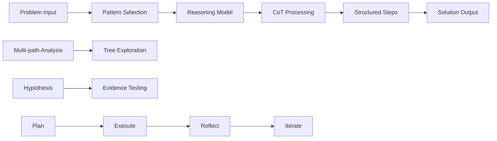
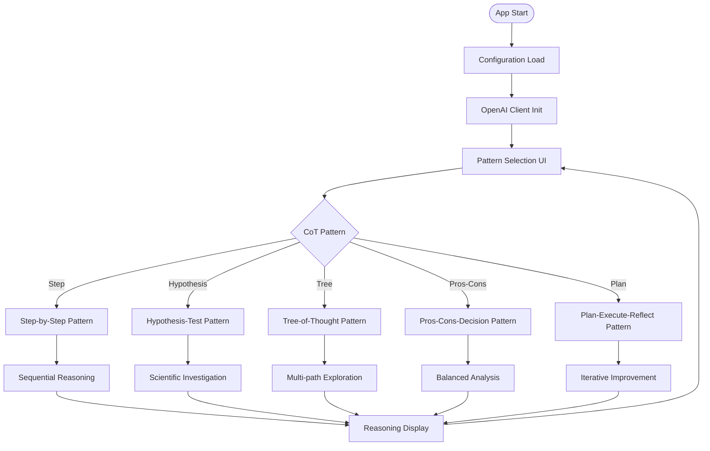
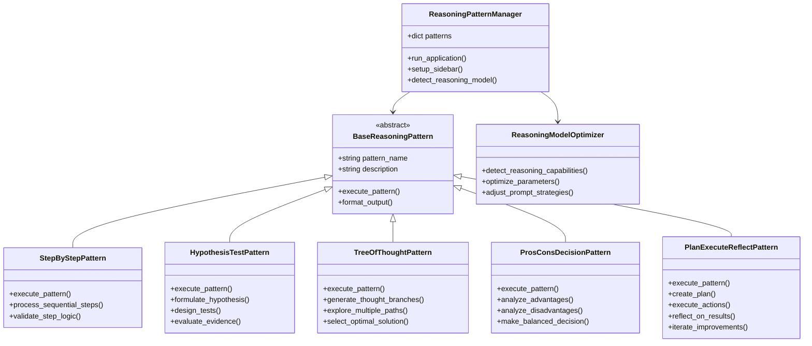
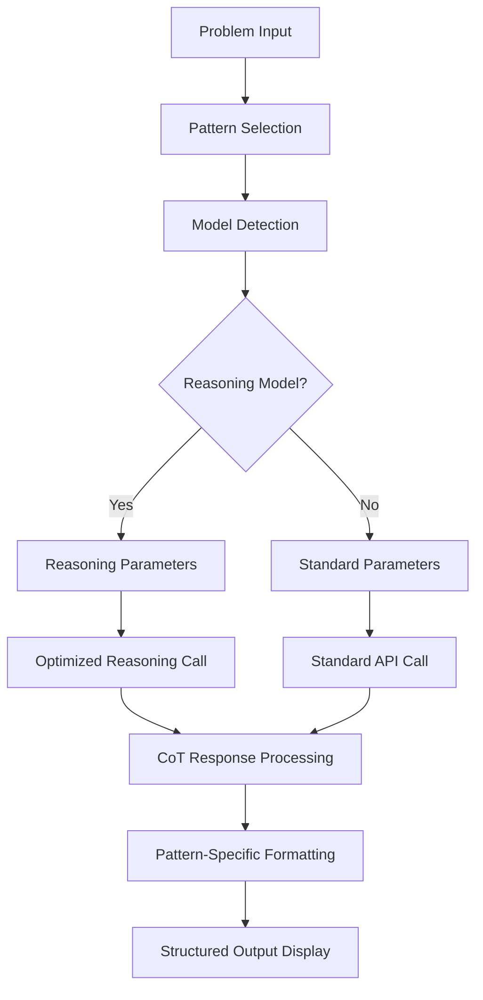
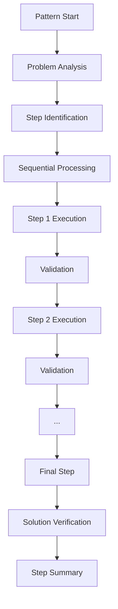
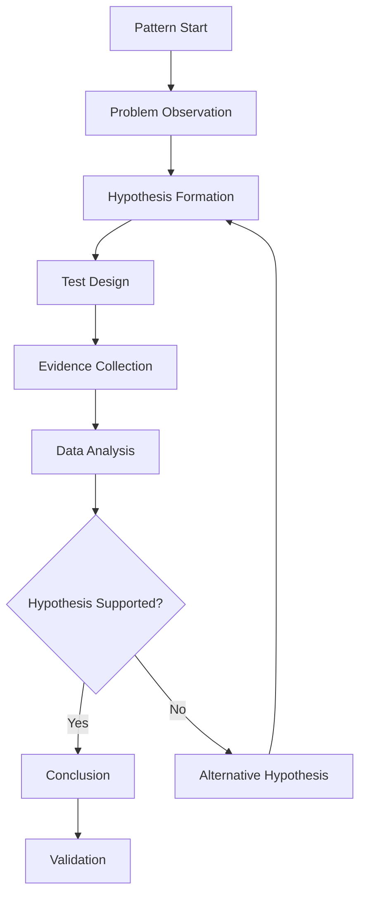
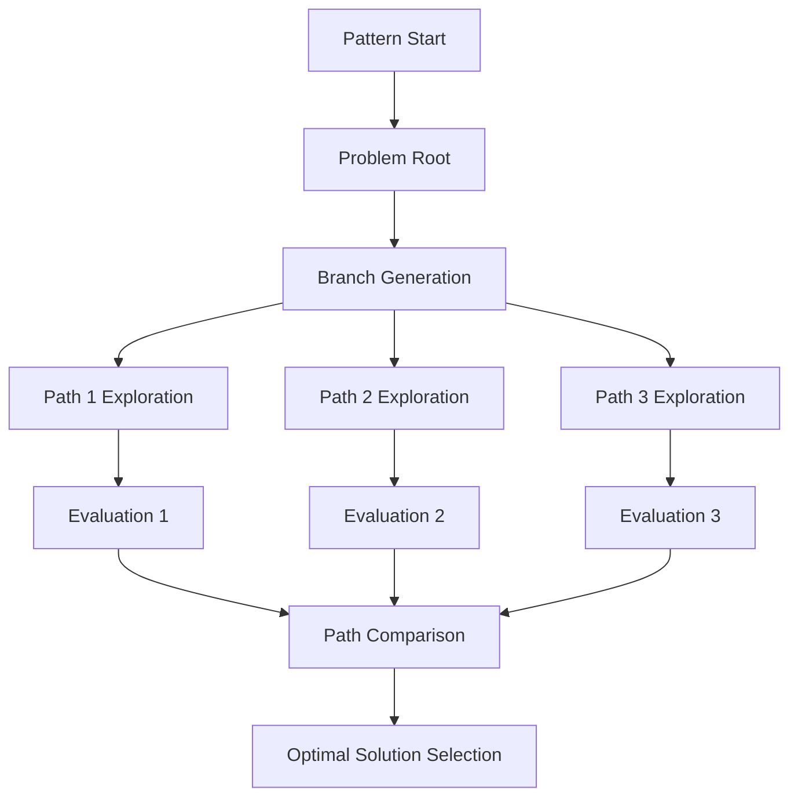
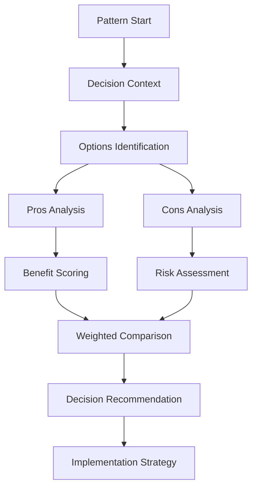
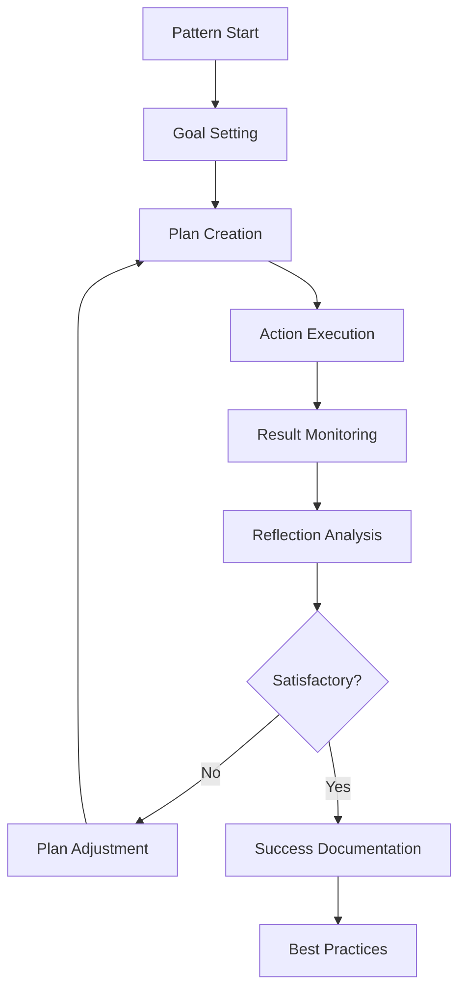
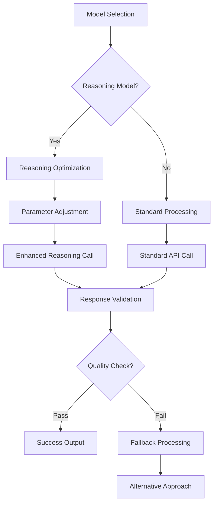

# 📋 a10_06_reasoning_chain_of_thought.py 設計書

## 📝 目次

1. [📖 概要書](#📖-概要書)
2. [🔧 システム構成](#🔧-システム構成)
3. [📋 関数一覧](#📋-関数一覧)
4. [📑 関数詳細設計](#📑-関数詳細設計)
5. [⚙️ 技術仕様](#⚙️-技術仕様)
6. [🚨 エラーハンドリング](#🚨-エラーハンドリング)

---

## 📖 概要書

### 🎯 処理の概要

**OpenAI 推論：Chain of Thought 5パターン学習アプリケーション**

本アプリケーションは、OpenAI Responses APIの推論機能を活用し、5つの異なるChain of Thought（思考の連鎖）パターンを実践的に学習できるインタラクティブなデモシステムです。各パターンは特定の問題解決アプローチに特化しており、推論モデル（o1/o3/o4シリーズ）の最適な活用方法を体系的に習得できます。

#### 🌟 主要機能

| 機能 | 説明 |
|------|------|
| 🔢 **Step-by-Step** | 逐次展開型：数学・アルゴリズム問題の段階的解法 |
| 🧪 **Hypothesis-Test** | 仮説検証型：科学的調査・バグ解析の仮説検証 |
| 🌳 **Tree-of-Thought** | 分岐探索型：複数思考経路による最適解発見 |
| ⚖️ **Pros-Cons-Decision** | 賛否比較型：メリデメ分析による合理的決定 |
| 🔄 **Plan-Execute-Reflect** | 反復改良型：計画→実行→振り返りの継続改善 |
| 🤖 **推論モデル最適化** | o1/o3/o4シリーズの自動検出・パラメータ最適化 |

### 📋 サブプログラムの一覧表

| プログラム名 | クラス・関数名 | 処理概要 |
|-------------|-------------|----------|
| a10_06_reasoning_chain_of_thought.py | BaseDemo | ベースデモクラス（統一化版） |
| | StepByStepReasoningDemo | 段階的推論（Step-by-Step）デモ |
| | HypothesisTestDemo | 仮説検証推論デモ |
| | TreeOfThoughtDemo | 思考の木（Tree of Thought）デモ |
| | ProsConsDecisionDemo | 賛否比較決定（Pros-Cons-Decision）デモ |
| | PlanExecuteReflectDemo | 計画実行振り返り（Plan-Execute-Reflect）デモ |
| | DemoManager | デモ管理クラス（統一化版） |

#### 🎨 処理対象データ



### 🔄 mainの処理の流れ



---

## 🔧 システム構成

### 📦 主要コンポーネント



### 📋 データフロー



---

## 📋 関数一覧

### 🏗️ アプリケーション制御関数

| 関数名 | 分類 | 処理概要 | 重要度 |
|--------|------|----------|---------|
| `main()` | 🎯 制御 | アプリケーション起動・パターン選択管理 | ⭐⭐⭐ |
| `ReasoningPatternManager.run_application()` | 🎯 制御 | パターン統合管理・実行制御 | ⭐⭐⭐ |
| `detect_reasoning_model()` | 🔍 検出 | 推論モデル自動検出・最適化 | ⭐⭐⭐ |

### 🧠 推論パターン実装関数

#### StepByStepPattern
| 関数名 | 分類 | 処理概要 | 重要度 |
|--------|------|----------|---------|
| `StepByStepPattern.execute_pattern()` | 🎯 実行 | 段階的思考パターン実行 | ⭐⭐⭐ |
| `process_sequential_steps()` | 🔄 処理 | 逐次ステップ処理・検証 | ⭐⭐⭐ |

#### HypothesisTestPattern
| 関数名 | 分類 | 処理概要 | 重要度 |
|--------|------|----------|---------|
| `HypothesisTestPattern.execute_pattern()` | 🎯 実行 | 仮説検証パターン実行 | ⭐⭐⭐ |
| `formulate_hypothesis()` | 🧪 仮説 | 仮説立案・検証設計 | ⭐⭐⭐ |

#### TreeOfThoughtPattern
| 関数名 | 分類 | 処理概要 | 重要度 |
|--------|------|----------|---------|
| `TreeOfThoughtPattern.execute_pattern()` | 🎯 実行 | 分岐思考パターン実行 | ⭐⭐⭐ |
| `explore_multiple_paths()` | 🌳 探索 | 複数経路探索・最適解選択 | ⭐⭐⭐ |

#### ProsConsDecisionPattern
| 関数名 | 分類 | 処理概要 | 重要度 |
|--------|------|----------|---------|
| `ProsConsDecisionPattern.execute_pattern()` | 🎯 実行 | 賛否分析パターン実行 | ⭐⭐⭐ |
| `make_balanced_decision()` | ⚖️ 決定 | バランス分析・合理的決定 | ⭐⭐⭐ |

#### PlanExecuteReflectPattern
| 関数名 | 分類 | 処理概要 | 重要度 |
|--------|------|----------|---------|
| `PlanExecuteReflectPattern.execute_pattern()` | 🎯 実行 | 計画実行反省パターン実行 | ⭐⭐⭐ |
| `iterate_improvements()` | 🔄 反復 | 継続改善・最適化処理 | ⭐⭐⭐ |

---

## 📑 関数詳細設計

### 🔢 StepByStepPattern.execute_pattern()

#### 🎯 処理概要
数学・アルゴリズム問題の段階的解法による逐次展開型思考

#### 📊 処理の流れ


#### 📋 IPO設計

| 項目 | 内容 |
|------|------|
| **INPUT** | 数学問題・アルゴリズム課題、推論レベル設定 |
| **PROCESS** | 問題分析 → ステップ分解 → 逐次実行 → 検証 → 統合 |
| **OUTPUT** | 段階的解法ステップ、各ステップ説明、最終解答 |

#### 🔍 推論プロンプト戦略
```python
step_by_step_prompt = """
以下の問題を段階的に解いてください：

{problem}

要求事項：
1. 各ステップを明確に番号付けしてください
2. 各ステップの理由を説明してください  
3. 計算過程を詳細に示してください
4. 最終答えを明確に示してください

形式：
ステップ1: [処理内容]
理由: [なぜこのステップが必要か]
計算: [詳細な計算過程]
結果: [このステップの結果]
"""
```

---

### 🧪 HypothesisTestPattern.execute_pattern()

#### 🎯 処理概要
科学的調査・バグ解析における仮説検証型思考プロセス

#### 📊 処理の流れ


#### 📋 IPO設計

| 項目 | 内容 |
|------|------|
| **INPUT** | 調査対象・問題現象、仮説設定指針 |
| **PROCESS** | 観察 → 仮説立案 → 検証設計 → 証拠収集 → 結論導出 |
| **OUTPUT** | 仮説、検証方法、証拠分析、結論 |

#### 🔍 仮説検証プロンプト戦略
```python
hypothesis_test_prompt = """
以下の現象について仮説検証アプローチで分析してください：

{problem}

検証手順：
1. 現象の観察と問題定義
2. 可能性の高い仮説を3つ立案
3. 各仮説の検証方法を設計
4. 予想される証拠を整理
5. 最も有力な仮説を選択
6. 結論と次のアクション

科学的思考プロセスを重視してください。
"""
```

---

### 🌳 TreeOfThoughtPattern.execute_pattern()

#### 🎯 処理概要
複数の思考経路を並行探索し最適解を発見する分岐探索型思考

#### 📊 処理の流れ


#### 📋 IPO設計

| 項目 | 内容 |
|------|------|
| **INPUT** | 複雑な問題・最適化課題、探索範囲設定 |
| **PROCESS** | 分岐生成 → 並行探索 → 評価比較 → 最適解選択 |
| **OUTPUT** | 複数思考経路、各経路評価、最適解、選択理由 |

#### 🔍 分岐探索プロンプト戦略
```python
tree_of_thought_prompt = """
以下の問題に対してTree of Thoughtアプローチで解決してください：

{problem}

思考構造：
1. 問題の根本分析
2. 3つの異なるアプローチを並行開発
   - アプローチA: [方向性1]
   - アプローチB: [方向性2]  
   - アプローチC: [方向性3]
3. 各アプローチの展開と評価
4. 比較分析（効率性、実現可能性、リスク）
5. 最適解の選択と統合

創造的で多角的な思考を展開してください。
"""
```

---

### ⚖️ ProsConsDecisionPattern.execute_pattern()

#### 🎯 処理概要
メリット・デメリット分析による合理的意思決定支援

#### 📊 処理の流れ


#### 📋 IPO設計

| 項目 | 内容 |
|------|------|
| **INPUT** | 意思決定課題・選択肢、評価基準 |
| **PROCESS** | 選択肢整理 → 利点分析 → 欠点分析 → 重み付け評価 → 決定 |
| **OUTPUT** | 利点・欠点一覧、評価スコア、推奨決定、実装案 |

#### 🔍 賛否分析プロンプト戦略
```python
pros_cons_prompt = """
以下の意思決定についてPros-Cons分析を行ってください：

{problem}

分析フレームワーク：
1. 決定コンテキストの明確化
2. 主要選択肢の特定（2-3個）
3. 各選択肢のメリット分析
   - 短期的利益
   - 長期的価値
   - 機会創出
4. 各選択肢のデメリット分析
   - リスクと制約
   - コストと負担
   - 潜在的問題
5. 重み付け評価（重要度×影響度）
6. 推奨決定と理由
7. 実装戦略

客観的で体系的な分析を行ってください。
"""
```

---

### 🔄 PlanExecuteReflectPattern.execute_pattern()

#### 🎯 処理概要
計画→実行→振り返りの反復改良による継続的最適化

#### 📊 処理の流れ


#### 📋 IPO設計

| 項目 | 内容 |
|------|------|
| **INPUT** | プロジェクト・改善課題、目標設定 |
| **PROCESS** | 計画策定 → 実行シミュレーション → 結果評価 → 改善点抽出 → 反復 |
| **OUTPUT** | 実行計画、実行結果、振り返り分析、改善提案 |

#### 🔍 計画実行反省プロンプト戦略
```python
plan_execute_reflect_prompt = """
以下の課題にPlan-Execute-Reflectアプローチで取り組んでください：

{problem}

PDCAサイクル：
1. Plan（計画）
   - 明確な目標設定
   - 具体的アクションプラン
   - 成功指標の定義
   - リスクと対策

2. Execute（実行）
   - アクション実行のシミュレーション
   - 予想される結果
   - 発生可能な問題

3. Reflect（振り返り）
   - 結果の評価分析
   - 学んだ教訓
   - 改善ポイント

4. Improve（改善）
   - 次回への改善提案
   - ベストプラクティス

継続的改善の思考で進めてください。
"""
```

---

## ⚙️ 技術仕様

### 📦 依存ライブラリ

| ライブラリ | バージョン | 用途 | 重要度 |
|-----------|-----------|------|---------|
| `streamlit` | 最新 | 🎨 Web UIフレームワーク | ⭐⭐⭐ |
| `openai` | 最新 | 🤖 OpenAI API SDK | ⭐⭐⭐ |
| `helper_st` | カスタム | 🎨 UI統合ヘルパー | ⭐⭐⭐ |
| `helper_api` | カスタム | 🔧 API管理ヘルパー | ⭐⭐⭐ |

### 🗃️ 推論モデル対応仕様

#### 📋 推論モデル検出・最適化

```yaml
Reasoning_Models:
  detection_keywords: ["o1", "o3", "o4"]
  supported_series:
    - "o1"
    - "o1-pro" 
    - "o3"
    - "o3-deep-research"
    - "o4"
    - "o4-mini"
    
  parameter_optimization:
    temperature: null  # 推論モデルでは無効
    max_tokens: "auto"  # モデル依存
    reasoning_effort: "medium"  # o3シリーズのみ
```

#### 🔄 推論API呼び出しパターン

```python
def is_reasoning_model(model_name: str) -> bool:
    """推論モデル検出"""
    reasoning_indicators = ["o1", "o3", "o4"]
    return any(indicator in model_name.lower() 
               for indicator in reasoning_indicators)

# 推論モデル用API呼び出し
if is_reasoning_model(selected_model):
    api_params = {
        "model": selected_model,
        "input": messages,
        # temperature不使用
    }
    
    # o3シリーズの場合
    if "o3" in selected_model:
        api_params["reasoning"] = {"effort": "medium"}
        
else:
    # 標準モデル用
    api_params = {
        "model": selected_model,
        "input": messages,
        "temperature": 0.7
    }

response = client.responses.create(**api_params)
```

### 🧠 思考パターン定義

#### 📋 パターン分類体系

```yaml
CoT_Patterns:
  analytical:
    - "step_by_step"
    - "hypothesis_test"
  
  exploratory:
    - "tree_of_thought"
    
  evaluative:
    - "pros_cons_decision"
    
  iterative:
    - "plan_execute_reflect"

Pattern_Applications:
  mathematical: ["step_by_step"]
  scientific: ["hypothesis_test"]
  optimization: ["tree_of_thought"]
  decision_making: ["pros_cons_decision"]
  project_management: ["plan_execute_reflect"]
```

#### ⚙️ パターン設定管理

```python
REASONING_PATTERNS = {
    "step_by_step": {
        "name": "Step-by-Step（逐次展開型）",
        "description": "問題を順序立てて段階的に解決",
        "best_for": ["数学問題", "アルゴリズム", "論理的推論"],
        "complexity": "低",
        "token_efficiency": "高"
    },
    
    "hypothesis_test": {
        "name": "Hypothesis-Test（仮説検証型）", 
        "description": "仮説を立てて証拠で検証する科学的アプローチ",
        "best_for": ["バグ解析", "実験計画", "根本原因分析"],
        "complexity": "中",
        "token_efficiency": "中"
    },
    
    "tree_of_thought": {
        "name": "Tree-of-Thought（分岐探索型）",
        "description": "複数の思考経路を探索して最適解を発見",
        "best_for": ["複雑な最適化", "創造的問題解決", "戦略立案"],
        "complexity": "高",
        "token_efficiency": "低"
    }
}
```

---

## 🚨 エラーハンドリング

### 📄 エラー分類

| エラー種別 | 原因 | 対処法 | 影響度 |
|-----------|------|--------|---------|
| **推論モデル非対応** | 🚫 非推論モデル選択 | 推論対応モデル提案 | 🟡 中 |
| **思考パターン失敗** | 🧠 複雑度過多・制約違反 | パターン簡略化・代替提案 | 🟡 中 |
| **トークン制限超過** | 📏 長大な推論過程 | 思考範囲調整・分割処理 | 🔴 高 |
| **API呼び出しタイムアウト** | ⏱️ 推論時間過多 | タイムアウト延長・簡易化 | 🟡 中 |
| **推論品質不足** | 📉 期待する思考深度不達 | プロンプト調整・モデル変更 | 🟠 低 |

### 🛠️ エラー処理戦略

#### 🔧 推論モデル最適化



#### ✅ エラーメッセージ例

```python
# 推論モデル推奨
if not is_reasoning_model(selected_model):
    st.warning("⚠️ より良い結果のために推論モデル（o1/o3/o4シリーズ）の使用をお勧めします")
    st.info("💡 推奨モデル: o3, o4-mini, o1-pro")

# トークン制限エラー
st.error("❌ 思考プロセスが複雑すぎます")
st.info("💡 対処法: 問題を小分けにするか、より簡単なパターンを選択してください")

# 推論品質不足
st.warning("⚠️ 推論の品質が期待値を下回っています")
st.info("💡 対処法: より具体的な問題設定または上位モデルをお試しください")
```

#### 🔄 自動フォールバック機能

```python
def reasoning_with_fallback(pattern: str, problem: str, model: str):
    """推論処理・フォールバック機能付き"""
    try:
        # 主要推論処理
        if is_reasoning_model(model):
            return execute_reasoning_pattern(pattern, problem, model)
        else:
            # 非推論モデルでの代替処理
            return execute_standard_pattern(pattern, problem, model)
            
    except TokenLimitExceeded:
        # 問題を分割して再処理
        simplified_problem = simplify_problem(problem)
        return execute_reasoning_pattern(pattern, simplified_problem, model)
        
    except ReasoningTimeout:
        # より軽量なパターンに切り替え
        fallback_pattern = get_simpler_pattern(pattern)
        return execute_reasoning_pattern(fallback_pattern, problem, model)
```

### 🎯 品質管理・デバッグ

```python
# 推論品質評価
def evaluate_reasoning_quality(response: str, pattern: str) -> dict:
    """推論品質の自動評価"""
    quality_metrics = {
        "logical_consistency": check_logical_flow(response),
        "step_completeness": check_step_coverage(response, pattern),
        "clarity_score": evaluate_explanation_clarity(response),
        "practical_applicability": assess_practical_value(response)
    }
    return quality_metrics

# デバッグ情報表示
with st.expander("🧠 推論プロセス分析"):
    st.json({
        "selected_pattern": pattern_name,
        "reasoning_model": is_reasoning_model(model),
        "token_usage": response.usage.dict(),
        "reasoning_time": processing_time,
        "quality_score": quality_metrics
    })
```

---

## 🎉 まとめ

この設計書は、**a10_06_reasoning_chain_of_thought.py** の包括的な技術仕様と実装詳細を網羅した完全ドキュメントです。

### 🌟 設計のハイライト

- **🧠 5パターン体系**: 問題解決に特化した5つの思考パターン完全網羅
- **🤖 推論モデル最適化**: o1/o3/o4シリーズの自動検出・パラメータ最適化
- **🎯 教育的設計**: 段階的学習による思考スキル向上支援
- **⚡ 実用性重視**: 実際のビジネス・研究での応用可能なパターン集
- **🛡️ 品質保証**: 推論品質評価と自動フォールバック機能

### 🔧 アーキテクチャ特徴

- **📦 パターンベース設計**: 各思考パターンの独立実装・統一インターフェース
- **🔄 適応的処理**: モデル能力に応じた自動パラメータ調整
- **🎨 直感的学習**: Streamlitによる対話的パターン学習環境
- **⚙️ 拡張性**: 新しい思考パターンの容易な追加・カスタマイズ
- **📊 分析機能**: 推論プロセス・品質の詳細分析・可視化