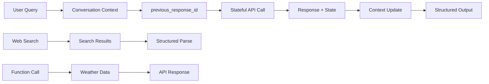
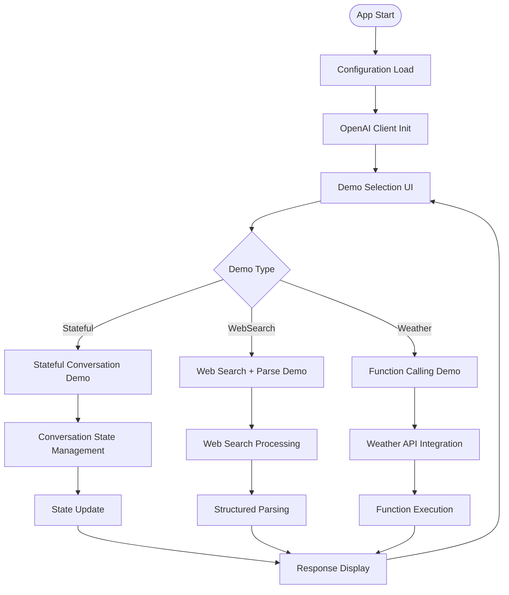
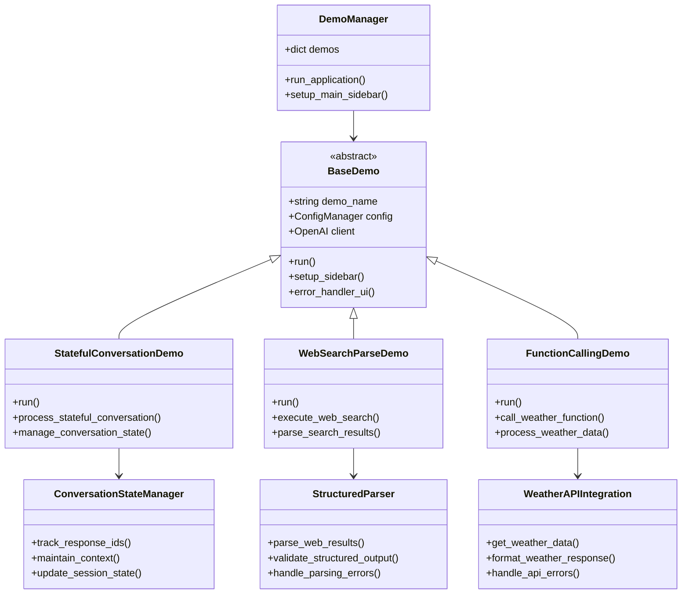
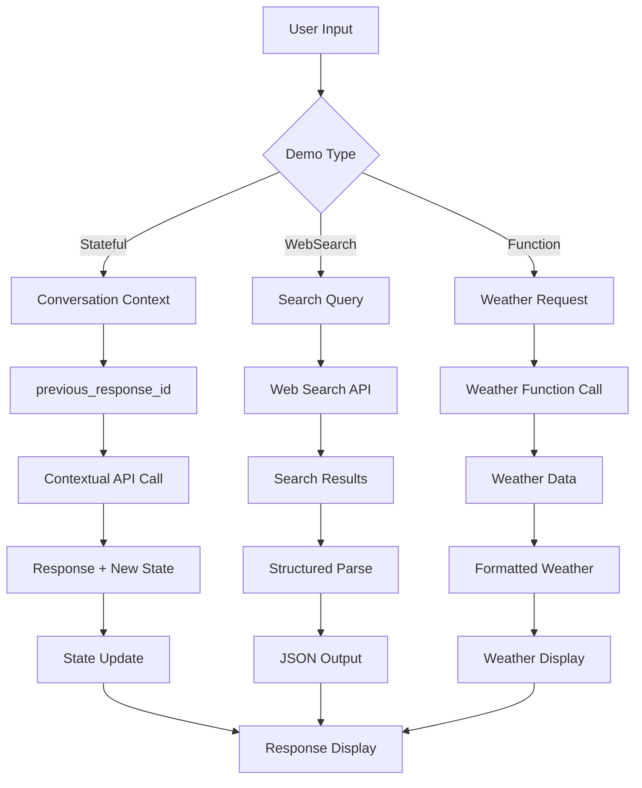
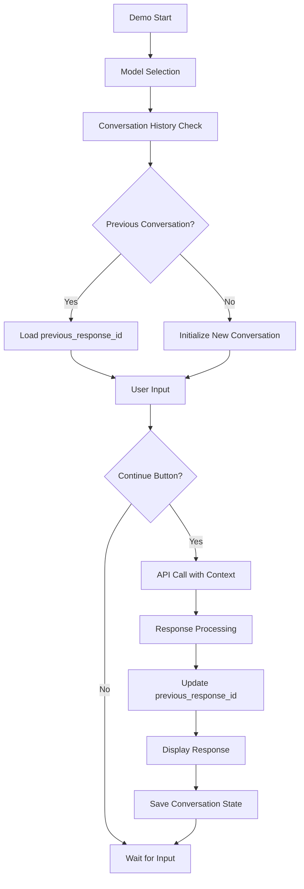
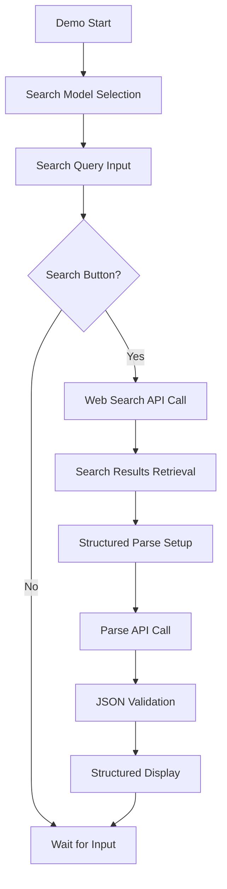
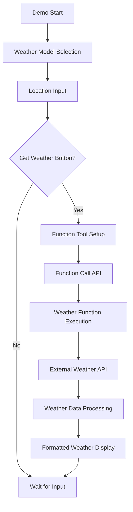
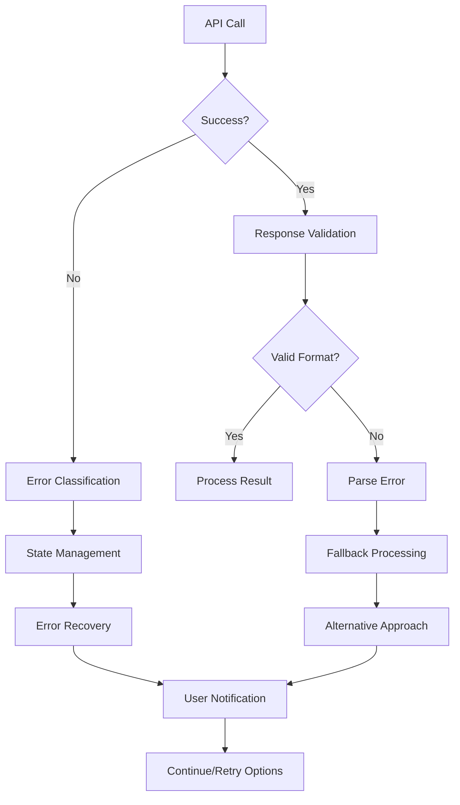

# 📋 a10_05_conversation_state.py 設計書

## 📝 目次

1. [📖 概要書](#📖-概要書)
2. [🔧 システム構成](#🔧-システム構成)
3. [📋 関数一覧](#📋-関数一覧)
4. [📑 関数詳細設計](#📑-関数詳細設計)
5. [⚙️ 技術仕様](#⚙️-技術仕様)
6. [🚨 エラーハンドリング](#🚨-エラーハンドリング)

---

## 📖 概要書

### 🎯 処理の概要

**OpenAI 会話状態管理デモアプリケーション**

本アプリケーションは、OpenAI Responses APIの`previous_response_id`パラメータを活用した高度な会話状態管理システムのデモンストレーションです。ステートフルな対話継続、Web検索ツール統合、外部API連携（天気情報）を通じて、実用的な会話AI システムの構築パターンを学習できます。

#### 🌟 主要機能

| 機能 | 説明 |
|------|------|
| 💬 **ステートフル対話** | `previous_response_id`による会話文脈の継続保持 |
| 🌐 **Web検索統合** | Web検索結果の構造化解析・JSON形式出力 |
| 🌤️ **Function Calling** | 天気APIとの統合・リアルタイム気象データ取得 |
| 📊 **構造化パース** | 非構造化応答の型安全な構造化処理 |
| 🔄 **セッション管理** | 会話履歴の永続化・状態追跡 |
| ⚙️ **モデル最適化** | 推論モデル・標準モデルの自動最適化 |

#### 🎨 処理対象データ



### 🔄 mainの処理の流れ



---

## 🔧 システム構成

### 📦 主要コンポーネント



### 📋 データフロー



---

## 📋 関数一覧

### 🏗️ アプリケーション制御関数

| 関数名 | 分類 | 処理概要 | 重要度 |
|--------|------|----------|---------|
| `main()` | 🎯 制御 | アプリケーション起動・デモ選択管理 | ⭐⭐⭐ |
| `DemoManager.run_application()` | 🎯 制御 | デモ統合管理・実行制御 | ⭐⭐⭐ |
| `BaseDemo.__init__()` | 🔧 初期化 | 基底クラス初期化・設定管理 | ⭐⭐⭐ |

### 💬 会話状態管理関数

| 関数名 | 分類 | 処理概要 | 重要度 |
|--------|------|----------|---------|
| `StatefulConversationDemo.run()` | 🎯 実行 | ステートフル対話デモ実行 | ⭐⭐⭐ |
| `process_stateful_conversation()` | 🔄 処理 | 会話状態継続処理 | ⭐⭐⭐ |
| `manage_conversation_state()` | 📊 管理 | previous_response_id管理 | ⭐⭐⭐ |

### 🌐 Web検索統合関数

| 関数名 | 分類 | 処理概要 | 重要度 |
|--------|------|----------|---------|
| `WebSearchParseDemo.run()` | 🎯 実行 | Web検索・構造化パースデモ | ⭐⭐⭐ |
| `execute_web_search()` | 🔍 検索 | Web検索実行・結果取得 | ⭐⭐⭐ |
| `parse_search_results()` | 📊 解析 | 検索結果の構造化解析 | ⭐⭐⭐ |

### 🌤️ Function Calling関数

| 関数名 | 分類 | 処理概要 | 重要度 |
|--------|------|----------|---------|
| `FunctionCallingDemo.run()` | 🎯 実行 | 天気API統合デモ実行 | ⭐⭐⭐ |
| `call_weather_function()` | 🔄 API | 天気API関数呼び出し | ⭐⭐⭐ |
| `process_weather_data()` | 📊 処理 | 天気データ処理・表示 | ⭐⭐⭐ |

---

## 📑 関数詳細設計

### 💬 StatefulConversationDemo.run()

#### 🎯 処理概要
`previous_response_id`を使用したステートフル対話システムの実装

#### 📊 処理の流れ


#### 📋 IPO設計

| 項目 | 内容 |
|------|------|
| **INPUT** | ユーザーメッセージ、previous_response_id、モデル選択 |
| **PROCESS** | 会話文脈読み込み → API呼び出し → 応答処理 → 状態更新 |
| **OUTPUT** | 文脈考慮済み応答、更新されたprevious_response_id、会話履歴 |

#### 🔍 会話状態管理パターン
```python
# 状態継続API呼び出し
messages = [
    EasyInputMessageParam(role="user", content=user_input)
]

api_params = {
    "model": selected_model,
    "input": messages
}

# 前回の応答IDがある場合
if previous_response_id:
    api_params["previous_response_id"] = previous_response_id

response = client.responses.create(**api_params)

# 新しい応答IDを保存
new_response_id = response.id
```

---

### 🌐 WebSearchParseDemo.run()

#### 🎯 処理概要
Web検索実行後の結果を構造化JSONに解析・型安全処理

#### 📊 処理の流れ


#### 📋 IPO設計

| 項目 | 内容 |
|------|------|
| **INPUT** | 検索クエリ、検索モデル選択 |
| **PROCESS** | Web検索実行 → 結果取得 → 構造化スキーマ適用 → JSON解析 |
| **OUTPUT** | 構造化検索結果JSON、検索メタデータ、解析統計 |

#### 🔍 構造化パース実装
```python
# Web検索結果の構造化スキーマ
class SearchResult(BaseModel):
    title: str = Field(..., description="検索結果のタイトル")
    url: str = Field(..., description="検索結果のURL")
    snippet: str = Field(..., description="検索結果の要約")

class WebSearchResults(BaseModel):
    query: str = Field(..., description="検索クエリ")
    results: List[SearchResult] = Field(..., description="検索結果リスト")
    
# 構造化解析API呼び出し
response = client.responses.parse(
    model=model,
    input=messages,
    text_format=WebSearchResults
)
```

---

### 🌤️ FunctionCallingDemo.run()

#### 🎯 処理概要
天気API統合・Function Callingによる外部データ取得

#### 📊 処理の流れ


#### 📋 IPO設計

| 項目 | 内容 |
|------|------|
| **INPUT** | 場所・都市名、天気モデル選択 |
| **PROCESS** | Function Tool登録 → API呼び出し → 外部API連携 → データ整形 |
| **OUTPUT** | 天気情報、API呼び出し結果、関数実行詳細 |

#### 🔍 Function Calling実装
```python
# 天気取得関数定義
def get_weather_data(location: str) -> dict:
    """天気データを取得する関数"""
    api_url = f"https://api.open-meteo.com/v1/forecast"
    params = {
        "latitude": get_lat(location),
        "longitude": get_lon(location),
        "current_weather": True
    }
    response = requests.get(api_url, params=params)
    return response.json()

# Function Tool登録
tools = [
    pydantic_function_tool(get_weather_data, name="get_weather")
]

# Function Call API呼び出し
response = client.responses.create(
    model=model,
    input=messages,
    tools=tools
)

# 関数実行結果の処理
for function_call in response.output.function_calls:
    function_name = function_call.name
    function_args = function_call.parsed_arguments
    result = execute_function(function_name, function_args)
```

---

## ⚙️ 技術仕様

### 📦 依存ライブラリ

| ライブラリ | バージョン | 用途 | 重要度 |
|-----------|-----------|------|---------|
| `streamlit` | 最新 | 🎨 Web UIフレームワーク | ⭐⭐⭐ |
| `openai` | 最新 | 🤖 OpenAI API SDK | ⭐⭐⭐ |
| `pydantic` | 最新 | 📊 構造化データ検証 | ⭐⭐⭐ |
| `requests` | 最新 | 🌐 外部API通信 | ⭐⭐⭐ |
| `helper_st` | カスタム | 🎨 UI統合ヘルパー | ⭐⭐⭐ |
| `helper_api` | カスタム | 🔧 API管理ヘルパー | ⭐⭐⭐ |

### 🗃️ 会話状態管理仕様

#### 📋 状態管理パラメータ

```yaml
Conversation_State:
  previous_response_id:
    type: "string"
    purpose: "会話文脈の継続"
    storage: "session_state"
    persistence: "セッション内永続"
    
  conversation_history:
    type: "List[Dict]"
    content: "message + response pairs"
    max_length: 50  # メッセージ履歴の最大保持数
    
  context_window:
    management: "automatic"
    strategy: "previous_response_id based"
```

#### 🔄 状態継続API呼び出しパターン

```python
# 基本パターン - 初回呼び出し
response = client.responses.create(
    model=model,
    input=messages
)
previous_response_id = response.id

# 継続パターン - 文脈保持呼び出し
response = client.responses.create(
    model=model, 
    input=[new_message],
    previous_response_id=previous_response_id
)

# 状態更新
previous_response_id = response.id
```

### 🌐 Web検索統合仕様

#### 📋 Web検索API設定

```yaml
Web_Search:
  tool_name: "web_search"
  capabilities: ["real_time_search", "web_browsing"]
  supported_models: ["gpt-4o-search-preview", "gpt-4o-mini-search-preview"]
  response_format: "unstructured_text"
  
  structured_parsing:
    method: "responses.parse()"
    schema: "Pydantic models"
    validation: "strict"
```

#### 🔍 検索結果構造化スキーマ

```python
class SearchResultItem(BaseModel):
    title: str = Field(..., description="検索結果タイトル")
    url: str = Field(..., description="検索結果URL")
    snippet: str = Field(..., description="検索結果要約")
    relevance_score: Optional[float] = Field(None, description="関連度スコア")

class WebSearchResponse(BaseModel):
    query: str = Field(..., description="検索クエリ")
    total_results: int = Field(..., description="総結果数")
    search_time: float = Field(..., description="検索実行時間")
    results: List[SearchResultItem] = Field(..., description="検索結果配列")
    
    model_config = {"extra": "forbid"}
```

### 🌤️ Function Calling統合仕様

#### 📋 外部API統合設定

```yaml
External_APIs:
  open_meteo:
    endpoint: "https://api.open-meteo.com/v1/forecast"
    purpose: "天気予報データ取得"
    auth: "不要"
    rate_limit: "10000 calls/day"
    
  function_tools:
    registration: "pydantic_function_tool()"
    execution: "automatic"
    error_handling: "try_catch_wrapper"
```

#### 🔧 Function Tool定義パターン

```python
from pydantic import BaseModel, Field

class WeatherRequest(BaseModel):
    location: str = Field(..., description="天気を取得したい場所")
    units: str = Field(default="celsius", description="温度単位")
    days: int = Field(default=1, description="予報日数")

# Function Tool登録
weather_tool = pydantic_function_tool(
    WeatherRequest,
    name="get_weather_forecast",
    description="指定された場所の天気予報を取得します"
)
```

---

## 🚨 エラーハンドリング

### 📄 エラー分類

| エラー種別 | 原因 | 対処法 | 影響度 |
|-----------|------|--------|---------|
| **会話状態エラー** | 🚫 無効なprevious_response_id | 状態リセット・新規会話開始 | 🟡 中 |
| **Web検索失敗** | 🌐 検索API制限・接続問題 | リトライ・代替検索提案 | 🔴 高 |
| **構造化パース失敗** | 📊 スキーマ不適合・検証エラー | スキーマ調整・フォールバック | 🟡 中 |
| **Function Call失敗** | 🔧 外部API障害・認証エラー | エラー詳細表示・代替手段 | 🔴 高 |
| **外部API制限** | ⚠️ レート制限・サービス停止 | 制限説明・待機時間提示 | 🟡 中 |
| **セッション状態破損** | 💾 状態管理問題 | セッション初期化・履歴復旧 | 🟠 低 |

### 🛠️ エラー処理戦略

#### 🔧 段階的エラー処理



#### ✅ エラーメッセージ例

```python
# 会話状態エラー
st.error("❌ 会話状態の継続に失敗しました")
st.info("💡 対処法: 新しい会話を開始してください")
st.button("🔄 会話をリセット", on_click=reset_conversation_state)

# Web検索エラー
st.error("❌ Web検索の実行に失敗しました")
st.warning("⚠️ 検索API制限に達している可能性があります")
st.info("💡 対処法: しばらく待ってから再実行してください")

# 構造化パースエラー
st.error("❌ 検索結果の構造化に失敗しました")
st.info("💡 生の検索結果を表示します")
st.text_area("検索結果（生データ）", value=raw_search_results)
```

#### 🔄 自動復旧機能

```python
# 会話状態の自動復旧
def recover_conversation_state():
    """会話状態の自動復旧処理"""
    if "previous_response_id" in st.session_state:
        if not validate_response_id(st.session_state.previous_response_id):
            # 無効な状態を検出した場合
            st.session_state.previous_response_id = None
            st.warning("⚠️ 会話状態をリセットしました")

# Function Call失敗時のフォールバック
def fallback_weather_processing(location: str):
    """天気API失敗時の代替処理"""
    try:
        # 主要API呼び出し
        return get_weather_data(location)
    except Exception as e:
        # フォールバック: 静的データまたは代替API
        st.warning("⚠️ リアルタイム天気データが取得できません")
        return get_cached_weather_data(location)
```

### 🎯 デバッグ機能

```python
# 会話状態デバッグ
with st.expander("🐛 会話状態デバッグ"):
    st.json({
        "previous_response_id": st.session_state.get("previous_response_id"),
        "conversation_length": len(conversation_history),
        "last_response_time": last_response_timestamp,
        "model_used": current_model
    })

# API呼び出し詳細
with st.expander("🔍 API呼び出し詳細"):
    st.json({
        "api_endpoint": api_endpoint,
        "request_params": sanitized_params,
        "response_metadata": response_metadata,
        "processing_time": processing_time
    })
```

---

## 🎉 まとめ

この設計書は、**a10_05_conversation_state.py** の包括的な技術仕様と実装詳細を網羅した完全ドキュメントです。

### 🌟 設計のハイライト

- **💬 高度な状態管理**: `previous_response_id`による正確な会話文脈継続
- **🌐 リアルタイム統合**: Web検索・外部API統合によるライブデータ処理  
- **📊 構造化処理**: 非構造化データの型安全な構造化変換
- **🔧 実用的統合**: Function Callingによる外部サービス連携
- **🛡️ 堅牢性**: 包括的エラーハンドリングと自動復旧機能

### 🔧 アーキテクチャ特徴

- **📦 モジュール設計**: BaseDemo継承による統一インターフェース
- **💾 セッション永続化**: Streamlitセッション状態による会話履歴管理
- **🔄 状態継続**: previous_response_idによる効率的な文脈管理
- **⚙️ 統合API**: Web検索・Function Calling・構造化パースの統合活用
- **🎯 実用重視**: 実際のビジネスアプリケーションで使用可能なパターン集