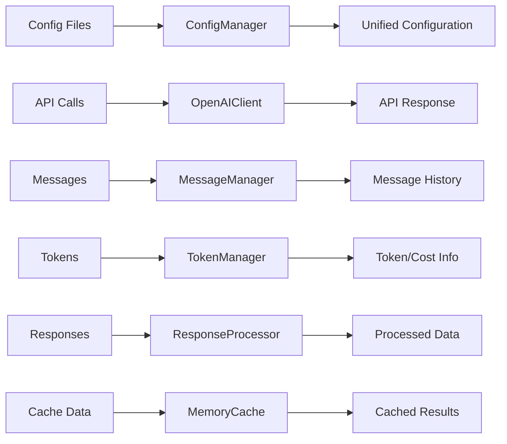
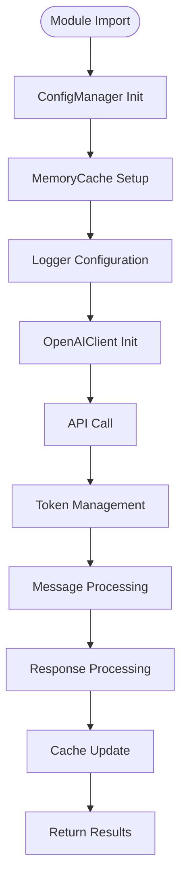
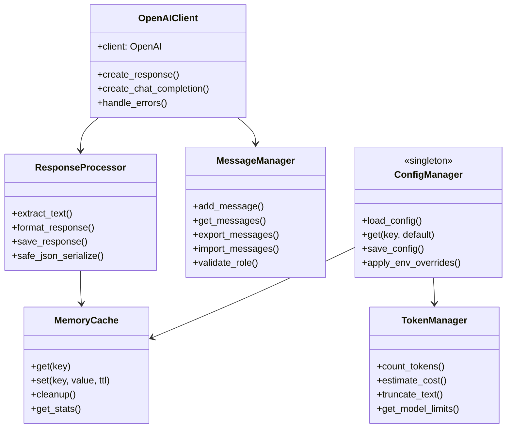
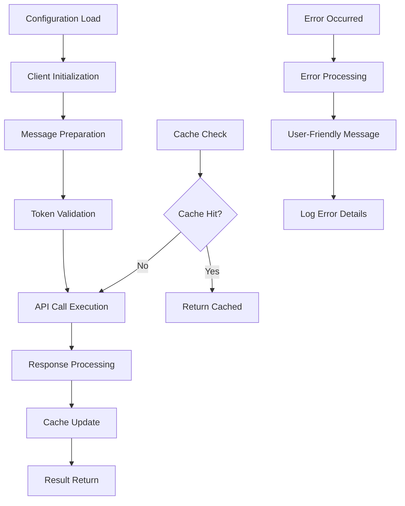
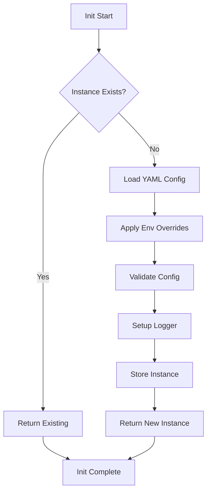
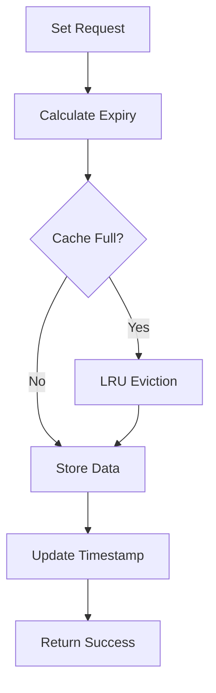
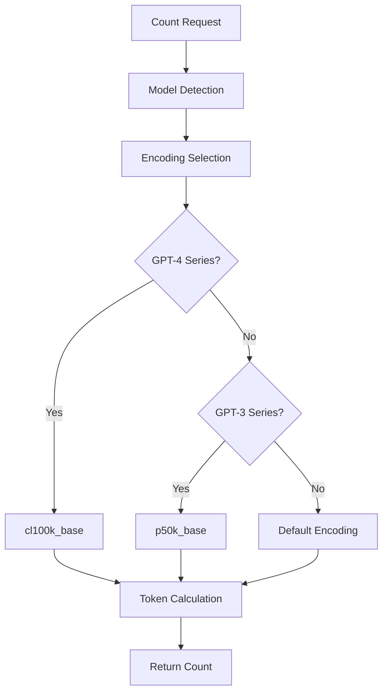
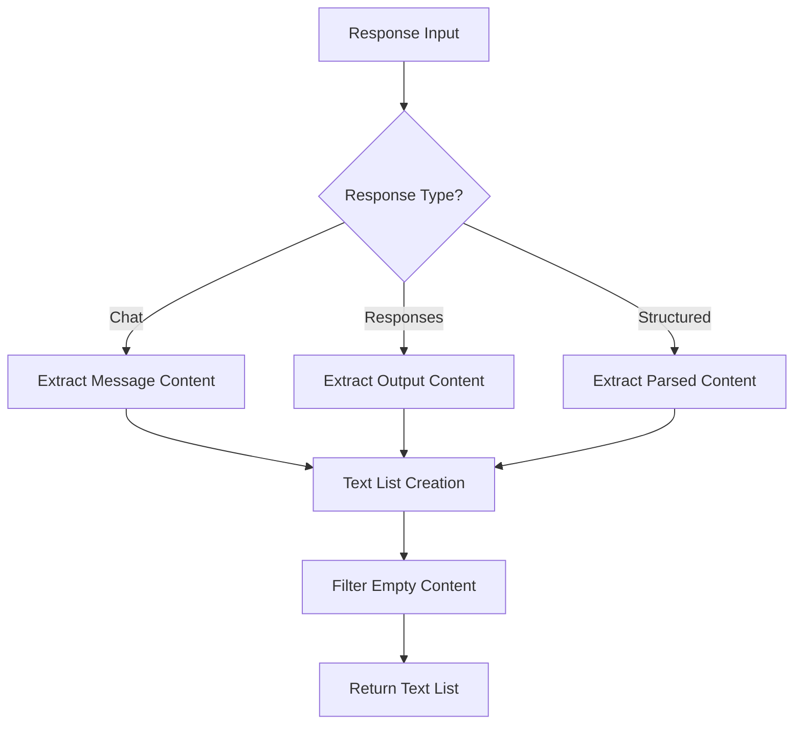
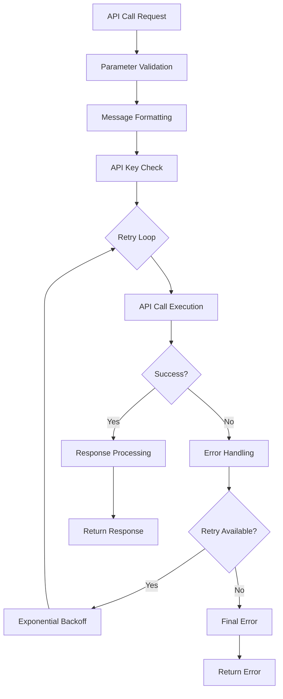
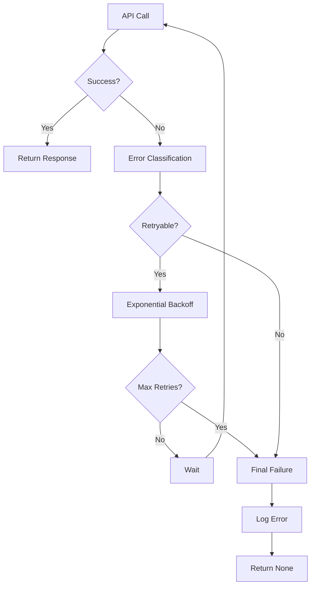

# 📋 helper_api.py 設計書

## 📝 目次

1. [📖 概要書](#📖-概要書)
2. [🔧 システム構成](#🔧-システム構成)
3. [📋 関数一覧](#📋-関数一覧)
4. [📑 関数詳細設計](#📑-関数詳細設計)
5. [⚙️ 技術仕様](#⚙️-技術仕様)
6. [🚨 エラーハンドリング](#🚨-エラーハンドリング)

---

## 📖 概要書

### 🎯 処理の概要

**OpenAI API統合・コア機能モジュール**

本モジュールは、OpenAI API統合の中核となるヘルパーライブラリです。設定管理、キャッシュシステム、トークン管理、レスポンス処理、エラーハンドリングなど、全サンプルプログラムに共通する基盤機能を提供します。APIの複雑さを抽象化し、一貫したインターフェースで効率的なOpenAI API活用を実現します。

#### 🌟 主要機能

| 機能 | 説明 |
|------|------|
| ⚙️ **設定管理** | YAML設定ファイル・環境変数のシングルトン管理 |
| 💾 **メモリキャッシュ** | TTLベース・サイズ制限付きキャッシュシステム |
| 📝 **メッセージ管理** | 会話履歴・ロール検証・上限制御の統合管理 |
| 🔢 **トークン管理** | マルチモデル対応トークン計算・コスト推定 |
| 🔄 **レスポンス処理** | OpenAI応答解析・フォーマット・安全JSON化 |
| 🤖 **OpenAIクライアント** | API呼び出しラッパー・エラー処理統合 |
| 📊 **ログ統合** | 構造化ログ・ローテーション・デバッグ支援 |

#### 🎨 処理対象データ



### 🔄 モジュールの処理の流れ



---

## 🔧 システム構成

### 📦 主要コンポーネント



### 📋 データフロー



---

## 📋 関数一覧

### 🏗️ 設定・キャッシュ管理クラス

| クラス・関数名 | 分類 | 処理概要 | 重要度 |
|---------------|------|----------|---------|
| `ConfigManager.__init__()` | ⚙️ 設定 | シングルトン設定マネージャ初期化 | ⭐⭐⭐ |
| `ConfigManager.get()` | ⚙️ 設定 | 設定値取得・デフォルト対応 | ⭐⭐⭐ |
| `ConfigManager.save_config()` | ⚙️ 設定 | 設定ファイル保存・永続化 | ⭐⭐ |
| `MemoryCache.get()` | 💾 キャッシュ | TTL対応キャッシュデータ取得 | ⭐⭐⭐ |
| `MemoryCache.set()` | 💾 キャッシュ | キャッシュデータ設定・期限管理 | ⭐⭐⭐ |
| `MemoryCache.cleanup()` | 💾 キャッシュ | 期限切れデータ自動清理 | ⭐⭐ |

### 🔢 メッセージ・トークン管理クラス

| クラス・関数名 | 分類 | 処理概要 | 重要度 |
|---------------|------|----------|---------|
| `MessageManager.add_message()` | 📝 メッセージ | メッセージ追加・ロール検証 | ⭐⭐⭐ |
| `MessageManager.get_messages()` | 📝 メッセージ | メッセージ履歴取得・上限制御 | ⭐⭐⭐ |
| `MessageManager.export_messages()` | 📝 メッセージ | メッセージ履歴エクスポート | ⭐⭐ |
| `TokenManager.count_tokens()` | 🔢 トークン | マルチモデル対応トークン計算 | ⭐⭐⭐ |
| `TokenManager.estimate_cost()` | 🔢 トークン | モデル別コスト推定計算 | ⭐⭐⭐ |
| `TokenManager.truncate_text()` | 🔢 トークン | 意味保持テキスト切り詰め | ⭐⭐ |

### 🔄 API・レスポンス処理クラス

| クラス・関数名 | 分類 | 処理概要 | 重要度 |
|---------------|------|----------|---------|
| `OpenAIClient.__init__()` | 🤖 API | OpenAIクライアント初期化 | ⭐⭐⭐ |
| `OpenAIClient.create_response()` | 🤖 API | Responses API統一呼び出し | ⭐⭐⭐ |
| `ResponseProcessor.extract_text()` | 🔄 処理 | 複雑応答からテキスト抽出 | ⭐⭐⭐ |
| `ResponseProcessor.format_response()` | 🔄 処理 | 応答データ標準化フォーマット | ⭐⭐⭐ |
| `ResponseProcessor.safe_json_serialize()` | 🔄 処理 | 安全JSON変換・エラー回避 | ⭐⭐ |

### 🛡️ ユーティリティ・デコレータ関数

| 関数名 | 分類 | 処理概要 | 重要度 |
|--------|------|----------|---------|
| `error_handler()` | 🛡️ エラー | 統一エラーハンドリングデコレータ | ⭐⭐⭐ |
| `timer()` | ⏱️ 計測 | 実行時間計測デコレータ | ⭐⭐ |
| `setup_logging()` | 📊 ログ | ログシステム初期化・設定 | ⭐⭐ |

---

## 📑 関数詳細設計

### ⚙️ ConfigManager.__init__()

#### 🎯 処理概要
シングルトンパターンによる統一設定管理システム初期化

#### 📊 処理の流れ


#### 📋 IPO設計

| 項目 | 内容 |
|------|------|
| **INPUT** | `config_path: str = "config.yml"`、環境変数（OPENAI_API_KEY等） |
| **PROCESS** | YAML読み込み → 環境変数適用 → 検証 → シングルトン登録 |
| **OUTPUT** | 設定済みConfigManagerインスタンス、ログシステム |

#### 🔍 設定階層構造
```python
config_structure = {
    "models": {
        "default": "gpt-4.1",
        "available": ["gpt-4o", "gpt-4o-mini", ...],
        "categories": {...}
    },
    "api": {
        "timeout": 30,
        "max_retries": 3
    },
    "cache": {
        "enabled": True,
        "ttl": 3600,
        "max_size": 100
    }
}
```

---

### 💾 MemoryCache.set()

#### 🎯 処理概要
TTL（Time To Live）対応メモリキャッシュへのデータ設定

#### 📊 処理の流れ


#### 📋 IPO設計

| 項目 | 内容 |
|------|------|
| **INPUT** | `key: str`、`value: Any`、`ttl: int = None`（秒） |
| **PROCESS** | 期限計算 → サイズチェック → LRU排除 → データ保存 |
| **OUTPUT** | `bool` - 設定成功・失敗、キャッシュ統計更新 |

---

### 🔢 TokenManager.count_tokens()

#### 🎯 処理概要
マルチモデル対応トークン数計算・エンコーディング自動選択

#### 📊 処理の流れ


#### 📋 IPO設計

| 項目 | 内容 |
|------|------|
| **INPUT** | `text: str`、`model: str = "gpt-4o"` |
| **PROCESS** | モデル検出 → エンコーディング選択 → tiktoken計算 |
| **OUTPUT** | `int` - トークン数、エラー時は0 |

#### 🔍 サポートモデル・エンコーディング
```python
MODEL_ENCODINGS = {
    "gpt-4": "cl100k_base",
    "gpt-4o": "cl100k_base", 
    "gpt-3.5": "p50k_base",
    "o1": "o200k_base",
    "o3": "o200k_base"
}
```

---

### 🔄 ResponseProcessor.extract_text()

#### 🎯 処理概要
OpenAI複雑応答構造からテキスト内容抽出・統一化

#### 📊 処理の流れ


#### 📋 IPO設計

| 項目 | 内容 |
|------|------|
| **INPUT** | `response: Response` - OpenAI応答オブジェクト |
| **PROCESS** | 応答タイプ判定 → 内容抽出 → テキスト統合 → フィルタリング |
| **OUTPUT** | `List[str]` - 抽出テキストリスト |

---

### 🤖 OpenAIClient.create_response()

#### 🎯 処理概要
OpenAI Responses API統一呼び出しラッパー・エラー処理統合

#### 📊 処理の流れ


#### 📋 IPO設計

| 項目 | 内容 |
|------|------|
| **INPUT** | `messages: List[EasyInputMessageParam]`、`model: str`、`**kwargs` |
| **PROCESS** | パラメータ検証 → メッセージ構築 → リトライ付きAPI呼び出し |
| **OUTPUT** | `Response` - OpenAI応答オブジェクト、例外時はNone |

---

## ⚙️ 技術仕様

### 📦 依存ライブラリ

| ライブラリ | バージョン | 用途 | 重要度 |
|-----------|-----------|------|---------|
| `openai` | 最新 | 🤖 OpenAI API SDK | ⭐⭐⭐ |
| `tiktoken` | 最新 | 🔢 トークン計算ライブラリ | ⭐⭐⭐ |
| `pyyaml` | 最新 | ⚙️ YAML設定ファイル解析 | ⭐⭐⭐ |
| `pathlib` | 標準 | 📁 パス操作 | ⭐⭐ |
| `datetime` | 標準 | ⏰ 時刻・期限管理 | ⭐⭐ |
| `functools` | 標準 | 🔧 デコレータ・関数ツール | ⭐⭐ |
| `abc` | 標準 | 🏗️ 抽象基底クラス | ⭐⭐ |
| `typing` | 標準 | 🔤 型ヒント | ⭐⭐ |
| `logging` | 標準 | 📊 ログシステム | ⭐⭐ |

### 🗃️ 設定ファイル仕様

#### 📋 config.yml構造

```yaml
# モデル設定
models:
  default: "gpt-4.1"
  available: ["gpt-4o", "gpt-4o-mini", "gpt-4.1", ...]
  categories:
    reasoning: ["o1", "o3", "o4", ...]
    standard: ["gpt-4o", "gpt-4.1", ...]
    audio: ["tts-1", "whisper-1", ...]

# API設定  
api:
  timeout: 30
  max_retries: 3
  base_url: null
  
# キャッシュ設定
cache:
  enabled: true
  ttl: 3600
  max_size: 100

# ログ設定
logging:
  level: "INFO"
  format: "%(asctime)s - %(name)s - %(levelname)s - %(message)s"
  file: "logs/app.log"
  max_size: 10485760  # 10MB
  backup_count: 5

# トークン・コスト設定
pricing:
  gpt-4o:
    input: 0.005
    output: 0.015
  gpt-4o-mini:
    input: 0.00015
    output: 0.0006
```

### 🔢 トークン管理仕様

#### 📋 モデル別トークン制限

```yaml
Model_Limits:
  gpt-4o:
    max_tokens: 128000
    max_output: 16384
    encoding: "cl100k_base"
    
  gpt-4o-mini:
    max_tokens: 128000
    max_output: 16384
    encoding: "cl100k_base"
    
  o1:
    max_tokens: 200000
    max_output: 100000
    encoding: "o200k_base"
    
  o3:
    max_tokens: 200000
    max_output: 100000
    encoding: "o200k_base"
```

#### ⚙️ コスト計算パターン

```python
def calculate_cost(model: str, input_tokens: int, output_tokens: int) -> float:
    """モデル別コスト計算"""
    pricing = config.get(f"pricing.{model}")
    if not pricing:
        return 0.0
        
    input_cost = (input_tokens / 1000) * pricing["input"]
    output_cost = (output_tokens / 1000) * pricing["output"]
    
    return input_cost + output_cost
```

### 💾 キャッシュシステム仕様

#### 🔄 TTLキャッシュ実装

```python
class MemoryCache:
    def __init__(self, max_size: int = 100, default_ttl: int = 3600):
        self._cache: Dict[str, Dict[str, Any]] = {}
        self._access_times: Dict[str, float] = {}
        self.max_size = max_size
        self.default_ttl = default_ttl
        
    def set(self, key: str, value: Any, ttl: int = None) -> bool:
        """TTL対応キャッシュ設定"""
        if len(self._cache) >= self.max_size:
            self._evict_lru()
            
        ttl = ttl or self.default_ttl
        expiry = time.time() + ttl
        
        self._cache[key] = {
            "value": value,
            "expiry": expiry
        }
        self._access_times[key] = time.time()
        return True
```

---

## 🚨 エラーハンドリング

### 📄 エラー分類

| エラー種別 | 原因 | 対処法 | 影響度 |
|-----------|------|--------|---------|
| **設定ファイルエラー** | 🚫 YAML構文エラー・ファイル不在 | デフォルト設定使用・構文確認指示 | 🔴 高 |
| **API認証エラー** | 🔑 無効APIキー・期限切れ | API キー確認・再設定指示 | 🔴 高 |
| **ネットワークエラー** | 🌐 接続失敗・タイムアウト | リトライ実行・接続確認提案 | 🟡 中 |
| **トークン制限エラー** | 📏 制限超過・計算失敗 | テキスト切り詰め・モデル変更提案 | 🟡 中 |
| **キャッシュエラー** | 💾 メモリ不足・期限管理失敗 | キャッシュクリア・サイズ調整 | 🟠 低 |
| **ログエラー** | 📊 ログ出力失敗・権限不足 | コンソール出力フォールバック | 🟠 低 |

### 🛠️ エラー処理戦略

#### 🔧 デコレータベースエラー処理

```python
def error_handler(func):
    """統一エラーハンドリングデコレータ"""
    @functools.wraps(func)
    def wrapper(*args, **kwargs):
        try:
            return func(*args, **kwargs)
        except OpenAIError as e:
            logger.error(f"OpenAI API Error: {e}")
            return None
        except Exception as e:
            logger.error(f"Unexpected error in {func.__name__}: {e}")
            return None
    return wrapper
```

#### 🔄 リトライ機構



#### ✅ エラーメッセージ例

```python
# 設定エラー
logger.error("❌ 設定ファイル読み込みに失敗しました")
logger.info("💡 デフォルト設定を使用します")

# API認証エラー
logger.error("❌ OpenAI API認証に失敗しました")
logger.info("💡 OPENAI_API_KEYが正しく設定されているか確認してください")

# トークン制限エラー
logger.warning("⚠️ トークン制限に近づいています")
logger.info("💡 テキストを短縮するか、より大容量のモデルを選択してください")
```

#### 🎯 ログシステム

```python
# ログ設定例
LOGGING_CONFIG = {
    "version": 1,
    "disable_existing_loggers": False,
    "formatters": {
        "standard": {
            "format": "%(asctime)s - %(name)s - %(levelname)s - %(message)s"
        }
    },
    "handlers": {
        "file": {
            "level": "INFO",
            "class": "logging.handlers.RotatingFileHandler",
            "filename": "logs/app.log",
            "maxBytes": 10485760,  # 10MB
            "backupCount": 5,
            "formatter": "standard"
        },
        "console": {
            "level": "DEBUG",
            "class": "logging.StreamHandler",
            "formatter": "standard"
        }
    },
    "loggers": {
        "helper_api": {
            "handlers": ["file", "console"],
            "level": "INFO",
            "propagate": False
        }
    }
}
```

---

## 🎉 まとめ

この設計書は、**helper_api.py** の包括的な技術仕様と実装詳細を網羅した完全ドキュメントです。

### 🌟 設計のハイライト

- **⚙️ 統一設定管理**: シングルトンパターンによる一元的設定システム
- **💾 効率的キャッシュ**: TTL・LRU対応メモリキャッシュシステム
- **🔢 正確トークン管理**: マルチモデル対応tiktoken統合・コスト計算
- **🛡️ 堅牢なエラー処理**: デコレータベース統一エラーハンドリング
- **🤖 API統合**: OpenAI API呼び出しの完全抽象化

### 🔧 アーキテクチャ特徴

- **📦 モジュラー設計**: 独立したクラス・機能の疎結合構成
- **🔄 デコレータパターン**: エラー処理・計測の横断的適用
- **💾 メモリ効率**: LRU・TTLによる効率的リソース管理
- **⚙️ 設定駆動**: YAML設定による柔軟なカスタマイズ対応
- **🎯 実用性**: 本番環境での使用を想定した堅牢性・パフォーマンス