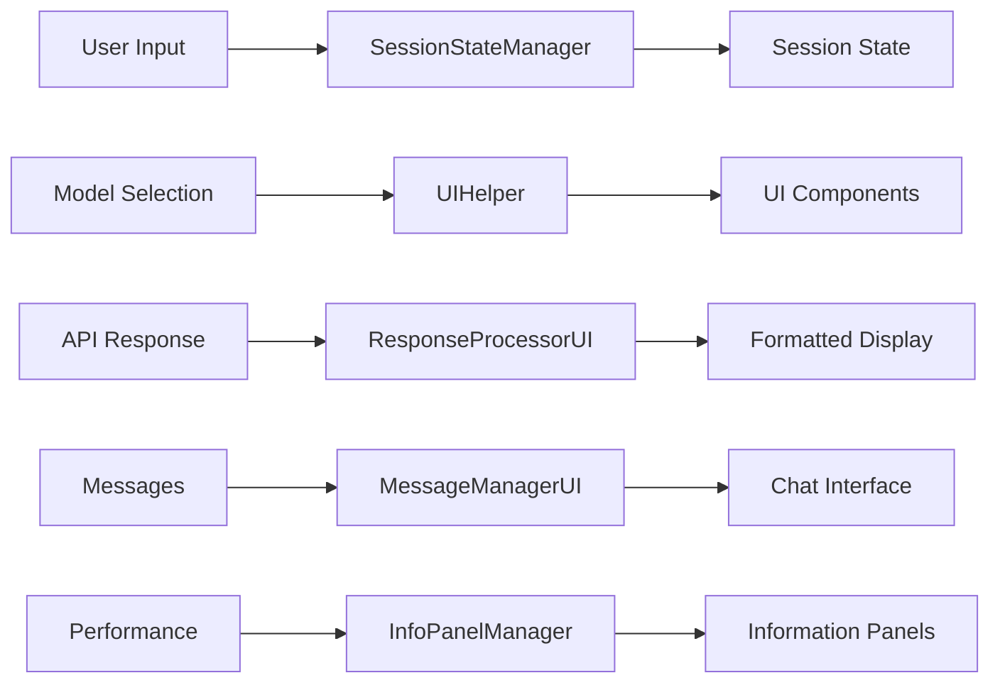
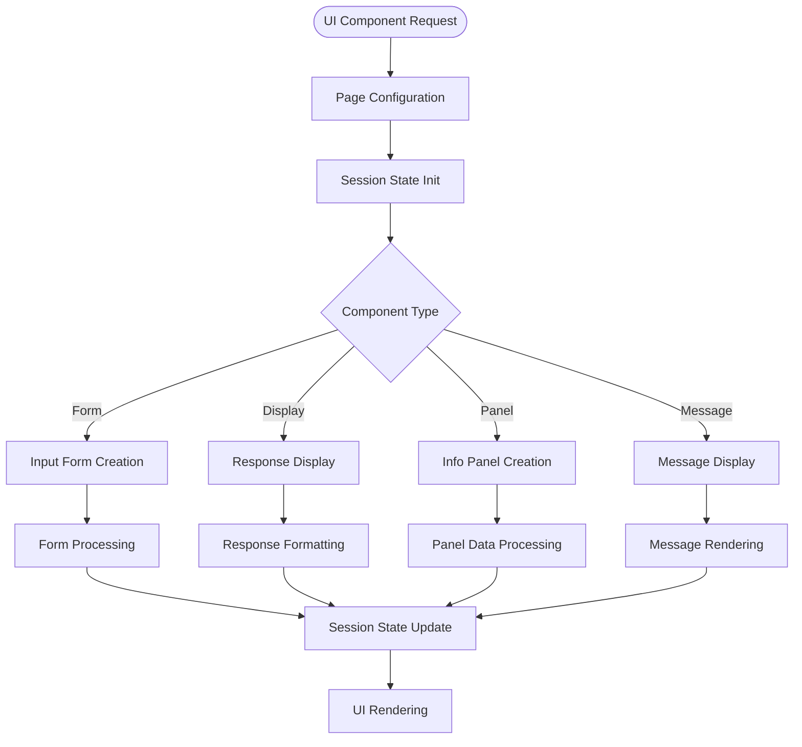
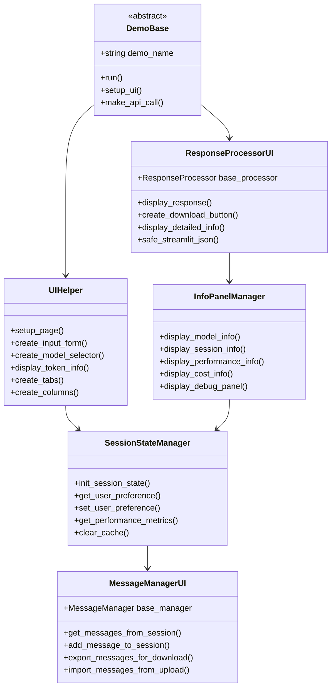
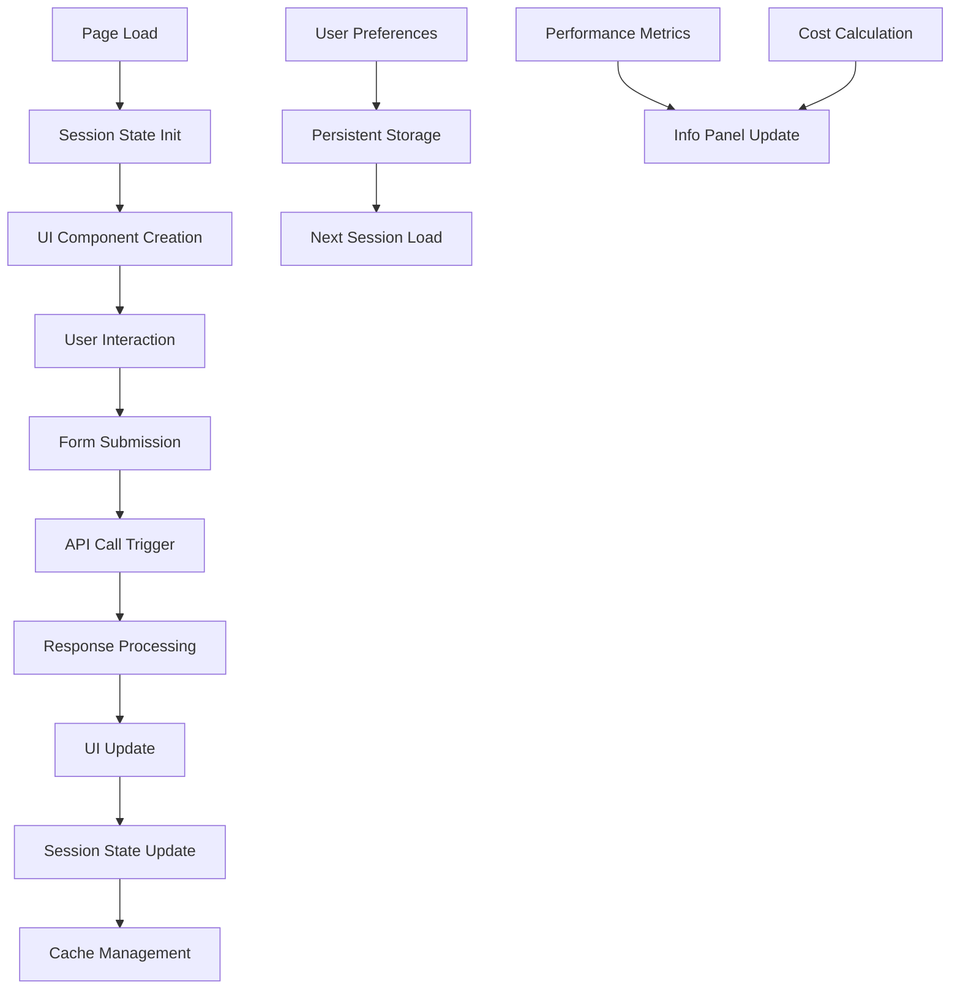
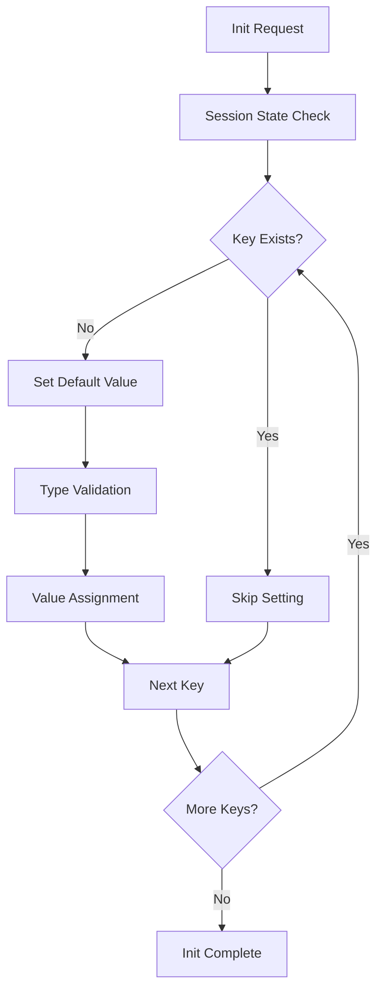
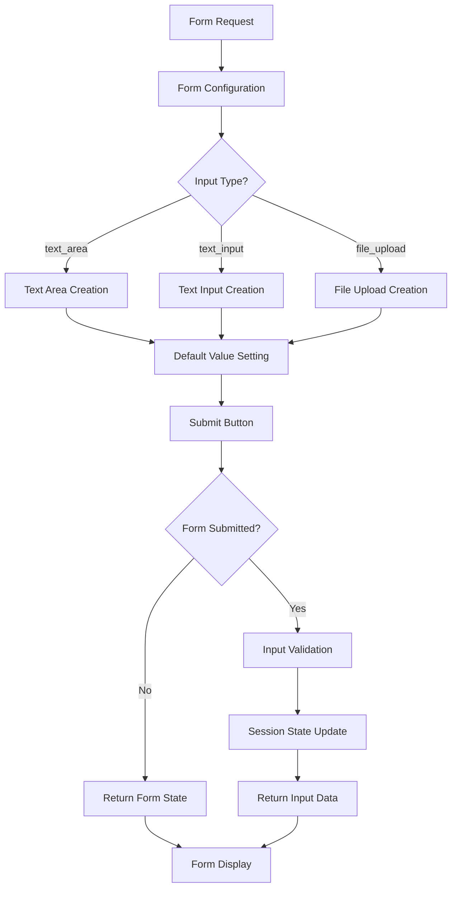
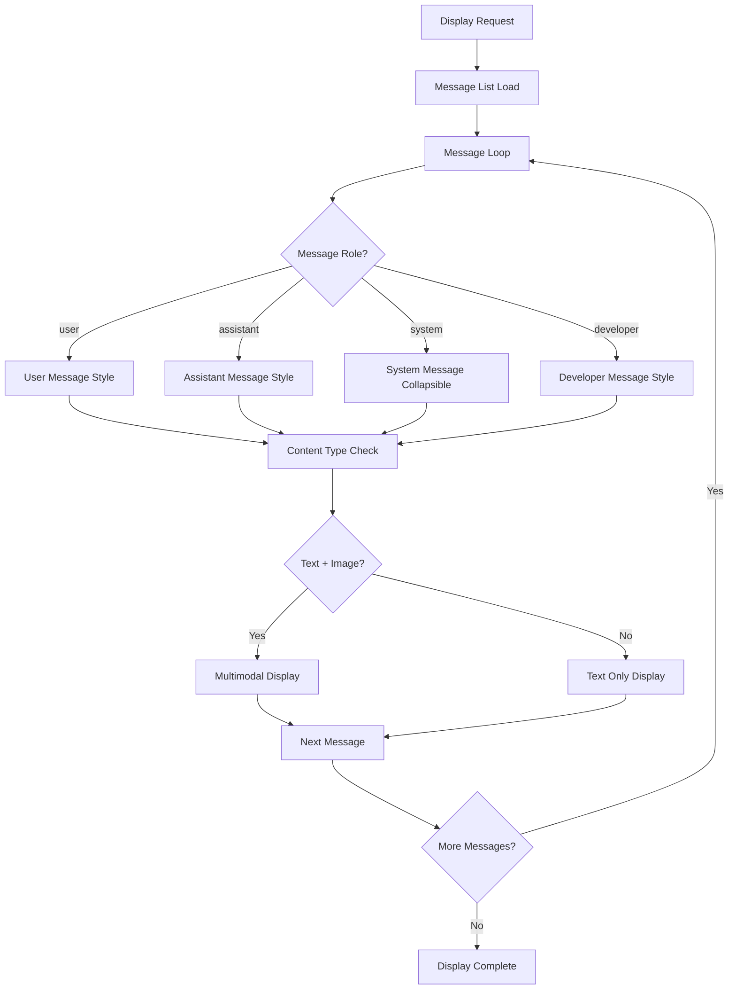
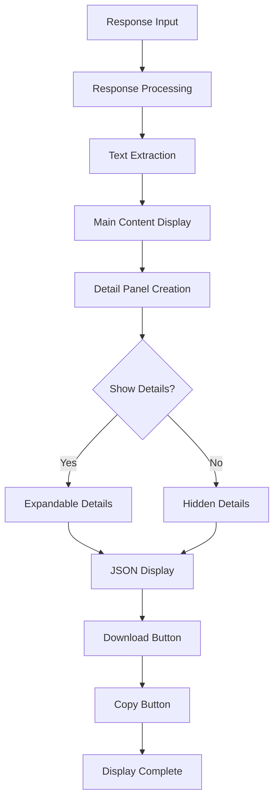
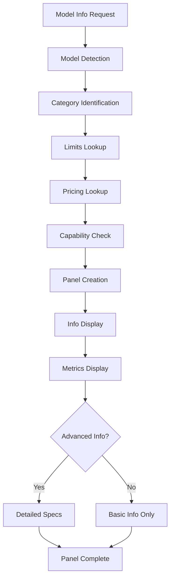
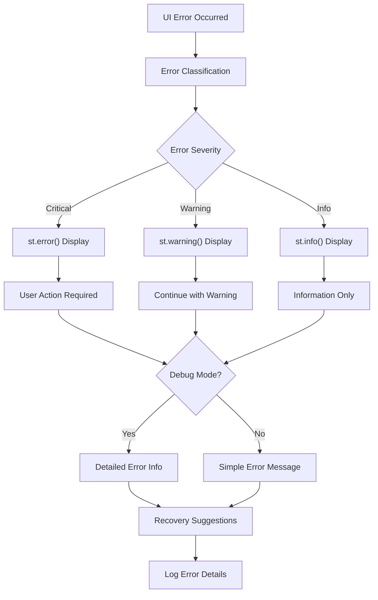

# 📋 helper_st.py 設計書

## 📝 目次

1. [📖 概要書](#📖-概要書)
2. [🔧 システム構成](#🔧-システム構成)
3. [📋 関数一覧](#📋-関数一覧)
4. [📑 関数詳細設計](#📑-関数詳細設計)
5. [⚙️ 技術仕様](#⚙️-技術仕様)
6. [🚨 エラーハンドリング](#🚨-エラーハンドリング)

---

## 📖 概要書

### 🎯 処理の概要

**Streamlit UI統合・ユーザーインターフェースモジュール**

本モジュールは、helper_api.pyのコア機能をStreamlit Webアプリケーション用に拡張したUIライブラリです。セッション状態管理、インタラクティブコンポーネント、レスポンス表示、情報パネル管理など、統一されたユーザーエクスペリエンスを提供し、全サンプルプログラムの基盤UIシステムとして機能します。

#### 🌟 主要機能

| 機能 | 説明 |
|------|------|
| 🎨 **ページ初期化** | Streamlit設定・セッション状態・デバッグパネル統合 |
| 📋 **モデル選択UI** | カテゴリ別モデル選択・情報表示・設定永続化 |
| 📝 **入力フォーム** | 柔軟な入力フォーム・検証・セッション統合 |
| 💬 **メッセージ表示** | チャット形式・マルチモーダル・ロール対応表示 |
| 🔢 **トークン分析** | リアルタイム計算・使用量警告・コスト表示 |
| 📊 **レスポンス処理** | フォーマット表示・コピー機能・ダウンロード |
| ℹ️ **情報パネル** | サイドバー情報・パフォーマンス・コスト計算 |

#### 🎨 処理対象データ



### 🔄 UIコンポーネントの処理の流れ



---

## 🔧 システム構成

### 📦 主要コンポーネント



### 📋 データフロー



---

## 📋 関数一覧

### 🏗️ セッション・状態管理クラス

| クラス・関数名 | 分類 | 処理概要 | 重要度 |
|---------------|------|----------|---------|
| `SessionStateManager.init_session_state()` | 📊 状態 | セッション状態安全初期化 | ⭐⭐⭐ |
| `SessionStateManager.get_user_preference()` | 📊 状態 | ユーザー設定取得・デフォルト対応 | ⭐⭐⭐ |
| `SessionStateManager.set_user_preference()` | 📊 状態 | ユーザー設定永続化保存 | ⭐⭐⭐ |
| `SessionStateManager.get_performance_metrics()` | 📊 状態 | パフォーマンス統計取得 | ⭐⭐ |
| `SessionStateManager.clear_cache()` | 📊 状態 | セッションキャッシュクリア | ⭐⭐ |

### 💬 メッセージ・UI管理クラス

| クラス・関数名 | 分類 | 処理概要 | 重要度 |
|---------------|------|----------|---------|
| `MessageManagerUI.get_messages_from_session()` | 💬 メッセージ | セッションメッセージ履歴取得 | ⭐⭐⭐ |
| `MessageManagerUI.add_message_to_session()` | 💬 メッセージ | セッションメッセージ追加・永続化 | ⭐⭐⭐ |
| `MessageManagerUI.export_messages_for_download()` | 💬 メッセージ | ダウンロード用メッセージエクスポート | ⭐⭐ |
| `UIHelper.setup_page()` | 🎨 UI | Streamlitページ設定・初期化 | ⭐⭐⭐ |
| `UIHelper.create_input_form()` | 🎨 UI | 柔軟入力フォーム生成・検証 | ⭐⭐⭐ |
| `UIHelper.create_model_selector()` | 🎨 UI | モデル選択UI・カテゴリ対応 | ⭐⭐⭐ |

### 📊 レスポンス・表示処理クラス

| クラス・関数名 | 分類 | 処理概要 | 重要度 |
|---------------|------|----------|---------|
| `ResponseProcessorUI.display_response()` | 📊 表示 | レスポンス統合表示・フォーマット | ⭐⭐⭐ |
| `ResponseProcessorUI.create_download_button()` | 📊 表示 | ダウンロードボタン・JSON生成 | ⭐⭐⭐ |
| `ResponseProcessorUI.safe_streamlit_json()` | 📊 表示 | 安全JSON表示・エラー回避 | ⭐⭐ |
| `InfoPanelManager.display_model_info()` | ℹ️ 情報 | モデル情報パネル表示 | ⭐⭐⭐ |
| `InfoPanelManager.display_cost_info()` | ℹ️ 情報 | コスト計算・表示パネル | ⭐⭐⭐ |

### 🛡️ 基底・デコレータクラス

| クラス・関数名 | 分類 | 処理概要 | 重要度 |
|---------------|------|----------|---------|
| `DemoBase.__init__()` | 🏗️ 基底 | デモアプリ基底クラス初期化 | ⭐⭐⭐ |
| `DemoBase.run()` | 🏗️ 基底 | 抽象デモ実行メソッド | ⭐⭐⭐ |
| `error_handler_ui()` | 🛡️ エラー | UI特化エラーハンドリングデコレータ | ⭐⭐⭐ |
| `timer_ui()` | ⏱️ 計測 | UI用実行時間計測デコレータ | ⭐⭐ |

---

## 📑 関数詳細設計

### 📊 SessionStateManager.init_session_state()

#### 🎯 処理概要
Streamlitセッション状態の安全な初期化・デフォルト値設定

#### 📊 処理の流れ


#### 📋 IPO設計

| 項目 | 内容 |
|------|------|
| **INPUT** | デフォルト値辞書、キーリスト |
| **PROCESS** | 存在チェック → 型検証 → デフォルト値設定 → 次キー処理 |
| **OUTPUT** | 初期化済みセッション状態、設定確認ログ |

#### 🔍 初期化セッション状態構造
```python
DEFAULT_SESSION_STATE = {
    # UI関連キャッシュ
    "ui_cache": {},
    "performance_metrics": [],
    
    # ユーザー設定
    "user_preferences": {
        "selected_model": "gpt-4o",
        "temperature": 0.7,
        "debug_mode": False
    },
    
    # メッセージ履歴（デモ別）
    "message_history": {},
    
    # 一時データ
    "temp_data": {},
    "form_data": {}
}
```

---

### 🎨 UIHelper.create_input_form()

#### 🎯 処理概要
柔軟な入力フォーム生成・バリデーション・セッション統合

#### 📊 処理の流れ


#### 📋 IPO設計

| 項目 | 内容 |
|------|------|
| **INPUT** | `form_type: str`、`default_value: Any`、`validation_rules: Dict` |
| **PROCESS** | フォーム種別判定 → UI作成 → バリデーション → セッション更新 |
| **OUTPUT** | `Tuple[Any, bool]` - 入力データ、送信フラグ |

#### 🔍 サポートフォーム種別
```python
FORM_TYPES = {
    "text_area": {
        "height": 75,
        "placeholder": "テキストを入力してください...",
        "max_chars": None
    },
    "text_input": {
        "placeholder": "入力してください...",
        "max_chars": 100
    },
    "file_uploader": {
        "accept_multiple_files": False,
        "type": None  # 制限なし
    }
}
```

---

### 💬 MessageManagerUI.display_messages()

#### 🎯 処理概要
チャット形式メッセージ表示・マルチモーダル・ロール対応レンダリング

#### 📊 処理の流れ


#### 📋 IPO設計

| 項目 | 内容 |
|------|------|
| **INPUT** | `messages: List[EasyInputMessageParam]`、`display_options: Dict` |
| **PROCESS** | メッセージループ → ロール判定 → スタイル適用 → コンテンツ表示 |
| **OUTPUT** | Streamlit表示コンポーネント、レンダリング統計 |

---

### 📊 ResponseProcessorUI.display_response()

#### 🎯 処理概要
OpenAI APIレスポンス統合表示・フォーマット・ダウンロード機能

#### 📊 処理の流れ


#### 📋 IPO設計

| 項目 | 内容 |
|------|------|
| **INPUT** | `response: Response`、`show_details: bool = False`、`show_raw: bool = False` |
| **PROCESS** | 応答処理 → テキスト抽出 → フォーマット → UI要素作成 |
| **OUTPUT** | フォーマット済み表示、ダウンロードボタン、コピー機能 |

---

### ℹ️ InfoPanelManager.display_model_info()

#### 🎯 処理概要
選択モデル詳細情報・制限・価格情報パネル表示

#### 📊 処理の流れ


#### 📋 IPO設計

| 項目 | 内容 |
|------|------|
| **INPUT** | `selected_model: str`、`show_advanced: bool = False` |
| **PROCESS** | モデル情報取得 → カテゴリ判定 → 制限・価格取得 → パネル構築 |
| **OUTPUT** | 情報パネル表示、メトリクス、詳細仕様 |

---

## ⚙️ 技術仕様

### 📦 依存ライブラリ

| ライブラリ | バージョン | 用途 | 重要度 |
|-----------|-----------|------|---------|
| `streamlit` | 最新 | 🎨 Web UIフレームワーク | ⭐⭐⭐ |
| `helper_api` | カスタム | 🔧 コアAPI機能インポート | ⭐⭐⭐ |
| `json` | 標準 | 📊 JSON処理・表示 | ⭐⭐ |
| `time` | 標準 | ⏱️ パフォーマンス計測 | ⭐⭐ |
| `traceback` | 標準 | 🐛 詳細エラー情報 | ⭐⭐ |
| `pandas` | 最新 | 📈 データ表示（オプション） | ⭐ |

### 🗃️ セッション状態管理仕様

#### 📋 セッション状態構造

```yaml
Session_State_Structure:
  # UI関連
  ui_cache:
    type: "Dict[str, Any]"
    purpose: "UI特化キャッシュ"
    ttl: "session_duration"
    
  performance_metrics:
    type: "List[Dict[str, Any]]"
    content: "execution_times, api_calls, token_usage"
    max_length: 100
    
  # ユーザー設定
  user_preferences:
    type: "Dict[str, Any]"
    persistence: "session_persistent"
    keys: ["selected_model", "temperature", "debug_mode"]
    
  # メッセージ履歴（デモ別）
  message_history:
    type: "Dict[str, List[Dict]]"
    key_format: "demo_{demo_name}"
    max_messages_per_demo: 50
    
  # フォームデータ
  form_data:
    type: "Dict[str, Any]"
    purpose: "form_input_cache"
    cleanup: "automatic"
```

#### ⚙️ ユーザー設定永続化

```python
def save_user_preference(key: str, value: Any) -> None:
    """ユーザー設定永続化"""
    if "user_preferences" not in st.session_state:
        st.session_state.user_preferences = {}
    
    st.session_state.user_preferences[key] = value
    
    # 設定ファイルへの保存（オプション）
    config = ConfigManager()
    config.set(f"user_preferences.{key}", value)
```

### 🎨 UI コンポーネント仕様

#### 📋 ページ設定標準

```yaml
Page_Config:
  page_title: "OpenAI API Demo"
  page_icon: "🤖"
  layout: "wide"
  initial_sidebar_state: "expanded"
  menu_items:
    "Get Help": null
    "Report a bug": null
    "About": "OpenAI API Demo Application"
```

#### 🎨 スタイル設定

```python
UI_STYLES = {
    "user_message": {
        "background_color": "#f0f2f6",
        "border_radius": "10px",
        "padding": "10px",
        "margin": "5px 0"
    },
    "assistant_message": {
        "background_color": "#ffffff",
        "border": "1px solid #e0e0e0", 
        "border_radius": "10px",
        "padding": "10px",
        "margin": "5px 0"
    },
    "system_message": {
        "background_color": "#fff3cd",
        "border": "1px solid #ffeaa7",
        "font_style": "italic"
    }
}
```

#### 📊 メトリクス表示パターン

```python
def display_token_metrics(tokens_used: int, tokens_limit: int, cost: float):
    """トークン使用量メトリクス表示"""
    usage_percentage = (tokens_used / tokens_limit) * 100
    
    col1, col2, col3 = st.columns(3)
    
    with col1:
        st.metric(
            label="トークン使用量",
            value=f"{tokens_used:,}",
            delta=f"{usage_percentage:.1f}%"
        )
    
    with col2:
        st.metric(
            label="制限",
            value=f"{tokens_limit:,}",
            delta=None
        )
    
    with col3:
        st.metric(
            label="推定コスト",
            value=f"${cost:.4f}",
            delta=None
        )
    
    # プログレスバー
    st.progress(usage_percentage / 100)
    
    # 警告表示
    if usage_percentage > 90:
        st.error("⚠️ トークン制限に近づいています")
    elif usage_percentage > 75:
        st.warning("⚠️ トークン使用量が多めです")
```

### 📋 フォーム・入力パターン

#### 🔧 統一入力フォームパターン

```python
def create_unified_input_form(
    form_key: str,
    input_type: str = "text_area",
    label: str = "入力",
    default_value: str = "",
    height: int = 75,
    placeholder: str = None,
    help_text: str = None,
    validation_func: callable = None
) -> Tuple[Any, bool]:
    """統一入力フォーム作成"""
    
    with st.form(key=form_key):
        if input_type == "text_area":
            user_input = st.text_area(
                label=label,
                value=default_value,
                height=height,
                placeholder=placeholder,
                help=help_text
            )
        elif input_type == "text_input":
            user_input = st.text_input(
                label=label,
                value=default_value,
                placeholder=placeholder,
                help=help_text
            )
        
        submitted = st.form_submit_button("実行")
        
        if submitted and validation_func:
            validation_result = validation_func(user_input)
            if not validation_result["valid"]:
                st.error(validation_result["message"])
                return None, False
        
        return user_input, submitted
```

---

## 🚨 エラーハンドリング

### 📄 エラー分類

| エラー種別 | 原因 | 対処法 | 影響度 |
|-----------|------|--------|---------|
| **セッション状態エラー** | 💾 状態破損・キー不在 | 状態初期化・デフォルト値設定 | 🟡 中 |
| **UI コンポーネントエラー** | 🎨 Streamlitレンダリング問題 | ページリロード・代替表示 | 🟡 中 |
| **フォーム検証エラー** | 📝 無効入力・型不一致 | 入力再要求・ヒント表示 | 🟠 低 |
| **JSON表示エラー** | 📊 シリアライゼーション失敗 | 安全表示・テキスト代替 | 🟠 低 |
| **ダウンロードエラー** | 💾 ファイル生成失敗 | エラーメッセージ・手動コピー | 🟠 低 |
| **パフォーマンス問題** | ⏱️ レンダリング遅延・メモリ | キャッシュクリア・最適化 | 🟠 低 |

### 🛠️ UI特化エラー処理戦略

#### 🔧 デコレータベースUI エラー処理

```python
def error_handler_ui(func):
    """UI特化エラーハンドリングデコレータ"""
    @functools.wraps(func)
    def wrapper(*args, **kwargs):
        try:
            return func(*args, **kwargs)
        except Exception as e:
            logger.error(f"UI Error in {func.__name__}: {e}")
            
            # UI用エラー表示
            st.error(f"❌ エラーが発生しました: {str(e)}")
            
            # デバッグモード時の詳細表示
            if st.session_state.get("debug_mode", False):
                with st.expander("🐛 詳細エラー情報"):
                    st.code(traceback.format_exc())
            
            return None
    return wrapper
```

#### 🎨 UI エラー表示パターン



#### ✅ UI エラーメッセージ例

```python
# セッション状態エラー
if "required_key" not in st.session_state:
    st.warning("⚠️ セッション状態を初期化しています...")
    SessionStateManager.init_session_state()
    st.rerun()

# フォーム検証エラー
def validate_user_input(text: str) -> dict:
    if not text.strip():
        return {
            "valid": False,
            "message": "❌ 入力テキストが空です。何か入力してください。"
        }
    if len(text) > 10000:
        return {
            "valid": False,
            "message": "❌ 入力テキストが長すぎます（最大10,000文字）。"
        }
    return {"valid": True, "message": ""}

# JSON表示エラー
def safe_streamlit_json(data: Any) -> None:
    """安全なJSON表示"""
    try:
        st.json(data)
    except Exception as e:
        st.error("❌ JSON表示に失敗しました")
        st.info("💡 テキスト形式で表示します")
        st.text(str(data))
        
        if st.session_state.get("debug_mode", False):
            st.code(f"JSON Error: {str(e)}")
```

#### 🔄 自動復旧・フォールバック機能

```python
class UIAutoRecovery:
    """UI自動復旧機能"""
    
    @staticmethod
    def recover_session_state():
        """セッション状態自動復旧"""
        required_keys = [
            "ui_cache", "performance_metrics",
            "user_preferences", "message_history"
        ]
        
        for key in required_keys:
            if key not in st.session_state:
                st.session_state[key] = {}
                logger.warning(f"Recovered missing session key: {key}")
    
    @staticmethod
    def fallback_display(content: Any, error: Exception) -> None:
        """表示フォールバック"""
        try:
            # 第一選択: JSON表示
            st.json(content)
        except:
            try:
                # 第二選択: YAML表示
                st.code(yaml.dump(content), language="yaml")
            except:
                # 最終選択: テキスト表示
                st.text(str(content))
                st.caption(f"⚠️ 表示形式をテキストにフォールバックしました: {str(error)}")
```

#### 🎯 パフォーマンス監視・最適化

```python
class UIPerformanceMonitor:
    """UIパフォーマンス監視"""
    
    @staticmethod
    @timer_ui
    def monitor_render_time(func):
        """レンダリング時間監視"""
        def wrapper(*args, **kwargs):
            start_time = time.time()
            result = func(*args, **kwargs)
            render_time = time.time() - start_time
            
            # 長時間レンダリングの警告
            if render_time > 2.0:
                st.warning(f"⚠️ レンダリングに時間がかかりました ({render_time:.2f}秒)")
            
            # パフォーマンス統計更新
            if "performance_metrics" not in st.session_state:
                st.session_state.performance_metrics = []
            
            st.session_state.performance_metrics.append({
                "function": func.__name__,
                "render_time": render_time,
                "timestamp": time.time()
            })
            
            return result
        return wrapper
```

---

## 🎉 まとめ

この設計書は、**helper_st.py** の包括的な技術仕様と実装詳細を網羅した完全ドキュメントです。

### 🌟 設計のハイライト

- **🎨 統一UI体験**: Streamlit基盤の一貫したユーザーインターフェース
- **📊 高度なセッション管理**: 永続化・パフォーマンス追跡・自動復旧
- **💬 マルチモーダル表示**: テキスト・画像・JSON・チャット形式対応
- **📋 柔軟フォームシステム**: バリデーション・永続化・エラー処理統合
- **ℹ️ 豊富な情報パネル**: リアルタイム統計・コスト・デバッグ情報

### 🔧 アーキテクチャ特徴

- **📦 コンポーネント設計**: 再利用可能UI部品の体系化
- **🔄 状態継続**: セッション横断データ永続化・復旧機能  
- **🛡️ UI特化エラー処理**: ユーザーフレンドリーエラー表示・自動復旧
- **⚡ パフォーマンス最適化**: レンダリング時間監視・キャッシュ管理
- **🎯 統合性**: helper_api.pyとの完全統合・一貫したインターフェース